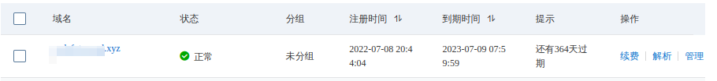
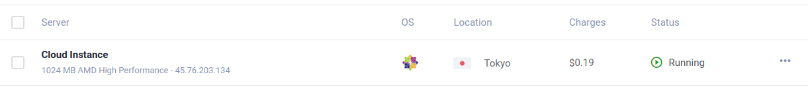
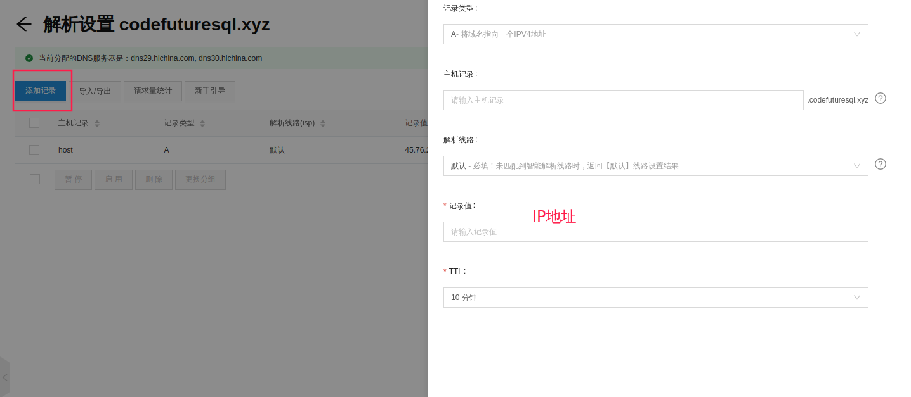
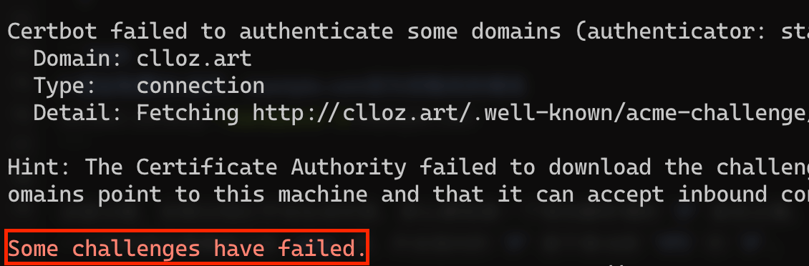

## 购买域名和VPS并添加域名解析

### 域名

由于要开启 `TLS` 进行加密，所以我们需要注册一个域名并且解析到我们的 `VPS`，我们可以到 [万网 – 阿里云](https://wanwang.aliyun.com/domain/searchresult#/?keyword=&suffix=com) 选一个自己喜欢的域名购买。注意的是阿里云的域名购买后想要添加解析需要**实名认证**才能使用，如果没有实名认证，即使你添加了解析也是不生效的。购买一个.xyz结尾的域名即可



### VPS

使用Vultr的服务器，支持支付宝付账，现在充10美元可以送100美元，觉得比较划算。配置了一个东京CentOS x7 x64的主机，每个月6$



获取服务器的IP地址后，在阿里云域名界面添加解析，点击添加记录

* 记录类型：A
* 主机记录：均可，可以填www
* 解析线路：默认
* 记录值：IP地址
* TTL：10分钟



deploy主机的时候可以添加ssh key,方便后面ssh到主机上配置。

## 安装配置v2ray

`v2ray` 的安装很简单，安装脚本来自 [fhs-install-v2ray](https://github.com/v2fly/fhs-install-v2ray)，如要移除，请参考 `README`。

```bash
// 安裝執行檔和 .dat 資料檔
# bash <(curl -L https://raw.githubusercontent.com/v2fly/fhs-install-v2ray/master/install-release.sh)
```

安装好之后我们可以用 `systemctl start v2ray` 和 `systemctl stop v2ray` 来开启和关闭 `v2ray`。

该脚本安装的 `v2ray` 的配置文件路径是 `/usr/local/etc/v2ray/config.json`，如果忘记了可以用 `systemctl status v2ray` 来查看。下面我们编写配置文件

```bash
{
  "inbounds": [
    {
      "port": 10000, # 该端口需要与后面 nginx 配置的端口一致
      "listen":"127.0.0.1", # 只监听 127.0.0.1，避免除本机外的机器探测到开放了 10000 端口
      "protocol": "vmess",
      "settings": {
        "clients": [
          {
            "id": "b831381d-6324-4d53-ad4f-8cda48b30811", # 此处填写生成的 uuid
            "alterId": 0 #0或64都行，与后面保持一致即可
          }
        ]
      },
      "streamSettings": {
        "network": "ws",
        "wsSettings": {
        "path": "/ray"		#可随意设置，与后面保持一致，建议不变
        }
      }
    }
  ],
  "outbounds": [
    {
      "protocol": "freedom",
      "settings": {}
    }
  ]
}
```

直接赋值这个内容粘贴到 `v2ray` 的配置文件中即可，只有两个地方时要修改的，一个的端口（也可以不修改），一个是 `id`。`id` 的生成可以到 [https://www.uuidgenerator.net](https://www.uuidgenerator.net/)

## 证书的生成和自动续签

`TLS` 是需要证书的，这里我们使用 `certbot` 来帮我们申请免费的 `Let's Encrypt` 证书，`Let's Encrypt` 是一家免费，开放，自动化的证书颁发机构，官方文档参考 [Let’s Encrypt 快速入门](https://letsencrypt.org/zh-cn/getting-started/)。`Let's Encrypt` 官方建议使用 `certbot` 来进行证书的获取。安装 `certbot` 需要先安装 `epel` 仓库，命令如下：

```bash
$ sudo yum install epel-release

$ sudo yum install certbot
```

由于我们的 `VPS` 上并没有一个真实运行的网站（只是用来进行流量的伪装），所以我们需要用 `certbot` 的 `standalone` 参数来运行一个独立的网页服务器进行身份验证（`certbot` 需要确定你拥有域名指向的服务器的所有权），该网页服务器会使用 `VPS` 的 `80` 端口，所以你需要关闭 `VPS` 上的 `web` 服务器（比如 `nginx`）。申请证书的命令如下

```bash
# 添加免费SSL证书，example.com改为你购买的域名
certbot certonly --standalone -d example.com # 生成证书的时候会让你填一个邮箱，在证书快到期的时候会发邮件给你

# 安装成功后的证书路径
/etc/letsencrypt/live/example.com/fullchain.pem
/etc/letsencrypt/live/example.com/privkey.pem

# 查看已经生成的证书
certbot certificates
```

这里注意，如果出现红字说生成失败，那么要检查一下域名解析填的 `IP` 是否正确，也可以在 `VPS` 中 `ping` 一下你的域名看看能不能 `ping` 通，并且指向的 `IP` 是不是当前 `VPS` 的 `IP`。



如果你的域名解析正确并且能够在 `VPS` 上 `ping` 通，但是还是一直红字提示失败，那么你需要检查一下 `VPS` 的防火墙，可以用 `systemctl status firewalld` 来查看是否开启了防火墙。一般来说出现这种情况都是因为防火墙的开启，比较简单的解决方法就是关闭防火墙：

```bash
systemctl stop firewalld
systemctl disable firewall
```

`Let's Encrypt` 的证书是免费的，但是每次证书的有效期只有 `90` 天，也就是我们至少在 `90` 天以内更新一次我们的证书，你可以到 `VPS` 上手动更新，命令时 `certbot renew`，还是要注意更新证书的时候需要关闭 `nginx`，否则会报 `80` 端口被占用。你用可以先用 `certbot renew --dry-run` 来检验是否能够成功更新，该命令只是检测，不会真的生成证书。

> 还有一个需要注意的点就是默认情况下只有证书有效期小于 `30` 天的时候才能进行更新，如果有效期超过 `30` 天则会更新失败。

如果每次手动更新太麻烦了，我们可以使用 `crond` 帮我们定期执行更新命令，首先进行安装并启动（`vultr` 的 `VPS` 默认已经安装了）

`crontab` 可以用 `cron` 表达式帮我们定期执行一些命令，输入 `crontab -e` 就可以输入我们要定期执行的表达式了：

```bash
1 0 15 * * /usr/bin/certbot renew --pre-hook "systemctl stop nginx" --post-hook "systemctl start nginx"
```

表达式的前五个 `*` 或者数字是 `cron` 表达式，分别代表 `分 时 日 月 年`，`*` 就代表 `每` 的意思，比如上面的 `1 0 15 * *` 表示每年每月的 `15` 号的 `00 : 01` 执行后面的命令。`--pre-hook 和 --post-hook` 则是 `certbot` 的两个参数表示在执行 `renew` 之前和之后的两个命令钩子，此处表示我们先关闭 `nginx` 在执行 `renew`，`renew` 完成后再启动 `nginx`。

## 安装配置 nginx

配置了 `TLS` 需要一个 `web` 服务器，这里可以选择 `nginx`，`apache` 或者 `caddy`，我使用的是 `nginx`。

```bash
# 安装 nginx
yum -y install nginx

# 设置nginx的开机启动
systemctl enable nginx
```

`nginx` 的配置文件默认是 `/etc/nginx/nginx.conf`，不过我建议是在 `/etc/nginx/conf.d` 中创建一个独立的配置文件 `v2ray.conf`，方便管理。`nginx.conf` 会读取 `conf.d` 中的所有 `conf` 文件。创建好配置文件后写入如下配置

```bash
server {
  listen 443 ssl;
  listen [::]:443 ssl;

  ssl_certificate       /etc/letsencrypt/live/example.com/fullchain.pem; # 此处的路径写你生成的证书路径
  ssl_certificate_key   /etc/letsencrypt/live/example.com/privkey.pem; # 此处的路径写你生成的证书路径
  ssl_session_timeout 1d;
  ssl_session_cache shared:MozSSL:10m;
  ssl_session_tickets off;

  ssl_protocols         TLSv1.1 TLSv1.2 TLSv1.3;
  ssl_ciphers           ECDHE-ECDSA-AES128-GCM-SHA256:ECDHE-RSA-AES128-GCM-SHA256:ECDHE-ECDSA-AES256-GCM-SHA384:ECDHE-RSA-AES256-GCM-SHA384:ECDHE-ECDSA-CHACHA20-POLY1305:ECDHE-RSA-CHACHA20-POLY1305:DHE-RSA-AES128-GCM-SHA256:DHE-RSA-AES256-GCM-SHA384;
  ssl_prefer_server_ciphers off;

  server_name           your.domain; # 你的域名
    location /ray { # 与 V2Ray 配置中的 path 保持一致
      if ($http_upgrade != "websocket") { # WebSocket协商失败时返回404
          return 404;
      }
      proxy_redirect off;
      proxy_pass http://127.0.0.1:14400; # 这里的端口写你在 v2ray 中配置的端口
      proxy_http_version 1.1;
      proxy_set_header Upgrade $http_upgrade;
      proxy_set_header Connection "upgrade";
      proxy_set_header Host $host;
      # Show real IP in v2ray access.log
      proxy_set_header X-Real-IP $remote_addr;
      proxy_set_header X-Forwarded-For $proxy_add_x_forwarded_for;
    }
}
```

需要修改的地方我已经在注释中表名，请仔细修改，**注意分号**。编写完成后我们用 `nginx -t` 来测试配置文件是否有语法错误，一般如果显示如下命令则表示语法没问题，我们可以重启 `nginx`

```bash
nginx: the configuration file /opt/homebrew/etc/nginx/nginx.conf syntax is ok
nginx: configuration file /opt/homebrew/etc/nginx/nginx.conf test is successful

systemctl restart nginx
```

> `caddy` 是一个比较新的用 `golang` 实现的 `web` 服务器，我不是很熟悉，不过它可以自动签发 `https` 证书，这一点来说比较方便，如果你不想自己配置证书可以使用 `caddy`。`caddy` 的配置参考 [新 V2Ray 白话文指南](https://guide.v2fly.org/advanced/wss_and_web.html#服务器配置)

上面的步骤都执行完了，一般来说我们的配置就已经完成了，此时在客户端上正确配置就能够访问 `Google` 了。我使用的arch linux，客户端配置大概如下所示：

```
{
  "log": {
    "access": "",
    "error": "",
    "loglevel": "warning"
  },
  "inbounds": [
    {
      "tag": "socks",
      "port": 1080,
      "listen": "127.0.0.1",
      "protocol": "socks",
      "sniffing": {
        "enabled": true,
        "destOverride": [
          "http",
          "tls"
        ]
      },
      "settings": {
        "auth": "noauth",
        "udp": true,
        "allowTransparent": false
      }
    },
    {
      "tag": "http",
      "port": 8000,
      "listen": "127.0.0.1",
      "protocol": "http",
      "sniffing": {
        "enabled": true,
        "destOverride": [
          "http",
          "tls"
        ]
      },
      "settings": {
        "udp": false,
        "allowTransparent": false
      }
    }
  ],
  "outbounds": [
    {
      "tag": "proxy",
      "protocol": "vmess",
      "settings": {
        "vnext": [
          {
            "address": "host.codefuturesql.xyz",
            "port": 443,
            "users": [
              {
                "id": "07ddbe34-60ab-4b08-872d-b3b1ff4bbb9e",
                "alterId": 0
              }
            ]
          }
        ]
      },
      "streamSettings": {
        "network": "ws",
        "security": "tls",
        "tlsSettings": {
          "allowInsecure": true,
          "serverName": "host.codefuturesql.xyz"
        },
        "wsSettings": {
          "path": "/ray",
          "headers": {
            "Host": "host.codefuturesql.xyz"
          }
        }
      },
      "mux": {
        "enabled": false,
        "concurrency": -1
      }
    },
    {
      "tag": "direct",
      "protocol": "freedom",
      "settings": {}
    },
    {
      "tag": "block",
      "protocol": "blackhole",
      "settings": {
        "response": {
          "type": "http"
        }
      }
    }
  ],
  "routing": {
    "domainStrategy": "IPIfNonMatch",
    "domainMatcher": "linear",
    "rules": [
      {
        "type": "field",
        "inboundTag": [
          "api"
        ],
        "outboundTag": "api"
      },
      {
        "type": "field",
        "inboundTag": [],
        "outboundTag": "proxy",
        "domain": [
          "t4.tianditu.com"
        ]
      },
      {
        "type": "field",
        "outboundTag": "direct",
        "domain": [
          "domain:example-example.com",
          "domain:example-example2.com"
        ]
      },
      {
        "type": "field",
        "outboundTag": "block",
        "domain": [
          "geosite:category-ads-all"
        ]
      },
      {
        "type": "field",
        "outboundTag": "direct",
        "domain": [
          "geosite:cn"
        ]
      },
      {
        "type": "field",
        "outboundTag": "direct",
        "ip": [
          "geoip:private",
          "geoip:cn"
        ]
      },
      {
        "type": "field",
        "port": "0-65535",
        "outboundTag": "proxy"
      }
    ]
  }
}

```

一开始并不能连接上网，后面检查客户端v2ray的日志，发现出现以下错误

```
failed to read response from www.gstatic.com > io: read/write on closed pipe
```

上网一查，发现是电脑时间比服务器时间慢了三分钟，导致无法连接，使用以下命令更新即可

```
sudo timedatectl set-timezone Asia/Shanghai

sudo timedatectl set-ntp true
```

## 参考文章

1. [2021 VPS 配置 v2ray + WebSocket + TLS 梯子教程](https://www.clloz.com/programming/assorted/2021/11/15/vps-2021/)
2. [数字极权时代生存手册](https://reconsidera.github.io/zh/book/)
3. [GFW详细分析及翻墙路由器](https://mba811.gitbooks.io/web-study/content/fq/fq1.html)
