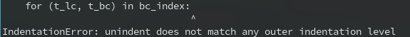
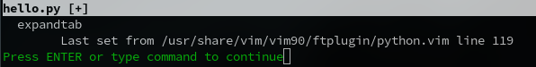
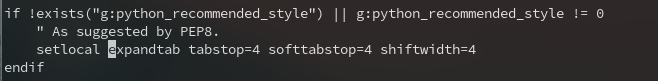

Recently i was writing some python code, i always encountered this error:



And what confuses me is that i have use ```set noexpandtab``` command in ```~/.vimrc```, but it doesn't work. Today i cannot stand it anymore, so i search it and find that [answer](https://vi.stackexchange.com/questions/13537/why-is-set-noexpandtab-in-my-vimrc-ignored-when-i-open-a-file/13538#13538?newreg=0e319cf574ca4183b1303c18a3ae8fac). It seems like python plugin overwrite my setting.

## Solution

1. use ```:verbose set noexpandtab?``` to find the pulgin file

   

2. search expandtab in that file

   

3. change it to noexpandtab

   
