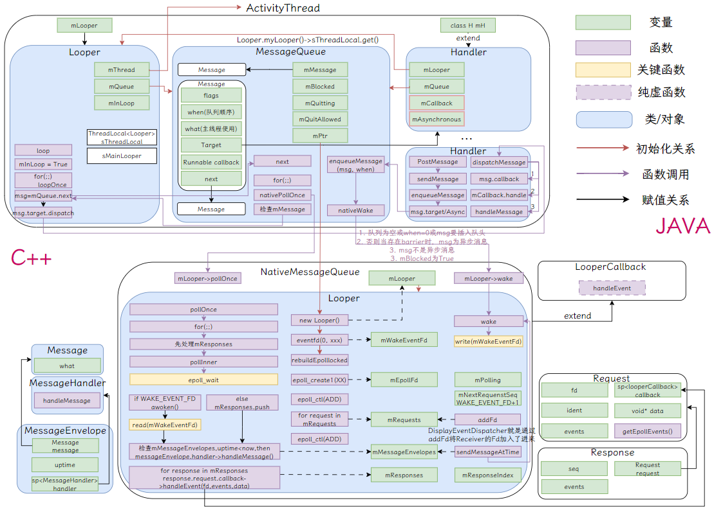
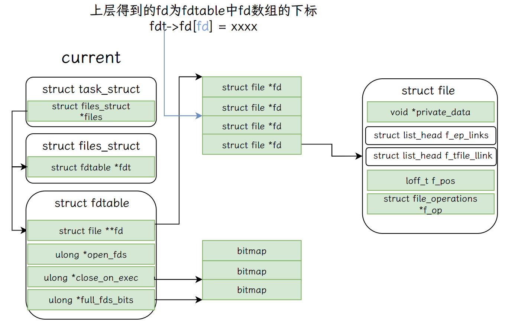
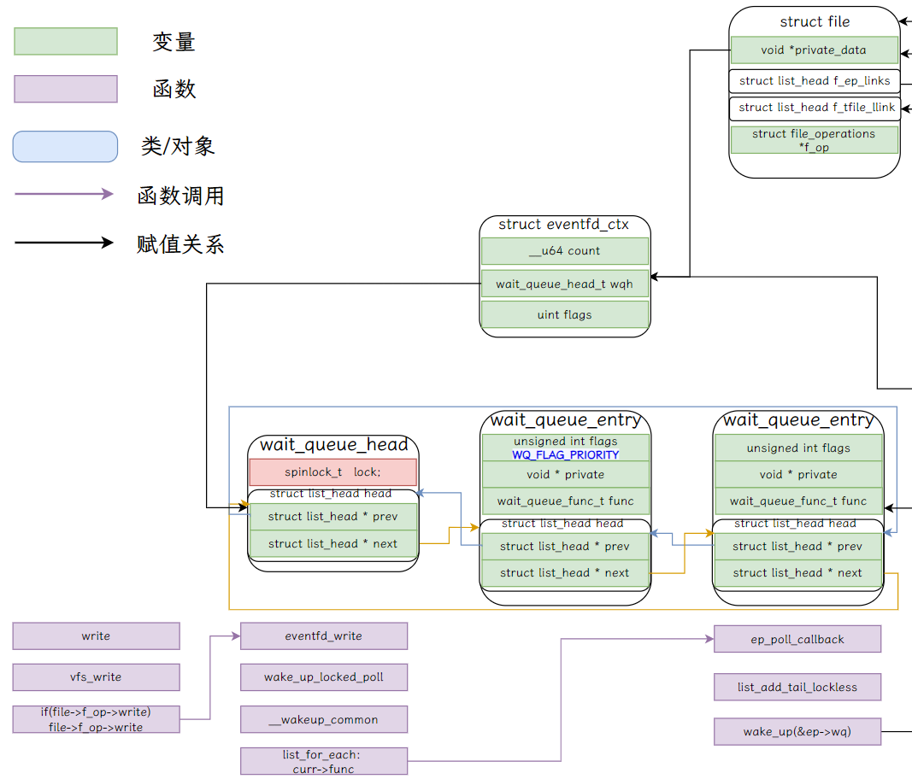
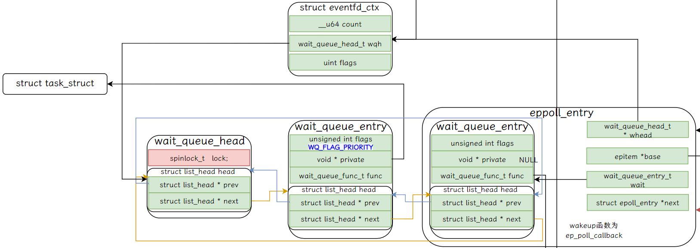
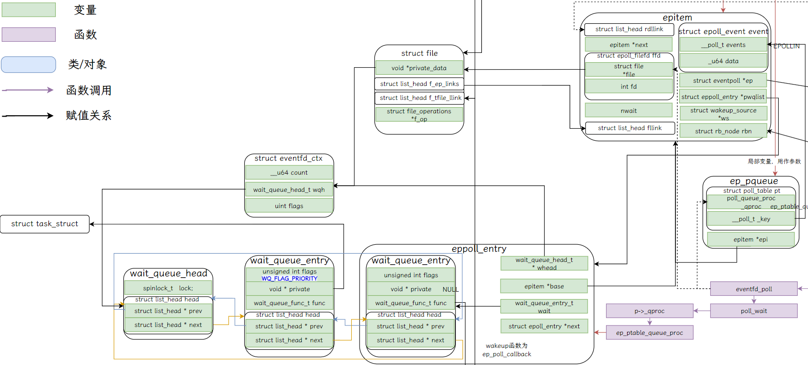
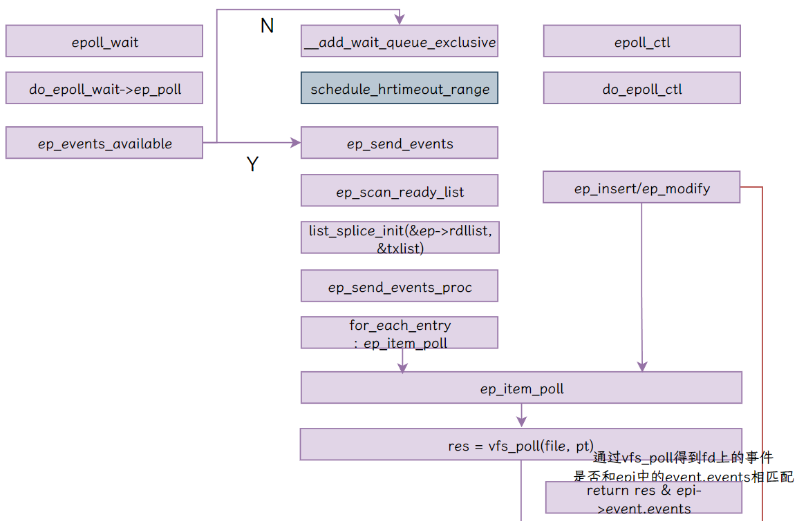
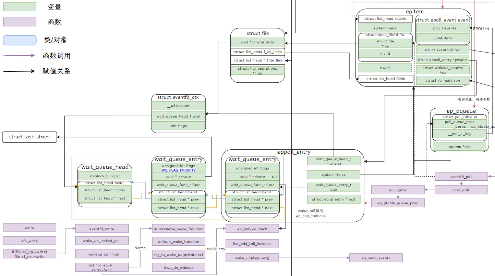

Android中的MessageQueue、Handler和Looper机制底层通过epoll和eventfd实现唤醒和等待，本篇文章致力于从上层对两者的使用以及底层的视角来进行分析。

注：本章源码基于Android14-5.15

## EventFd & Epoll在Android中的使用场景——MessageQueue



MessageQueue是Android中最常见的线程间通信机制，发起方获取接收方的Handler，通过Handler将Message送入接收方的MessageQueue中，接收方通过```loop```函数不断地从自己的MessageQueue中取出Message进行分发，完成请求。其中底层的等待和唤醒用的是```epoll```系统调用，使用的文件描述符是```eventfd```，本篇博客从MessageQueue的视角来看epoll和eventfd的使用。

### MessageQueue初始化

当java层的MessageQueue初始化时会调用C++层的```nativeInit```函数

```C++
MessageQueue(boolean quitAllowed) {
    mQuitAllowed = quitAllowed;
    mPtr = nativeInit();
}
```

```nativeInit```函数位于```android_os_MessageQueue.cpp```中，该函数主要用于创建nativeMessageQueue对象，对象初始化时创建C++层的Looper

```c++
NativeMessageQueue::NativeMessageQueue() : mPollEnv(NULL), mPollObj(NULL), mExceptionObj(NULL) {
    mLooper = Looper::getForThread();           // NULL
    if (mLooper == NULL) {
        mLooper = new Looper(false);            // <---------
        Looper::setForThread(mLooper);
    }
}
```

在```Looper.cpp```中，Looper构造函数中通过函数```eventfd()```创建了Eventfd，将其赋予mWakeEventFd

```C++
Looper::Looper(bool allowNonCallbacks)
    : ... {
    mWakeEventFd.reset(eventfd(0, EFD_NONBLOCK | EFD_CLOEXEC));
	...
    rebuildEpollLocked();
}
```

接着在```rebuildEpollLocked()```函数中，通过函数```epoll_create1()```创建EpollFd，将其赋予给mEpollFd

```c++
void Looper::rebuildEpollLocked() {
    // Allocate the new epoll instance and register the WakeEventFd.
    mEpollFd.reset(epoll_create1(EPOLL_CLOEXEC));
	...
    epoll_event wakeEvent = createEpollEvent(EPOLLIN, WAKE_EVENT_FD_SEQ);
    int result = epoll_ctl(mEpollFd.get(), EPOLL_CTL_ADD, mWakeEventFd.get(), &wakeEvent);
	...
    for (const auto& [seq, request] : mRequests) {
        epoll_event eventItem = createEpollEvent(request.getEpollEvents(), seq);
        int epollResult = epoll_ctl(mEpollFd.get(), EPOLL_CTL_ADD, request.fd, &eventItem);
    }
}
```

接着我们根据根据参数```EPOLLIN```和```WAKE_EVENT_FD_SEQ```创建```epoll_event```，将mWakeEventFd通过```epoll_ctl```函数添加到epoll要等待的事件队列中。

到这里，epoll和eventfd初始化有关的部分结束了，接下来我们看epoll的等待和唤醒。

### 等待和唤醒

等待是通过```epoll_wait```函数进行等待，唤醒则是mWakeEventFd上被写入数据时唤醒。

Java层Looper会通过```loop->loopOnce->mQueue.next->nativePollOnce->Looper::pollInner```层层调用到底层的```epoll_wait```，当timeoutMillis为0或者等待的Fd上存在数据（处于就绪状态），则会立即返回，否则进入等待。

```c++
int Looper::pollInner(int timeoutMillis) {
	...
    struct epoll_event eventItems[EPOLL_MAX_EVENTS];
    int eventCount = epoll_wait(mEpollFd.get(), eventItems, EPOLL_MAX_EVENTS, timeoutMillis);
    ...
}
```

Java层Handler会通过```postMessage/sendMessage->enqueueMessage->nativeWake->Looper::wake```层层调用到底层的```write(mWakeEventFd)```

```c++
void Looper::wake() {
    uint64_t inc = 1;
    ssize_t nWrite = TEMP_FAILURE_RETRY(write(mWakeEventFd.get(), &inc, sizeof(uint64_t)));
}
```

而```Looper::pollInner```中```epoll_wait```被唤醒后，检测到数据为```WAKE_EVENT_FD_SEQ```，且是输入事件，会调用```awoken()```函数，对mWakeEventFd进行读取。这里读取主要是将EventFd底层对应的计数器置为0，否则下一次epoll_wait时会误认为数据准备好直接返回。

```c++
int Looper::pollInner(int timeoutMillis) {
    struct epoll_event eventItems[EPOLL_MAX_EVENTS];
    int eventCount = epoll_wait(mEpollFd.get(), eventItems, EPOLL_MAX_EVENTS, timeoutMillis);

    for (int i = 0; i < eventCount; i++) {
        const SequenceNumber seq = eventItems[i].data.u64;
        uint32_t epollEvents = eventItems[i].events;
        if (seq == WAKE_EVENT_FD_SEQ) {
            if (epollEvents & EPOLLIN) {
                awoken();
            } else {
                ALOGW("Ignoring unexpected epoll events 0x%x on wake event fd.", epollEvents);
            }
        } else {
			...
        }
    }
Done: ;
}

void Looper::awoken() {
    uint64_t counter;
    TEMP_FAILURE_RETRY(read(mWakeEventFd.get(), &counter, sizeof(uint64_t)));
}
```

总结一下，Epoll+EventFd在Android上的使用主要有以下几步：

1. ```eventfd()```函数创建EventFd
2. ```epoll_create1()```函数创建EpollFd
3. ```epoll_ctl(mEpollFd.get(), EPOLL_CTL_ADD, mWakeEventFd.get(), &wakeEvent)```将要监听的EventFd加入EpollFd的列表中
4. ```epoll_wait(mEpollFd.get(), eventItems, EPOLL_MAX_EVENTS, timeoutMillis)```等待mEpollFd上监听的Fd
5. ```Write(xxx)```写入数据到EventFd
6. ```Read(XXX)```对EventFd进行读取

## EventFd 源码分析

#### 前传：Linux中的Fd以及如何跨进程



由上图可知，我们在用户空间获得Fd其实是内核数据结构中数组的下标，内核会根据fdt->fd[fd]找到struct file，该数据结构中的private_data通常保存着和文件有关的上下文。这其实很好地解释了，如果我们想要通过fd通信的话，直接将fd塞给对面为什么是不行的，因为对方在内核中其实并没有建立起这样一个联系。如果先要通过fd跨进程通信，可以参考该文章[3]。而Android中的Binder天生带着跨进程传输fd的机制，就是说当你将fd通过Binder发送给对方时，对方在接受fd后就可以使用该fd和你进行通信了。这主要归功于```Parcel::writeFileDescriptor```函数和Binder Driver中对Fd的处理。

```c
status_t Parcel::writeFileDescriptor(int fd, bool takeOwnership) {
    ...
    #ifdef BINDER_WITH_KERNEL_IPC
        flat_binder_object obj;
        obj.hdr.type = BINDER_TYPE_FD;
        obj.flags = 0;
        obj.binder = 0; /* Don't pass uninitialized stack data to a remote process */
        obj.handle = fd;
        obj.cookie = takeOwnership ? 1 : 0;
        return writeObject(obj, true);
    #else  // BINDER_WITH_KERNEL_IPC
        LOG_ALWAYS_FATAL("Binder kernel driver disabled at build time");
        (void)fd;
        (void)takeOwnership;
        return INVALID_OPERATION;
    #endif // BINDER_WITH_KERNEL_IPC
}
```

Binder Driver中对Fd的处理如下，会在处理Transaction的时候进行转换

```c
static void binder_transaction(struct binder_proc *proc,
			       ...)
{
    ...
		object_size = binder_get_object(target_proc, user_buffer,
				t->buffer, object_offset, &object);
    ...
   		hdr = &object.hdr;
		off_min = object_offset + object_size;
		switch (hdr->type) {
                ...
        case BINDER_TYPE_FD: {
			struct binder_fd_object *fp = to_binder_fd_object(hdr);
			binder_size_t fd_offset = object_offset +
				(uintptr_t)&fp->fd - (uintptr_t)fp;
			int ret = binder_translate_fd(fp->fd, fd_offset, t,
						      thread, in_reply_to);
			...
		} break;
}

static int binder_translate_fd(u32 fd, binder_size_t fd_offset,
			       struct binder_transaction *t,
			       struct binder_thread *thread,
			       struct binder_transaction *in_reply_to)
{

	...
	file = fget(fd);
	/*
	 * Add fixup record for this transaction. The allocation
	 * of the fd in the target needs to be done from a
	 * target thread.
	 */
	fixup = kzalloc(sizeof(*fixup), GFP_KERNEL);
	fixup->file = file;
	fixup->offset = fd_offset;
	fixup->target_fd = -1;
	list_add_tail(&fixup->fixup_entry, &t->fd_fixups);
	return ret;
}
```

binder_thread_read函数中会调用binder_apply_fd_fixups函数，将t->fd_fixups上的所有fd进行处理，从而实现fd的跨进程传递。

```c
static int binder_apply_fd_fixups(struct binder_proc *proc,
				  struct binder_transaction *t)
{
	...
	list_for_each_entry_safe(fixup, tmp, &t->fd_fixups, fixup_entry) {
		fd_install(fixup->target_fd, fixup->file);
		list_del(&fixup->fixup_entry);
		kfree(fixup);
	}
	...
	return ret;
}
```

---

其实MessageQueue对EventFd的使用通常并不用于跨进程传输，通常在Vsync分发时BitTube会将已经进行pair的其中一个fd发给消费者，此时涉及到跨进程传输。回到主线，由上面分析可知，和EventFd主要有关的操作为eventfd创建EventFd、Write和Read，当然，后面还会调用到eventfd_poll函数。

### 创建Eventfd

eventfd包含一个由内核维护的64位无符号整型计数器，创建eventfd时会返回一个文件描述符，进程可以通过对这个文件描述符进行read/write来读取/改变计数器的值，从而实现进程间通信。eventfd不仅可以用于进程间通信，还能用于用户态和内核态的通信。

```eventfd()```函数存在两个参数：

参数initval：创建eventfd时初始值；

参数flags：eventfd文件描述符的标志，有下面三个：

* EFD_CLOEXEC：表示eventfd在exec其他程序时会自动关闭这个文件描述符

* EFD_NONBLOCK：表示eventfd非阻塞

* EFD_SEMAPHORE：表示eventfd作为一个信号量来使用

```C
//代码路径：/fs/eventfd.c
SYSCALL_DEFINE2(eventfd2, unsigned int, count, int, flags)
{
	return do_eventfd(count, flags);
}

static int do_eventfd(unsigned int count, int flags)
{
	struct eventfd_ctx *ctx;
	struct file *file;
	int fd;
...
	ctx = kmalloc(sizeof(*ctx), GFP_KERNEL);
...
	kref_init(&ctx->kref);
	init_waitqueue_head(&ctx->wqh);
	ctx->count = count;
	ctx->flags = flags;
	ctx->id = ida_simple_get(&eventfd_ida, 0, 0, GFP_KERNEL);
...
	flags &= EFD_SHARED_FCNTL_FLAGS;
	flags |= O_RDWR;
	fd = get_unused_fd_flags(flags);
...
	file = anon_inode_getfile("[eventfd]", &eventfd_fops, ctx, flags);
	file->f_mode |= FMODE_NOWAIT;
	fd_install(fd, file);
	return fd;
}
```

代码中主要主要干了如下几件事情

1. 初始化```eventfd_ctx```结构体中的内容
2. ```get_unused_fd_flags```获取当前fdt进程中空闲的fdt描述符
3. ```anon_inode_getfile``` 真正的创建文件描述符，并且把eventfd的文件操作结构体复写进去。
4. ```fd_install ```通过RCU机制把创建出来的文件描述符和fd关联起来

#### 初始化eventfd_ctx结构体中的内容

```c
struct eventfd_ctx {
	struct kref kref;
	wait_queue_head_t wqh;
	/*
	 * Every time that a write(2) is performed on an eventfd, the
	 * value of the __u64 being written is added to "count" and a
	 * wakeup is performed on "wqh". A read(2) will return the "count"
	 * value to userspace, and will reset "count" to zero. The kernel
	 * side eventfd_signal() also, adds to the "count" counter and issue a wakeup.
	 */
	__u64 count;
	unsigned int flags;
	int id;
};
```

我们通过内核的注释可以看到，当eventfd上执行write操作时，count值加上写入的数值，同时唤醒wqh上的线程；eventfd上执行read操作时，count值返回给用户空间，且count被置为zero。其中对kref初始化时将其中的refcount设置为了1，我们看一下对wait_queue_head_t的初始化。

```c
struct wait_queue_head {
	spinlock_t		lock;
	struct list_head	head;
};
typedef struct wait_queue_head wait_queue_head_t;

#define init_waitqueue_head(wq_head)						\
	do {									\
		static struct lock_class_key __key;				\
										\
		__init_waitqueue_head((wq_head), #wq_head, &__key);		\
	} while (0)

void __init_waitqueue_head(struct wait_queue_head *wq_head, const char *name, struct lock_class_key *key)
{
	spin_lock_init(&wq_head->lock);
	lockdep_set_class_and_name(&wq_head->lock, key, name);
	INIT_LIST_HEAD(&wq_head->head);
}
```

wq_head中的head成员为双向链表元素，是Linux内核最常见的数据结构之一，其中包含一个prev指针和next指针，```INIT_LIST_HEAD```宏将两个指针指向head自己。

#### anon_inode_getfile创建file

```rust
struct file *anon_inode_getfile(const char *name,
                const struct file_operations *fops,
                void *priv, int flags)
{
    if (fops->owner && !try_module_get(fops->owner))
        return ERR_PTR(-ENOENT);
    file = alloc_file(&path, OPEN_FMODE(flags), fops);
    file->f_mapping = anon_inode_inode->i_mapping;
    file->f_flags = flags & (O_ACCMODE | O_NONBLOCK);
    file->private_data = priv;
    return file;
}

static const struct file_operations eventfd_fops = {
#ifdef CONFIG_PROC_FS
	.show_fdinfo	= eventfd_show_fdinfo,
#endif
	.release	= eventfd_release,
	.poll		= eventfd_poll,
	.read_iter	= eventfd_read,
	.write		= eventfd_write,
	.llseek		= noop_llseek,
};
```

核心方法就是alloc_file方法。创建一个文件描述符，写入private_data并传递fops。而这个文件描述符的名字是"[eventfd]"，并且把eventfd_ctx上下作为当前file的私有数据。当然，每一个进程里面都有一个fs结构体，象征着这个进程所在的目录，而这个eventfd则是说明是在这个目录下的创建的一个虚拟文件。

### Eventfd有关的读写操作

#### 写操作

```C++
static ssize_t eventfd_write(struct file *file, const char __user *buf, size_t count,loff_t *ppos)
{
	struct eventfd_ctx *ctx = file->private_data;
	ssize_t res;
	__u64 ucnt;
	DECLARE_WAITQUEUE(wait, current);
    if (copy_from_user(&ucnt, buf, sizeof(ucnt)))
        return -EFAULT;
	spin_lock_irq(&ctx->wqh.lock);
	if (ULLONG_MAX - ctx->count > ucnt)
		res = sizeof(ucnt);
	else if (!(file->f_flags & O_NONBLOCK)) {
		__add_wait_queue(&ctx->wqh, &wait);
		for (res = 0;;) {
			set_current_state(TASK_INTERRUPTIBLE);
			if (ULLONG_MAX - ctx->count > ucnt) {
				res = sizeof(ucnt);
				break;
			}
			if (signal_pending(current)) {
				res = -ERESTARTSYS;
				break;
			}
			spin_unlock_irq(&ctx->wqh.lock);
			schedule();
			spin_lock_irq(&ctx->wqh.lock);
		}
		__remove_wait_queue(&ctx->wqh, &wait);
		__set_current_state(TASK_RUNNING);
	}
	if (likely(res > 0)) {
		ctx->count += ucnt;
		if (waitqueue_active(&ctx->wqh))
			wake_up_locked_poll(&ctx->wqh, EPOLLIN);
	}
	spin_unlock_irq(&ctx->wqh.lock);

	return res;
}
```

1. 定义wait_entry等待项

   ```c
   struct wait_queue_entry {
   	unsigned int		flags;
   	void			*private;
   	wait_queue_func_t	func;
   	struct list_head	entry;
   };
   #define __WAITQUEUE_INITIALIZER(name, tsk) {					\
   	.private	= tsk,							\
   	.func		= default_wake_function,				\
   	.entry		= { NULL, NULL } }
   
   #define DECLARE_WAITQUEUE(name, tsk)						\
   	struct wait_queue_entry name = __WAITQUEUE_INITIALIZER(name, tsk)
   ```

2. copy_from_user将用户空间内容拷贝到ucnt中，ucnt中为write要写入的值。

3. 当ucnt加上event_ctx中count值小于ULLONG_MAX，表示可以写入；否则判断flags是否为非阻塞，

   1. 阻塞

      将上下文对应的等待entry添加到等待队列中。该循环首先会切换当前进程进入到TASK_INTERRUPTIBLE，该循环不断的通过schedule方法切换到最需要切换处理的进程(vruntime最小的)。跳出的循环条件有两个，第一个当（ULLONG_MAX - ctx的count）的值 比拷贝下来的数据大，则直接测量当前数据的大小后跳出。第二，就是被中断信号中断了。最后把当前的等待队列头从等待队列移除出来，把进程设置为TASK_RUNNING

   2. 非阻塞

      此时res并没有赋值，会在后面直接进行返回，并不更新ctx中的count

4. 当res大于0（传递下来有数据），则把当前的计数增加一个输入进来的数据大小，最后唤醒等待队列中的进程。返回结果。



#### 读操作

```c
void eventfd_ctx_do_read(struct eventfd_ctx *ctx, __u64 *cnt)
{
	lockdep_assert_held(&ctx->wqh.lock);
	*cnt = ((ctx->flags & EFD_SEMAPHORE) && ctx->count) ? 1 : ctx->count;
	ctx->count -= *cnt;
}

static ssize_t eventfd_read(struct kiocb *iocb, struct iov_iter *to)
{
	struct file *file = iocb->ki_filp;
	struct eventfd_ctx *ctx = file->private_data;
	__u64 ucnt = 0;
	DECLARE_WAITQUEUE(wait, current);
...
	spin_lock_irq(&ctx->wqh.lock);
	if (!ctx->count) {
		if ((file->f_flags & O_NONBLOCK) ||
		    (iocb->ki_flags & IOCB_NOWAIT)) {
			spin_unlock_irq(&ctx->wqh.lock);
			return -EAGAIN;
		}
		__add_wait_queue(&ctx->wqh, &wait);
		for (;;) {
			set_current_state(TASK_INTERRUPTIBLE);
			if (ctx->count)
				break;
			if (signal_pending(current)) {
				__remove_wait_queue(&ctx->wqh, &wait);
				__set_current_state(TASK_RUNNING);
				spin_unlock_irq(&ctx->wqh.lock);
				return -ERESTARTSYS;
			}
			spin_unlock_irq(&ctx->wqh.lock);
			schedule();
			spin_lock_irq(&ctx->wqh.lock);
		}
		__remove_wait_queue(&ctx->wqh, &wait);
		__set_current_state(TASK_RUNNING);
	}
	eventfd_ctx_do_read(ctx, &ucnt);
	if (waitqueue_active(&ctx->wqh))
		wake_up_locked_poll(&ctx->wqh, EPOLLOUT);
	spin_unlock_irq(&ctx->wqh.lock);
	...
	return sizeof(ucnt);
}
```

1. 定义wait_entry等待项
2. 判断ctx中count是否不为0，为0表示没有可读内容，则加入等待队列直到count不为0；否则表示存在可读内容，通过eventfd_ctx_do_read函数将ctx_count内容读到ucnt，同时将其置为0。
3. 如果等待队列上存在entry，则进行唤醒。

阅读源码之后，尝试总结这种系统调用比起常规的file的读写优势。

1. eventfd不会像file的读写一样尝试着构建一个文件在磁盘上，写入缓存后把脏数据写入磁盘。eventfd只会在内存中构建一个名为[eventfd]的虚拟文件，在这个文件中进行通信。

2. eventfd 不能像正常的file一样读写大量的数据。其读写是有限制的。所有的写数据都在一个无符号64位的count上，它会记录下所有写进来的数据。但是也正是整个原因累积写入的数据一旦超出这个这个值，将会失败。所以eventfd通常使用来做通知的。

3. 在eventfd中，无论是读还是写都会先进入一个循环，读数据的时候，如果没有任何读取，将会不断的进行进程调度切换。而数据是写入当前file结构体私有数据中的eventfd_ctx。

4. 注意一下，写入数据时候的逻辑:

   >  ULLONG_MAX - ctx->count > ucnt

   这个逻辑是跳出进程调度循环逻辑。换句话说，当写入的数据+累加的数据大于当前的无符号64位的最大值的时候，会进入阻塞等待其他进程的消耗在eventfd中累积的数据，直到小于这个最大值。才允许继续写入。而read则是如果可读的数据为0，一直等待读取数据。我们需要注意一个问题，每一次写入数据的量要足够小，而且必须想办法消耗，同时要保证先写后读，不然如果只有一个进程关注这个eventfd文件，就可能会出现死锁的情况。

### Eventfd有关的epoll操作

```ep_insert->ep_item_poll->vfs_poll->eventfd_poll```调用链，会在epoll中进行介绍。

```c
static __poll_t eventfd_poll(struct file *file, poll_table *wait)
{
	struct eventfd_ctx *ctx = file->private_data;
	__poll_t events = 0;
	u64 count;

	poll_wait(file, &ctx->wqh, wait);
	count = READ_ONCE(ctx->count);

	if (count > 0)
		events |= EPOLLIN;
	if (count == ULLONG_MAX)
		events |= EPOLLERR;
	if (ULLONG_MAX - 1 > count)
		events |= EPOLLOUT;

	return events;
}

static inline void poll_wait(struct file * filp, wait_queue_head_t * wait_address, poll_table *p)
{
	if (p && p->_qproc && wait_address)
		p->_qproc(filp, wait_address, p);
}

typedef struct poll_table_struct {
	poll_queue_proc _qproc;
	__poll_t _key;
} poll_table;

typedef void (*poll_queue_proc)(struct file *, wait_queue_head_t *, struct poll_table_struct *);
```

_qproc函数为外面传入的函数ep_ptable_queue_proc，会在epoll中进行讲解，该函数的作用是生成一个eppoll_entry插入eventfd的等待队列中，效果如下。



## Epoll 源码分析

epoll的使用一般分为三个步骤:

1. 调用```epoll_create```构建一个epoll的句柄

   ```c
   EpollFd = epoll_create(EPOLL_SIZE_HINT);
   ```

2. 调用```epoll_ctl``` 注册一个事件的监听，这个事件一般是文件描述符的数据是否发生变化

   ```c
   epoll_ctl(mEpollFd, EPOLL_CTL_ADD, mWakeEventFd, &eventItem);
   ```

   该方法的作用是向mEpollFd句柄中注册一个新的事件监听mWakeEventFd，把eventItem作为相关的数据传入，其中eventItem为一个epoll_event类型的结构体

   ```
   struct epoll_event
   {
     uint32_t events;	/* Epoll events */
     epoll_data_t data;	/* User data variable */
   } 
   ```

   events为要监听的事件类型，可以是EPOLLIN和EPOLLOUT等等，data为自定义的数据。

3. 调用```epoll_wait```阻塞当前的循环，直到监听到数据流发生变化，就释放阻塞进行下一步

   ```
   epoll_wait(mEpollFd, eventItems, EPOLL_MAX_EVENTS, timeoutMillis);
   ```

   该方法的作用为将会监听mEpollFd句柄中之前添加所有的fd对应的监听事件，设定了最大的监听量以及超时事件。如果发生了某些监听对象发生了变化，则把相关变化的数据输出到eventItems中。

### Epoll Create

```c
SYSCALL_DEFINE1(epoll_create1, int, flags)
{
	return do_epoll_create(flags);
}

static int do_epoll_create(int flags)
{
	int error, fd;
	struct eventpoll *ep = NULL;
	struct file *file;
	/*
	 * Create the internal data structure ("struct eventpoll").
	 */
	error = ep_alloc(&ep);
	if (error < 0)
		return error;
	/*
	 * Creates all the items needed to setup an eventpoll file. That is,  a file structure and a free file descriptor.
	 */
	fd = get_unused_fd_flags(O_RDWR | (flags & O_CLOEXEC));
	file = anon_inode_getfile("[eventpoll]", &eventpoll_fops, ep,
				 O_RDWR | (flags & O_CLOEXEC));

	ep->file = file;
	fd_install(fd, file);
	return fd;
}
```

其实和eventfd创建时做的事情类似

1. 创建struct eventpoll结构体
2. ```get_unused_fd_flags```获取未使用的fd
3. ```anon_inode_getfile```创建file，将ep（eventpoll类型）作为其private_data
4. ```fd_install```将fdtable和file关联起来

do_epoll_create中的ep_alloc函数做的事情也比较简单， 通过kzalloc分配内存，并赋予初值。我们详细看一下eventpoll数据结构

```c++
/*
 * This structure is stored inside the "private_data" member of the file structure and represents the main data structure for the eventpoll interface.
 */
struct eventpoll {
	struct mutex mtx;
	/* Wait queue used by sys_epoll_wait() */
	wait_queue_head_t wq;
	/* Wait queue used by file->poll() */
	wait_queue_head_t poll_wait;
	/* List of ready file descriptors */
	struct list_head rdllist;
	/* Lock which protects rdllist and ovflist */
	rwlock_t lock;
	/* RB tree root used to store monitored fd structs */
	struct rb_root_cached rbr;
	/*
	 * This is a single linked list that chains all the "struct epitem" that
	 * happened while transferring ready events to userspace w/out
	 * holding ->lock.
	 */
	struct epitem *ovflist;
	/* wakeup_source used when ep_send_events or __ep_eventpoll_poll is running */
	struct wakeup_source *ws;
	/* The user that created the eventpoll descriptor */
	struct user_struct *user;

	struct file *file;

	/* used to optimize loop detection check */
	u64 gen;
	struct hlist_head refs;
	...
};
```

其中比较重要的成员有

1. wq

   等待队列，用于epoll_wait调用时向wq中加入entry

2. poll_wait

   等待队列，用于poll调用时向wq中加入entry

3. rdllist

   就绪的文件链表，当监听事件出现时，将对应的fd添加到rddlist上

4. rbr

   用于储存监视fd的红黑树

### Epoll_ctl

```c
SYSCALL_DEFINE4(epoll_ctl, int, epfd, int, op, int, fd,
		struct epoll_event __user *, event)
{
	struct epoll_event epds;
	if (ep_op_has_event(op) &&
	    copy_from_user(&epds, event, sizeof(struct epoll_event)))
		return -EFAULT;
	return do_epoll_ctl(epfd, op, fd, &epds, false);
}

int do_epoll_ctl(int epfd, int op, int fd, struct epoll_event *epds,
		 bool nonblock)
{
	int error;
	int full_check = 0;
	struct fd f, tf;
	struct eventpoll *ep;
	struct epitem *epi;
	struct eventpoll *tep = NULL;

	error = -EBADF;
	f = fdget(epfd);
	/* Get the "struct file *" for the target file */
	tf = fdget(fd);
	...

	/*
	 * At this point it is safe to assume that the "private_data" contains our own data structure.
	 */
	ep = f.file->private_data;
	error = epoll_mutex_lock(&ep->mtx, 0, nonblock);

    //loop check
	if (op == EPOLL_CTL_ADD) {
		if (!list_empty(&f.file->f_ep_links) ||
				ep->gen == loop_check_gen ||
						is_file_epoll(tf.file)) {
			...
		}
	}

	/*
	 * Try to lookup the file inside our RB tree
	 */
	epi = ep_find(ep, tf.file, fd);

	error = -EINVAL;
	switch (op) {
	case EPOLL_CTL_ADD:
		if (!epi) {
			epds->events |= EPOLLERR | EPOLLHUP;
			error = ep_insert(ep, epds, tf.file, fd, full_check);
		} else
			error = -EEXIST;
		break;
	...
	}
	if (tep != NULL)
		mutex_unlock(&tep->mtx);
	mutex_unlock(&ep->mtx);

	return error;
}
```

1. 根据epfd和fd获取struct fd

   ```c
   struct fd {
   	struct file *file;
   	unsigned int flags;
   };
   ```

   即获取其关联的file结构，flags暂时不用关心

2. 各种错误检测（代码被我略去），主要是要求目标文件必须要支持poll操作，即eventfd需要支持poll操作

3. 获取eventpoll数据ep

4. ```ep_find```函数，在ep的二叉树rbr中通过file和fd进行寻找对应的epitem，此时由于并未插入过，所以epi为null

5. 处理op，如果是```EPOLL_CTL_ADD```，且epi为null（并不在二叉树中），设置对应的epoll_event的events或上```EPOLLERR```和```EPOLLHUP```，调用\```ep_insert\```函数，该函数创建对应的epitem，并将其插入二叉树中。

下面详细看看ep_insert函数，该函数将epitem插入ep管理的二叉树中，创建entry插入目标fd对应的等待队列中。

```c++
static int ep_insert(struct eventpoll *ep, const struct epoll_event *event,
		     struct file *tfile, int fd, int full_check)
{
	int error, pwake = 0;
	__poll_t revents;
	struct epitem *epi;
	struct ep_pqueue epq;
	struct eventpoll *tep = NULL;

	if (is_file_epoll(tfile))
		tep = tfile->private_data;

	...
    
	if (!(epi = kmem_cache_zalloc(epi_cache, GFP_KERNEL))) {
		percpu_counter_dec(&ep->user->epoll_watches);
		return -ENOMEM;
	}

	/* Item initialization follow here ... */
	INIT_LIST_HEAD(&epi->rdllink);
	epi->ep = ep;
	ep_set_ffd(&epi->ffd, tfile, fd);
	epi->event = *event;
	epi->next = EP_UNACTIVE_PTR;

	if (tep)
		mutex_lock_nested(&tep->mtx, 1);
	/* Add the current item to the list of active epoll hook for this file */
	if (unlikely(attach_epitem(tfile, epi) < 0)) {
		if (tep)
			mutex_unlock(&tep->mtx);
		kmem_cache_free(epi_cache, epi);
		percpu_counter_dec(&ep->user->epoll_watches);
		return -ENOMEM;
	}

	if (full_check && !tep)
		list_file(tfile);

	/*
	 * Add the current item to the RB tree. All RB tree operations are
	 * protected by "mtx", and ep_insert() is called with "mtx" held.
	 */
	ep_rbtree_insert(ep, epi);
	if (tep)
		mutex_unlock(&tep->mtx);

	ep_get(ep);

	...

	/* Initialize the poll table using the queue callback */
	epq.epi = epi;
	init_poll_funcptr(&epq.pt, ep_ptable_queue_proc);

	revents = ep_item_poll(epi, &epq.pt, 1);

	/* We have to drop the new item inside our item list to keep track of it */
	write_lock_irq(&ep->lock);

	/* record NAPI ID of new item if present */
	ep_set_busy_poll_napi_id(epi);

	/* If the file is already "ready" we drop it inside the ready list */
	if (revents && !ep_is_linked(epi)) {
		list_add_tail(&epi->rdllink, &ep->rdllist);
		ep_pm_stay_awake(epi);

		/* Notify waiting tasks that events are available */
		if (waitqueue_active(&ep->wq))
			wake_up(&ep->wq);
		if (waitqueue_active(&ep->poll_wait))
			pwake++;
	}

	write_unlock_irq(&ep->lock);

	/* We have to call this outside the lock */
	if (pwake)
		ep_poll_safewake(ep, NULL, 0);

	return 0;
}
```

1. 创建ep_pqueue结构体epq，kmem_cache_zalloc分配epitem的堆空间

2. 初始化rdllink、ep、ffd、event和next成员

   1. rdllink

      还记得eventpoll的成员rdllist么，两者链接起来形成链表，表示epitem对应的fd加入就绪队列

   2. ep

      连接eventpoll

   3. ffd

      包含数据成员file和fd，连接目标文件的file和fd，可以视为eventfd的file和fd

   4. event

      包含events成员和data成员，events表示监听的事件类型。

3. 初始化epq

   epq包含以下两个成员

   1. ```struct epitem *epi```：指向epitem

   2. ```struct poll_table pt```：该数据结构包含两个成员

      1. ```poll_queue_proc _qproc```

         ```c
         typedef void (*poll_queue_proc)(struct file *, wait_queue_head_t *, struct poll_table_struct *);
         ```

      2. ```__poll_t _key```

         ```c
         typedef unsigned __bitwise __poll_t;
         ```

   ```init_poll_funcptr```函数将两个成员进行初始化，将函数指针设置为```ep_ptable_queue_proc```，_key设置为0。

   ```c
   init_poll_funcptr(&epq.pt, ep_ptable_queue_proc);
   
   static inline void init_poll_funcptr(poll_table *pt, poll_queue_proc qproc)
   {
   	pt->_qproc = qproc;
   	pt->_key   = ~(__poll_t)0; /* all events enabled */
   }
   ```

4. ep_item_poll函数，将pt的key设置为epi.event.events，层层调用到vfs_poll->eventfd_poll->poll_wait函数

   ```c
   static __poll_t ep_item_poll(const struct epitem *epi, poll_table *pt, int depth)
   {
   	struct file *file = epi_fget(epi);
   	__poll_t res;
       
   	pt->_key = epi->event.events;
   	if (!is_file_epoll(file))
   		res = vfs_poll(file, pt);
   	else
   		res = __ep_eventpoll_poll(file, pt, depth);
   	fput(file);
   	return res & epi->event.events;
   }
   ```

   我们再回顾一下eventfd_poll

   ```c
   static __poll_t eventfd_poll(struct file *file, poll_table *wait)
   {
   	struct eventfd_ctx *ctx = file->private_data;
   	__poll_t events = 0;
   	u64 count;
   
   	poll_wait(file, &ctx->wqh, wait);
   	count = READ_ONCE(ctx->count);
   
   	if (count > 0)
   		events |= EPOLLIN;
   	if (count == ULLONG_MAX)
   		events |= EPOLLERR;
   	if (ULLONG_MAX - 1 > count)
   		events |= EPOLLOUT;
   
   	return events;
   }
   
   static inline void poll_wait(struct file * filp, wait_queue_head_t * wait_address, poll_table *p)
   {
   	if (p && p->_qproc && wait_address)
   		p->_qproc(filp, wait_address, p);
   }
   ```

   可以看到调用了poll_table的_qproc函数，即我们前面赋值的```ep_ptable_queue_proc```函数。

   ```c
   /*
    * This is the callback that is used to add our wait queue to the target file wakeup lists.
    */
   static void ep_ptable_queue_proc(struct file *file, wait_queue_head_t *whead,
   				 poll_table *pt)
   {
   	struct ep_pqueue *epq = container_of(pt, struct ep_pqueue, pt);
   	struct epitem *epi = epq->epi;
   	struct eppoll_entry *pwq;
   
   	pwq = kmem_cache_alloc(pwq_cache, GFP_KERNEL);
   	if (unlikely(!pwq)) {
   		epq->epi = NULL;
   		return;
   	}
   
   	init_waitqueue_func_entry(&pwq->wait, ep_poll_callback);
   	pwq->whead = whead;
   	pwq->base = epi;
   	if (epi->event.events & EPOLLEXCLUSIVE)
   		add_wait_queue_exclusive(whead, &pwq->wait);
   	else
   		add_wait_queue(whead, &pwq->wait);
   	pwq->next = epi->pwqlist;
   	epi->pwqlist = pwq;
   }
   ```

   该函数的主要作用为创建eppoll_entry变量，其中包含数据成员wait_queue_entry_t wait，将其加入到eventfd_ctx对应的等待队列中

这种设计十分常见，几乎所有关于poll和epoll方法的重写都是这样设计的。需要重写一个qproc的方法，通过vfs_poll调用到对应文件op的poll函数时，通过poll_wait调用自己重写的qproc方法，把自己的等待队列和上层调度者的等待队列关联起来，这样一旦唤醒了该文件的等待队列同时也会唤起上层调度者对应的等待队列。



### Epoll_wait



```c
SYSCALL_DEFINE4(epoll_wait, int, epfd, struct epoll_event __user *, events,
		int, maxevents, int, timeout)
{
	return do_epoll_wait(epfd, events, maxevents, timeout);
}

static int do_epoll_wait(int epfd, struct epoll_event __user *events,
			 int maxevents, int timeout)
{
	struct fd f;
	struct eventpoll *ep;
	/* Get the "struct file *" for the eventpoll file */
	f = fdget(epfd);
	ep = f.file->private_data;
	/* Time to fish for events ... */
	error = ep_poll(ep, events, maxevents, timeout);
}

static int ep_poll(struct eventpoll *ep, struct epoll_event __user *events,
		   int maxevents, long timeout)
{
	int res = 0, eavail, timed_out = 0;
	u64 slack = 0;
	wait_queue_entry_t wait;
	ktime_t expires, *to = NULL;

	lockdep_assert_irqs_enabled();

	if (timeout > 0) {
		struct timespec64 end_time = ep_set_mstimeout(timeout);

		slack = select_estimate_accuracy(&end_time);
		to = &expires;
		*to = timespec64_to_ktime(end_time);
	} else if (timeout == 0) {

		timed_out = 1;

		write_lock_irq(&ep->lock);
		eavail = ep_events_available(ep);
		write_unlock_irq(&ep->lock);

		goto send_events;
	}

fetch_events:

	if (!ep_events_available(ep))
		ep_busy_loop(ep, timed_out);

	eavail = ep_events_available(ep);
	if (eavail)
		goto send_events;

	/*
	 * Busy poll timed out.  Drop NAPI ID for now, we can add
	 * it back in when we have moved a socket with a valid NAPI
	 * ID onto the ready list.
	 */
	ep_reset_busy_poll_napi_id(ep);

	do {
		init_wait(&wait);

		write_lock_irq(&ep->lock);
		/*
		 * Barrierless variant, waitqueue_active() is called under
		 * the same lock on wakeup ep_poll_callback() side, so it
		 * is safe to avoid an explicit barrier.
		 */
		__set_current_state(TASK_INTERRUPTIBLE);

		/*
		 * Do the final check under the lock. ep_scan_ready_list()
		 * plays with two lists (->rdllist and ->ovflist) and there
		 * is always a race when both lists are empty for short
		 * period of time although events are pending, so lock is
		 * important.
		 */
		eavail = ep_events_available(ep);
		if (!eavail) {
			if (signal_pending(current))
				res = -EINTR;
			else
				__add_wait_queue_exclusive(&ep->wq, &wait);
		}
		write_unlock_irq(&ep->lock);

		if (eavail || res)
			break;

		if (!schedule_hrtimeout_range(to, slack, HRTIMER_MODE_ABS)) {
			timed_out = 1;
			break;
		}

		/* We were woken up, thus go and try to harvest some events */
		eavail = 1;

	} while (0);

	__set_current_state(TASK_RUNNING);

	if (!list_empty_careful(&wait.entry)) {
		write_lock_irq(&ep->lock);
		__remove_wait_queue(&ep->wq, &wait);
		write_unlock_irq(&ep->lock);
	}

send_events:
	if (fatal_signal_pending(current)) {
		res = -EINTR;
	}
	/*
	 * Try to transfer events to user space. In case we get 0 events and
	 * there's still timeout left over, we go trying again in search of
	 * more luck.
	 */
	if (!res && eavail &&
	    !(res = ep_send_events(ep, events, maxevents)) && !timed_out)
		goto fetch_events;

	return res;
}
```

其中有几个比较关键的函数

1. ep_events_available(struct eventpoll *ep)

   ```c
   static inline int ep_events_available(struct eventpoll *ep)
   {
   	return !list_empty_careful(&ep->rdllist) ||
   		READ_ONCE(ep->ovflist) != EP_UNACTIVE_PTR;
   }
   ```

   检测rdllist是否为空以及ovflist是否为UNACTIVE_PTR，当不会空或指针不为UNACTIVE，则表示有准备好的事件，返回true，否则返回false。

2. ep_sent_events(ep, events, maxevents)

   当存在可用事件时会调用该函数，将可用事件发到用户空间

   ```c
   static int ep_send_events(struct eventpoll *ep,
   			  struct epoll_event __user *events, int maxevents)
   {
   	struct epitem *epi, *tmp;
   	LIST_HEAD(txlist);
   	poll_table pt;
   	int res = 0;
   
   	init_poll_funcptr(&pt, NULL);
   	mutex_lock(&ep->mtx);
   	ep_start_scan(ep, &txlist);
   
   	list_for_each_entry_safe(epi, tmp, &txlist, rdllink) {
   		struct wakeup_source *ws;
   		__poll_t revents;
   
   		if (res >= maxevents)
   			break;
   		...
   		list_del_init(&epi->rdllink);
   
   		revents = ep_item_poll(epi, &pt, 1);
   		if (!revents)
   			continue;
   
   		events = epoll_put_uevent(revents, epi->event.data, events);
   		...
   	}
   	ep_done_scan(ep, &txlist);
   	mutex_unlock(&ep->mtx);
   
   	return res;
   }
   ```

   1. ```init_poll_funcptr```将poll_table的指针初始化为NULL，表示后面调用到ep_item_poll函数时qproc为空，不进行任何操作，只是单纯的将fd发生的事件返回，和一开始```ep_insert```时有区别。

   2. ```ep_start_scan```将ep中rdlist的内容赋予到链表txlist上，同时将ep->ovflist置为NULL。

   3. 遍历txlist的每个entry，根据上面链接的epi，调用```ep_item_poll```函数，该函数会调用```vfs_poll```函数返回fd上对应的事件，然后和epi->event.events相与，返回我们监听的事件。

      ```c
      static __poll_t ep_item_poll(const struct epitem *epi, poll_table *pt,
      				 int depth)
      {
      	struct file *file = epi_fget(epi);
      	__poll_t res;
      
      	pt->_key = epi->event.events;
      	if (!is_file_epoll(file))
      		res = vfs_poll(file, pt);
      	else
      		res = __ep_eventpoll_poll(file, pt, depth);
      	fput(file);
      	return res & epi->event.events;
      }
      ```

   4. epoll_put_uevent将revents和data放入到用户空间的uevent中，revents表示事件类型，data用于区分fd，前面我们epoll_ctl的时候mWakeEventFd中构造的epoll_event，他的data为一个序列号，后面我们会根据该data来判断是哪个fd发生了EPOLL_IN事件

3. 如果不存在准备好的事件

   1. 初始化一个wait_entry

   2. 通过__add_wait_queue_exclusive将其加入到ep->wq中，exclusive表示独立唤醒，避免唤醒风暴，唤醒到本entry不再继续唤醒（如果传入参数nr_exclusive此时为0）

   3. ```schedule_hrtimeout_range```等待唤醒或者timeout

      被唤醒后可能有两种情况

      1. wait不在ep->wq中，表示被唤醒，此时eavail为1
      2. wait在ep->wq中，表示是被timeout叫醒的，此时eavail为0

到这里，我们少分析了一个函数，就是当时创建eppoll_entry时，被hook上去的```ep_poll_callback```函数，该函数会在epoll_write或者read的时候被检测到等待队列上有等待者，从而调用wait_entry的wait_queue_func_t，也就是```ep_poll_callback```函数

```c
static int ep_poll_callback(wait_queue_entry_t *wait, unsigned mode, int sync, void *key)
{
	int pwake = 0;
	struct epitem *epi = ep_item_from_wait(wait);
	struct eventpoll *ep = epi->ep;
	__poll_t pollflags = key_to_poll(key);
	unsigned long flags;
	int ewake = 0;

	read_lock_irqsave(&ep->lock, flags);
	ep_set_busy_poll_napi_id(epi);
	...

	/*
	 * Wake up ( if active ) both the eventpoll wait list and the ->poll()
	 * wait list.
	 */
	if (waitqueue_active(&ep->wq)) {
		if ((epi->event.events & EPOLLEXCLUSIVE) &&
					!(pollflags & POLLFREE)) {
			switch (pollflags & EPOLLINOUT_BITS) {
			case EPOLLIN:
				if (epi->event.events & EPOLLIN)
					ewake = 1;
				break;
			case EPOLLOUT:
				if (epi->event.events & EPOLLOUT)
					ewake = 1;
				break;
			case 0:
				ewake = 1;
				break;
			}
		}
		wake_up(&ep->wq);
	}
	if (waitqueue_active(&ep->poll_wait))
		pwake++;

out_unlock:
	read_unlock_irqrestore(&ep->lock, flags);

	/* We have to call this outside the lock */
	if (pwake)
		ep_poll_safewake(ep, epi, pollflags & EPOLL_URING_WAKE);

	if (!(epi->event.events & EPOLLEXCLUSIVE))
		ewake = 1;
	...

	return ewake;
}
```

1. 获取entry对应的epi项
2. 检查epi->event.events和发生的事件是否match，不match则跳到out_unlock，否则继续执行
3. 将epi加入到rdllist上
4. 唤醒ep->wq上的等待项



---

**总结一下**

Android中最常见的线程间通信机制MessageQueue底层采用epoll和eventfd进行等待和唤醒，eventfd内核中维护着一个64位无符号整数和一个等待队列（很多fd都维护了等待队列，例如timerfd、socketfd等）当write和read该fd时会唤醒或者加入到该等待队列中。epoll可以用来监视多个fd的事件，因此内核中维护了多个链表结构，包括就绪文件队列，等待队列等。当进行epoll_ctl将监视的目标fd加入进来时，会创建epitem加入红黑树，以及entry加入到目标fd的等待队列中。epoll_wait会先查看就绪文件链表是否存在内容，存在则直接返回，否则需要等待，将调用者加入到ep的等待队列中。当目标fd存在事件时会去唤醒其等待队列上的所有entry，包括epoll entry，而epoll entry的唤醒函数不是```default_wake_function```而是```ep_poll_callback```，该函数处理ep中的就绪队列和唤醒ep上等待队列的线程。

## 参考

1. [Android 重学系列 Handler与相关系统调用的剖析(上)](https://www.jianshu.com/p/416de2a3a1d6)
2. [Linux fd 系列 — socket fd 是什么？](https://www.qiyacloud.cn/2021/08/2021-08-05/)
3. [进程间传递文件描述符](https://pureage.info/2015/03/19/passing-file-descriptors.html)