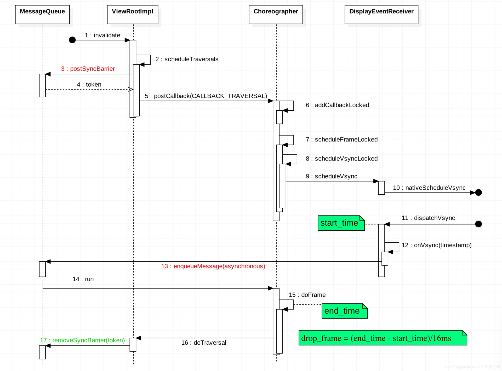
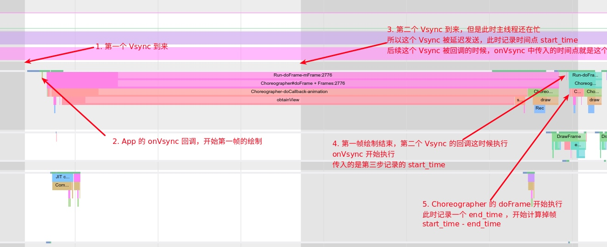
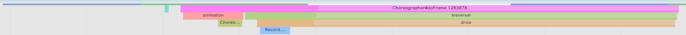
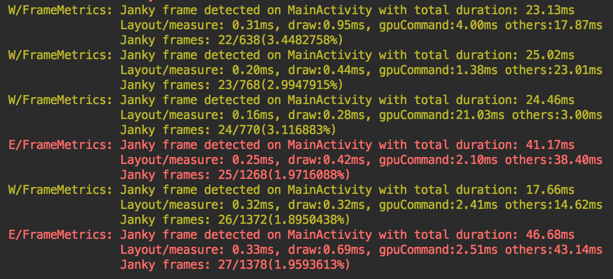
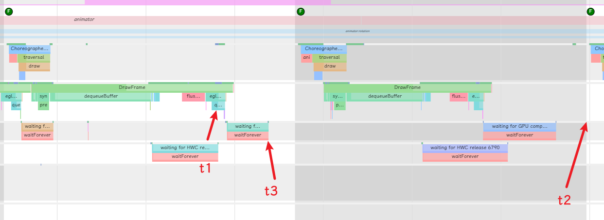
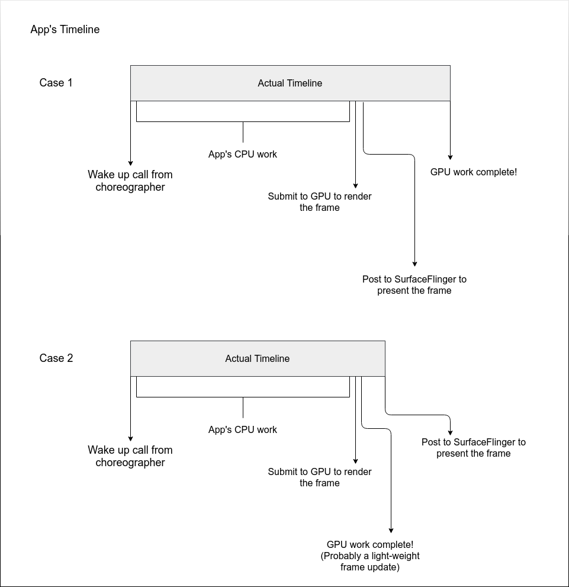
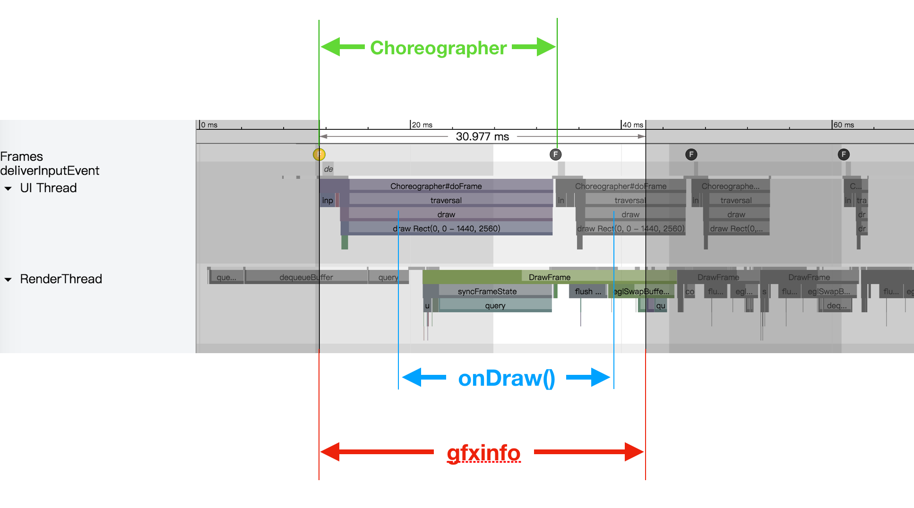
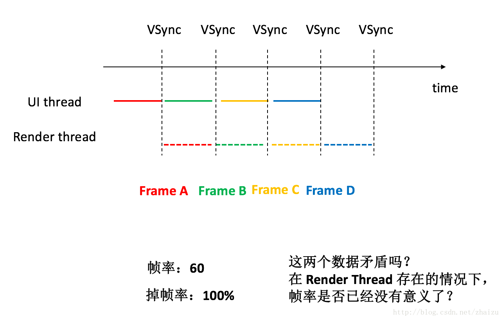

本文章中帧数据包含帧率和帧渲染时长。两者之间相互存在联系，因此求得一种指标往往可以得到另一个指标的值，比如知道每一帧的渲染时长，通常可以统计一秒内出现了多少次这样的帧来计算帧率，因此本文结构为：

1. 先给出Android系统可以获取帧相关信息的API及其原理
2. 总结获取帧率的手段
3. 总结获取帧渲染时长的手段
4. 给出掉帧的定义
5. 相关工具获取帧率的方法

## Android系统中帧有关的接口

由于 Choreographer 的位置，许多性能监控的手段都是利用 Choreographer 来做的，除了自带的掉帧计算，Choreographer 提供的 FrameCallback 和 FrameInfo 都给 App 暴露了接口，让 App 开发者可以通过这些方法监控自身 App 的性能。其中常用的方法如下：

1. Choreographer 自身的掉帧计算逻辑

2. 利用 FrameCallback 的 doFrame 回调

3. 利用 FrameInfo 进行监控

   ```
   使用 ：adb shell dumpsys gfxinfo [package name] framestats
   示例 ：adb shell dumpsys gfxinfo com.meizu.flyme.launcher framestats
   ```

4. FrameMetrics接口

5. 利用 SurfaceFlinger 进行监控

   ```shell
   使用 ：adb shell dumpsys SurfaceFlinger –-latency [view name]
   示例 ：adb shell dumpsys SurfaceFlinger –-latency  com.smile.gifmaker/com.yxcorp.gifshow.HomeActivity#0
   ```

6. 利用 SurfaceFlinger PageFlip 机制进行监控

   ```
   使用 ：adb service call SurfaceFlinger 1013
   
   备注 ：需要系统权限
   ```

7. BlockCanary 基于 Looper 的性能监控

### Choreographer 自身的掉帧计算逻辑

Choreographer.doFrame 的掉帧检测比较简单，从下图可以看到，Vsync 信号到来的时候会标记一个 start_time ，执行 doFrame 的时候标记一个 end_time ，这两个时间差就是 Vsync 处理时延，也就是掉帧

[](https://androidperformance.com/images/15717421364722.jpg)

我们以 Systrace 的掉帧的实际情况来看掉帧的计算逻辑

[](https://androidperformance.com/images/15717421441350.jpg)

这里需要注意的是，这种方法计算的掉帧，是前一帧的掉帧情况，而不是这一帧的掉帧情况，这个计算方法是有缺陷的，会导致有的掉帧没有被计算到。

SKIPPED_FRAME_WARNING_LIMIT 默认为30 , 由 debug.choreographer.skipwarning 这个属性控制

```
if (jitterNanos >= mFrameIntervalNanos) {
    final long skippedFrames = jitterNanos / mFrameIntervalNanos;
    if (skippedFrames >= SKIPPED_FRAME_WARNING_LIMIT) {
        Log.i(TAG, "Skipped " + skippedFrames + " frames!  "
                + "The application may be doing too much work on its main thread.");
    }
}
```

唯一阻碍我们获取数值的是：skippedFrames 的数值只有大于 SKIPPED_FRAME_WARNING_LIMIT 才会输出相关的警告。而 SKIPPED_FRAME_WARNING_LIMIT 的数值可以由系统参数 debug.choreographer.skipwarning 来设定。

> 注意：初始条件下，系统中不存在 debug.choreographer.skipwarning 参数，因此 SKIPPED_FRAME_WARNING_LIMIT 将取默认值 30。因此，正常情况下，我们能够看见上诉 Log 出现的机会极少。

因此，如果我们修改（设定）系统属性 debug.choreographer.skipwarning 为 1，Logcat 中将打印出每一次丢帧的Log。需要说明的是，由于为 SKIPPED_FRAME_WARNING_LIMIT 赋值的代码段由 Zygote 在系统启动阶段加载，而其他应用都是在拷贝复用 Zygote 中的设定，因此设定系统属性后需要重启 Zygote 才能使得上述设定生效。

具体的设置方法如下：

```shell
setprop debug.choreographer.skipwarning 1
setprop ctl.restart surfaceflinger; setprop ctl.restart zygote
```

设定完成以后，我们可以直接通过 Logcat 中的信息得到系统中所有应用的绘制丢帧信息，包括丢帧发生的时间以及连续丢帧的数量。不过由于 Logcat 信息的滞后性，以上信息我们几乎只能进行在测试完成后进行统计分析，而无法进行实时处理。

### 利用FrameCallback doFrame回调

缺点：该方案需要将测试代码与待测应用打包在一起，因此理论上仅能测试自己开发的应用。

优点：可以对丢帧信息进行实时处理



Choreographer 收到通知依次处理 Input、Animation、Draw，这三个过程都是通过 FrameCallback 回调的方式完成的。在 Draw 过程中，具体是执行 ViewRootImpl#performTraversals() 方法，完成视图树的 measure、layout、draw 流程。
而 FrameCallback#doFrame(long frameTimeNanos) 方法中可以得到 VSync 到来的时间戳，这样就能得到连续两帧开始渲染之间的间隔，**将该值近似作为上一帧的渲染耗时。**
实现 FrameCallback 接口，并通过 Choreographer#postFrameCallback() 方法将其跟 Input、Animation、Draw 这些回调一起塞入主线程的消息队列，就能源源不断的获取每一帧的渲染时间戳，每一个 VSync 的时间戳代表一帧，这样可以得到某段时间内渲染完成的帧数，二者相除即可得到帧率。

* FrameCallback 接口

```
public interface FrameCallback {
    public void doFrame(long frameTimeNanos);
}
```

* 接口使用

```
Choreographer.getInstance().postFrameCallback(youOwnFrameCallback );
```

* 接口处理

```
public void postFrameCallbackDelayed(FrameCallback callback, long delayMillis) {
    ......
    postCallbackDelayedInternal(CALLBACK_ANIMATION,
            callback, FRAME_CALLBACK_TOKEN, delayMillis);
}  
```

### 利用FrameInfo进行监控

 FrameInfo 是由 Android 6.0（具体来讲是 Android M Preview） 引入到 HWUI 模块中的统计功能。由[CanvasContext](https://www.jianshu.com/p/0ac95813f16a)在doFrame（）时进行记录。

```c++
enum class FrameInfoIndex {
    Flags = 0,
    FrameTimelineVsyncId,
    IntendedVsync,
    Vsync,
    InputEventId,
    HandleInputStart,
    AnimationStart,
    PerformTraversalsStart,
    DrawStart,
    FrameDeadline,
    FrameStartTime,
    FrameInterval,
    // End of UI frame info
    SyncQueued,
    SyncStart,
    IssueDrawCommandsStart,
    SwapBuffers,
    FrameCompleted,
    DequeueBufferDuration,
    QueueBufferDuration,
    GpuCompleted,
    SwapBuffersCompleted,
    DisplayPresentTime,
    CommandSubmissionCompleted,

    // Must be the last value!
    // Also must be kept in sync with FrameMetrics.java#FRAME_STATS_COUNT
    NumIndexes
};
```

在 5.0 上执行 gfxinfo 命令，得到的即为渲染一帧所经过的各个阶段的耗时情况（单位毫秒）：

```shell
$ adb shell dumpsys gfxinfo [package name]

    Draw Prepare Process Execute
    0.51 0.69 4.52 0.40
    0.43 1.20 3.90 0.36
    0.42 0.64 3.70 0.37
    0.41 0.68 4.08 0.57
    0.46 1.24 3.79 0.35
```

在 7.0 上执行：

```shell
$ adb shell dumpsys gfxinfo [package name]

    Stats since: 115689258308387ns
    Total frames rendered: 138
    Janky frames: 114 (82.61%)
    50th percentile: 19ms
    90th percentile: 150ms
    95th percentile: 200ms
    99th percentile: 300ms
    Number Missed Vsync: 40
    Number High input latency: 2
    Number Slow UI thread: 40
    Number Slow bitmap uploads: 2
    Number Slow issue draw commands: 70

    Draw Prepare Process Execute
    50.00 0.40 5.48 3.78
    50.00 0.77 1.66 3.97
    50.00 4.31 2.01 2.59
    50.00 5.29 9.59 4.39
    50.00 2.95 3.07 8.06
    50.00 1.76 1.93 3.12
```

在 7.0 系统上带上 framestats 参数可以获取最近的 120 帧数据：

```shell
$ adb shell dumpsys gfxinfo com.demo.app framestats

Stats since: 101631537739178ns
Total frames rendered: 42
Janky frames: 31 (73.81%)
50th percentile: 17ms
90th percentile: 19ms
95th percentile: 21ms
99th percentile: 34ms
Number Missed Vsync: 2
Number High input latency: 2
Number Slow UI thread: 3
Number Slow bitmap uploads: 0
Number Slow issue draw commands: 27

—PROFILEDATA—
Flags,IntendedVsync,Vsync,OldestInputEvent,NewestInputEvent,HandleInputStart,AnimationStart,PerformTraversalsStart,DrawStart,SyncQueued,SyncStart,IssueDrawCommandsStart,SwapBuffers,FrameCompleted,DequeueBufferDuration,QueueBufferDuration,GpuCompleted,
0,22011224362816,22011224362816,9223372036854775807,0,22011224989964,22011224994808,22011225930120,22011226078089,22011226757724,22011227319131,22011228175329,22011235528298,22011236413819,4151251,397604,22011240481840,
0,22011240794923,22011240794923,9223372036854775807,0,22011241286997,22011241289757,22011242055643,22011242199341,22011242749705,22011243082205,22011243774080,22011251659654,22011252762779,4709480,485260,22011256941998,
0,22011257230915,22011257230915,9223372036854775807,0,22011257635540,22011257639238,22011258448248,22011258593301,22011259262415,22011259839811,22011260575228,22011268342156,22011269282000,4550000,391770,22011273304500,
...
—PROFILEDATA—
```

第一部分是卡顿的统计数据，包括掉帧率、不同分位值对应的耗时；第二部分（PROFILEDATA）是详细数据，即绘制一帧所经过的各个阶段的起始时间戳，最后一项减去第二项即为该帧的耗时（单位纳秒）；

除了 framestats 参数，执行 reset 参数可以清楚帧数据缓存，重新开始记录帧数据。

官方参考链接：https://developer.android.google.cn/training/testing/performance?hl=zh-cn

### FrameMetrics回调接口

从 7.0（API 24）开始，**安卓 SDK** 新增 OnFrameMetricsAvailableListener 接口用于提供帧绘制各阶段的耗时，数据源与 GPU Profile 相同。

回调接口为 Window.FrameMetrics：

```
public interface OnFrameMetricsAvailableListener {
    void onFrameMetricsAvailable(Window window, FrameMetrics frameMetrics, int dropCountSinceLastInvocation);
}
```

FrameMetrics 存储了如下数据：

| 阶段                                                         | 含义（纳秒）                                 | 备注          |
| ------------------------------------------------------------ | -------------------------------------------- | ------------- |
| [ANIMATION_DURATION](https://developer.android.com/reference/android/view/FrameMetrics.html#ANIMATION_DURATION) | 动画耗时                                     |               |
| [COMMAND_ISSUE_DURATION](https://developer.android.com/reference/android/view/FrameMetrics.html#COMMAND_ISSUE_DURATION) | 执行 OpenGL 命令和 DisplayList 耗时          |               |
| [DRAW_DURATION](https://developer.android.com/reference/android/view/FrameMetrics.html#DRAW_DURATION) | 创建和更新 DisplayList 耗时                  |               |
| [FIRST_DRAW_FRAME](https://developer.android.com/reference/android/view/FrameMetrics.html#FIRST_DRAW_FRAME) | 布尔值，标志该帧是否为此 Window 绘制的第一帧 | 一般忽略此帧  |
| [INPUT_HANDLING_DURATION](https://developer.android.com/reference/android/view/FrameMetrics.html#INPUT_HANDLING_DURATION) | 处理用户输入操作的耗时                       |               |
| [INTENDED_VSYNC_TIMESTAMP](https://developer.android.com/reference/android/view/FrameMetrics.html#INTENDED_VSYNC_TIMESTAMP) | 预期 VSync 到来的时间戳                      | API >=26 可用 |
| [LAYOUT_MEASURE_DURATION](https://developer.android.com/reference/android/view/FrameMetrics.html#LAYOUT_MEASURE_DURATION) | layout/measure 耗时                          |               |
| [SWAP_BUFFERS_DURATION](https://developer.android.com/reference/android/view/FrameMetrics.html#SWAP_BUFFERS_DURATION) | CPU 在等待 GPU 完成渲染的耗时                |               |
| [SYNC_DURATION](https://developer.android.com/reference/android/view/FrameMetrics.html#SYNC_DURATION) | 上传 bitmap 到 GPU 的耗时                    |               |
| [TOTAL_DURATION](https://developer.android.com/reference/android/view/FrameMetrics.html#TOTAL_DURATION) | 整帧渲染耗时                                 |               |
| [UNKNOWN_DELAY_DURATION](https://developer.android.com/reference/android/view/FrameMetrics.html#UNKNOWN_DELAY_DURATION) | 未知延迟                                     |               |
| [VSYNC_TIMESTAMP](https://developer.android.com/reference/android/view/FrameMetrics.html#VSYNC_TIMESTAMP) | VSync 实际到来的时间戳                       | API >=26 可用 |

比如使用 [ActivityFrameMetrics](https://github.com/frogermcs/ActivityFrameMetrics) 的效果：



该方法可以在 Application 统一完成初始化，无需各个页面单独设置。

需要注意的是，虽然 FrameMetrics 与 gfxinfo 的数据同源，但是二者在计算帧率时也有差别。FrameMetrics 获得的是单个帧的数据，正常情况下只能拿到渲染一帧的各个阶段的数据（加起来是该帧总耗时），而不能像 gfxinfo 那样拿到每一帧渲染的起始时间戳。如果用横线表示每帧的渲染，则对开发者而言，FrameMetrics 获得的帧绘制过程是：
—— ———— —— ————

而其实际渲染过程，也即是 gfxinfo 获取的渲染过程可能是：
——     ——
   ————   ————

### Dumpsys SurfaceFlinger --latency

每一次的命令都会得到128行的帧相关的数据

```shell
$ adb shell dumpsys SurfaceFlinger –latency  com.smile.gifmaker/com.yxcorp.gifshow.HomeActivity#0

16666666
23761666738507  23761705288823  23761672407674
23761682746738  23761721703564  23761688864238
23761698902312  23761738097264  23761705294969
23761715912522  23761754504922  23761721696950
23761731606430  23761770939507  23761738094452
23761747756067  23761787361696  23761754402474
23761764638100  23761803741646  23761770941746
23761781786748  23761820153731  23761787353206
```

该条命令最终会调用如下源码，打印出绘制过程中的关键时间点：

```c++
/* 
FrameTracker tracks information about the most recently rendered frames. It uses a circular buffer of frame records, and is *NOT* thread-safe-mutexing must be done at a higher level if multi-threaded access is possible.

其实 FrameTracker 是按照图层（Layer / Surface）统计的，而针对每个 Layer ，FrameTracker 都记录了它最近 128 帧的信息。
*/
    
void FrameTracker::dumpStats(String8& result) const {
    Mutex::Autolock lock(mMutex);
    processFencesLocked();
    const size_t o = mOffset;
    for (size_t i = 1; i < NUM_FRAME_RECORDS; i++) {
        const size_t index = (o+i) % NUM_FRAME_RECORDS;
        result.appendFormat("%" PRId64 "\t%" PRId64 "\t%" PRId64 "\n",
            mFrameRecords[index].desiredPresentTime,
            mFrameRecords[index].actualPresentTime,
            mFrameRecords[index].frameReadyTime);
    }
    result.append("\n");
}
```

1. 第一行数据，表示刷新的时间间隔refresh_period
2. 第1列：这一部分的数据表示应用程序绘制图像的时间点 ，也就是QueueBuffer的时间。
3. 第2列：在SF(软件)将帧提交给H/W(硬件)绘制之前的垂直同步时间，也就是每帧绘制完提交到硬件的时间戳，该列就是垂直同步的时间戳，即该buffer在屏幕上成功显示present fence signal的时间。
4. 第3列：在SF将帧提交给H/W的时间点，算是H/W接受完SF发来数据的时间点，绘制完成的时间点，是acquire fence signal的时间。[2] [3] [4]



### 利用 SurfaceFlinger PageFlip 机制进行监控

当 SurfaceFlinger 接收到 Surface 更新通知的时候，将会由 SurfaceFlinger::handleMessageRefresh 函数进行处理，其中包含重建可见区域、初始化、合成等步骤。这里，我们主要关注 SurfaceFlinger::doComposition() 这个方法。

```c
void SurfaceFlinger::handleMessageRefresh() {
  ...
  if (CC_UNLIKELY(mDropMissedFrames && frameMissed)) {
    // Latch buffers, but don't send anything to HWC, then signal another
    // wakeup for the next vsync
    preComposition();
    repaintEverything();
  } else {
    preComposition();
    rebuildLayerStacks();
    setUpHWComposer();
    doDebugFlashRegions();
    doComposition(); //重点关注对象
    postComposition();
  }
  ...
}
```

在 doComposition 中，完成 Surface 的合成之后，都会调用 DisplayDevice::flip()，它会使用变量 mPageFlipCount 统计我们进行合成的次数，这个变量就是我们统计 FPS 的核心原始数据。mPageFlipCount 记录了 SurfaceFlinger 一共进行了多少次合成，也可以简单理解为，SurfaceFlinger 向屏幕提交了多少帧的数据。

```c
void SurfaceFlinger::doComposition() {
  ATRACE_CALL();
  const bool repaintEverything = android_atomic_and(0, &mRepaintEverything);
  for (size_t dpy=0 ; dpy<mDisplays.size() ; dpy++) {
    const sp<DisplayDevice>& hw(mDisplays[dpy]);
    if (hw->isDisplayOn()) {
      ...
      hw->flip(hw->swapRegion);//重点关注对象
      ...
    }
    // inform the h/w that we're done compositing
    hw->compositionComplete();
  }
  postFramebuffer();
}
```

```c
void DisplayDevice::flip(const Region& dirty) const {
  ...
  mPageFlipCount++;
}
```

不仅如此， Android 还为我们获取这个基础数据提供了比较方便的方法。通过执行 adb 命令：service call SurfaceFlinger 1013，我们就可以得出当前的 mPageFlipCount。

```shell
$ service call SurfaceFlinger 1013
service call SurfaceFlinger 1013
Result: Parcel(00aea4f4    '....')
```

## 帧率

本文只考虑通过系统指令进行监控指令，不考虑在APP本身注册回调函数获取的方式，如doFrame回调和FrameMetrics回调。

### FrameInfo 进行监控

通过以下命令，获取PROFILE-DATA，计算过去一秒多少条数据。

```
dumpsys gfxinfo com.demo.app framestats
```

### Dumpsys SurfaceFlinger --latency

通过计算每秒内有多少个行来计算帧率。[]

###  SurfaceFlinger PageFlip 机制

根据 FPS 的定义，我们不难逆推得出 FPS 的计算方法：

在 t1 时刻通过执行命令```service call SurfaceFlinger 1013```获取 mPageFlipCount 的数值 v1，在t2时刻再次执行命令```service call SurfaceFlinger 1013```获取 mPageFlipCount 的数值 v2，FPS 的计算公式：

```java
FPS = (v2 - v1) / (t2 - t1);
```

需要注意的是：mPageFlipCount 的原始数据是 16 进制的，一般而言计算之前需要先进行进制转换。

## 帧渲染时长

定义：The total time taken by the app frame is calculated by using the choreographer wake-up as the start time and max(gpu, post time) as the end time. Post time is the time the frame was sent to SurfaceFlinger. Since the GPU usually runs in parallel, it could be that the gpu finished later than the post time. [6]



### FrameInfo 进行监控

FrameInfo给出的是绘制一帧所经过的各个阶段的起始时间戳，最后一项减去第二项即为该帧的耗时（单位纳秒），即处理此帧所花的总时间可以通过执行 FRAME_COMPLETED - INTENDED_VSYNC 计算得出。

### Dumpsys SurfaceFlinger --latency

个人认为可以通过t1或者t3减去上一个Vsync的值来获取帧的执行时间。

### Systrace/atrace 获取帧时长

个人认为，使用systrace/atrace监控各事件的时间戳，也可以获取帧渲染时长和帧率，类似于[android_FPS_frome_GFX](https://github.com/sandmanli/android_FPS_frome_GFX/tree/master)。

### 为什么不利用Choreographer的FrameCallback doFrame回调？

上图是通过 systrace 在华为 mate9 pro （7.0 系统）真机上获取的。从 5.0 系统开始，安卓系统使用 UI 线程 + Render 线程共同完成帧渲染。该帧圆圈被标志为黄色，表示渲染耗时超过 16.6ms。

对该帧而言，通过 Choreographer 和 gfxinfo 获取的帧渲染耗时是不相等的。Choreographer 方式得到的帧耗时依然是 16.6ms，而 gfxinfo 则大于 16.6ms。

注意，图中竖直方向上的 UI 线程和 Render 线程的色块耗时并不总是对应的。可能由于掉帧现象的出现，导致 UI 线程绘制的帧对应的 Render 线程绘制过程后移。

UI 线程和 Render 线程共同完成帧绘制和渲染，也就是说，一帧的耗时分布在两个线程中，等于二者的耗时之和。但是 Choreographer 方式只统计了 UI 线程中的部分，而忽略了 Render 线程的部分，这样会导致得到的耗时偏小、帧率偏大。更进一步，既然一帧的绘制和渲染分布于两个线程， 那即使一帧的耗时综合大于 16.6 ms，只要位于 UI 线程部分的耗时不超过 16.6ms，那么就不影响 UI 线程绘制下一帧，但是会导致屏幕接着显示上一帧的内容，出现掉帧，而 Choreographer 仅凭帧耗时无法检测出这种掉帧。


## 丢帧的定义

丢帧的定义有很多

1. dumpsys SurfaceFlinger中的掉帧

   每一行都可以通过下面的公式得到一个值，该值是一个标准，我们称为jankflag，如果当前行的jankflag与上一行的jankflag发生改变，那么就叫掉帧。

   ceil((C - A) / refresh-period)

2. 渲染时长超过16.6ms（对60FPS来说）视为一次掉帧。这里的渲染时长和前面的（C-A）存在一定的区别（个人认为）。

   某一帧“掉了”，并不是这一帧没有绘制完成被丢掉了或者没被显示在屏幕上，而是虽然没有“按时”显示在屏幕上但是还是显示了。

3. PerfDog Jank

   **PerfDog Jank 计算思路：**考虑视觉惯性，假设以前三帧的平均帧耗时为参考，作为vsync时间间隔，连续两次vsync没有新渲染画面刷新，则认为是一次潜在卡顿，也就是说下一帧耗时大于前三帧平均帧耗时2倍，则认为一次潜在卡顿。同时单帧耗时满足大于两倍电影帧耗时1000ms/24*2 (由于人眼低于24帧才能辨别画面不连续性)，则认为是一次真正卡顿。同时若单帧耗时大于3倍电影帧耗时，则认为是一次严重卡顿。

   **注解：**

   为什么是两次vsync？GPU一般是3重缓冲buffer，当前帧已占用一个buffer，即剩余2缓冲buffer，人眼一般可容忍2帧延迟。

   为什么是两帧电影帧耗时？低于24帧画面，人眼就能感知到画面不连续性，电影一般都是24帧。即电影帧耗时1000ms / 24≈41.67ms，两帧电影帧耗时也就是41.67ms \* 2，三帧电影帧耗时是41.67ms \* 3。

4. 因为 BufferQueue 和 TripleBuffer 的存在，此时 BufferQueue 中可能还有上一帧或者上上一帧准备好的 Buffer，可以直接被 SurfaceFlinger 拿去做合成，因此需要考虑bufferQueue是否包含可用的buffer。[1]

   如果主线程 + 渲染线程每一帧的执行都超过 16.6ms(60fps 的情况下)，那么就可能会出现掉帧。

   

按正常逻辑来说，掉帧越多，帧率会越低。考虑下图这种极端情况：



渲染了 A B C D 共 4 帧，每帧都耗时 2 个 VSync 周期，即每帧都出现了掉帧，掉帧率100%，但是由于 UI 线程和 Render 线程并行进行，5 个 VSync 周期渲染完成了 4 帧。如果不只是 4 帧，而是 n 帧，n 较大，那么可以近似认为 n 个 VSync 周期渲染完成了 n 帧。帧率就是 60，但是掉帧率是 100%。这显然与“掉帧越多，帧率会越低”是矛盾的，甚至是违反常识的。所以，我认为，在 Render 线程存在的情况（即开启硬件加速的情况下），帧率已经无法作为表征 UI 性能的指标了。这也可以从侧面解释，为什么 gfxInfo 也好，Google Vitals 也好，都给出了帧渲染数据、掉帧率等，但是就是没给出帧率这个至关重要的数据指标。当然这只是一己之见，欢迎讨论指正。

因此流畅度≠帧率。

丢帧的定义千奇百怪，目前还没有一个定论，笔者比较倾向于采用的是当Vsync发生到GPU completion的渲染时长超过Vsync间隔时，为丢帧。

## 相关工具

1. TinyDancer 

   (https://github.com/friendlyrobotnyc/TinyDancer)

2. MobilePerf（阿里巴巴）

3. PerfDog（腾讯，闭源）

   PerfDog性能狗. 全平台性能测试分析专家

4. Hertz（美团）

   在了解了屏幕绘制原理和卡顿形成的原因后，很容易想到通过检测FPS就可以知道App是否发生了卡顿，也能够通过一段连续的FPS帧数计算丢帧率来衡量当前页面绘制的质量。然而实践发现FPS的刷新频率非常快，并且容易发生抖动，因此直接通过比较通过FPS来侦测卡顿是比较困难的。而检测主线程消息循环执行的时间就要容易的多了，这也是业内常用的一种检测卡顿的方法。因此，**Hertz在实践中采用的就是检测主线程每次执行消息循环的时间，当这一时间大于阈值时，就记为发生一次卡顿。**

5. BlockCanary

   https://github.com/markzhai/AndroidPerformanceMonitor

总结如下表所示

| 名字              | 描述                                                         | 获取帧率原理                                                 | 厂商      |
| ----------------- | ------------------------------------------------------------ | ------------------------------------------------------------ | --------- |
| TinyDancer        | android library for displaying fps from the choreographer    | Choreographer中FrameCallBack doFrame回调                     |           |
| mobileperf        | mobileperf is a Python PC tool that can collect Android performance data: cpu,memory,fps,logcat log,traffic,process thread number,process launch log.mobileperf also support monkey test. | 用了两种方式:<br />use_legacy_method 为true时，需要root权限: `service call SurfaceFlinger 1013` 得到帧数<br/>为false,`dumpsys SurfaceFlinger --latency`  <br/>Android 8.0 `dumpsys SurfaceFlinger` 没有内容，则用`dumpsys gfxinfo package_name framestats` | Alibaba   |
| Hertz             | 移动端性能监控方案                                           | 主线程每次执行消息循环的时间，当这一时间大于阈值时，就记为发生一次卡顿 | 美团      |
| BlockCanary       | A transparent ui-block detection library for Android,        | 通过dispatch Message的时间来检测block                        |           |
| AndroidDevMetrics | Performance metrics library for Android development.         | Choreographer中FrameCallBack doFrame回调                     |           |
| Takt              | Android library for measuring the FPS using Choreographer.   |                                                              |           |
| vtools            | 一个集高级重启、应用安装自动点击、CPU调频等多项功能于一体的工具箱。 | 1. find /sys -name fps 2>/dev/null  & find /sys -name measured_fps 2>/dev/null （确实存在一些文件可以直接cat出fps）<br />2. /sys/class/drm/sde-crtc-0/measured_fps<br />3./sys/class/graphics/fb0/measured_fps<br />4. service call SurfaceFlinger 1013 |           |
| btrace            | a high performance Android trace tool which is **based on Perfetto,** it support to define custom events automatically during building apk and using bhook to provider more native events like Render/Binder/IO etc. | 未知，太难分析                                               | bytedance |
| solopi            | 无线化、非侵入式的Android自动化工具，公测版拥有录制回放、性能测试、一机多控三项主要功能，能为测试开发人员节省宝贵时间。 | dumpsys gfxinfo                                              | alipay    |

还有其他工具如[fpsviewer](https://github.com/SilenceDut/fpsviewer)、[AndroidMonitor](https://github.com/jackuhan/AndroidMonitor)、[UIPerforance](https://github.com/lyric315/UIPerforance/tree/master)、[debug_view_kotlin](https://github.com/heimashi/debug_view_kotlin/tree/76b188a43c241a8636c3fb0ea4d2dcd68adc6901)、[NoobCoach](https://github.com/matthewYang92/NoobCoach/tree/06574a9ca7294a7db17813dc7d28f81e5bb4576e)使用doFrame FrameCallback，[SoloX](https://github.com/smart-test-ti/SoloX/tree/88b7b180aa356e38cb1180f5213758c3b5b6696b)、[Android-monitor-shell-script](https://github.com/moyu6027/Android-monitor-shell-script/tree/master)用dumpsys Surfaceflinger。

## Reference

1. [Android 基于 Choreographer 的渲染机制详解](http://androidperformance.com/2019/10/22/Android-Choreographer/#/%E5%88%A9%E7%94%A8-FrameInfo-%E8%BF%9B%E8%A1%8C%E7%9B%91%E6%8E%A7)
2. [安卓帧率计算方案和背后原理剖析](https://zhuanlan.zhihu.com/p/435304317)
3. [安卓帧率FPS计算原理](https://blog.csdn.net/SunIOT/article/details/125117018)
4. [或许是迄今为止第一篇讲解 fps 计算原理的文章吧](https://juejin.cn/post/6844904182898524168)
5. [移动性能测试 用第三方库 (surface_stats_collector.py) 获取 AndroidFPS 过程分析](https://testerhome.com/topics/2232)
6. [Android Jank detection with FrameTimeline 使用 FrameTimeline 进行 Android Jank 检测](https://perfetto.dev/docs/data-sources/frametimeline)