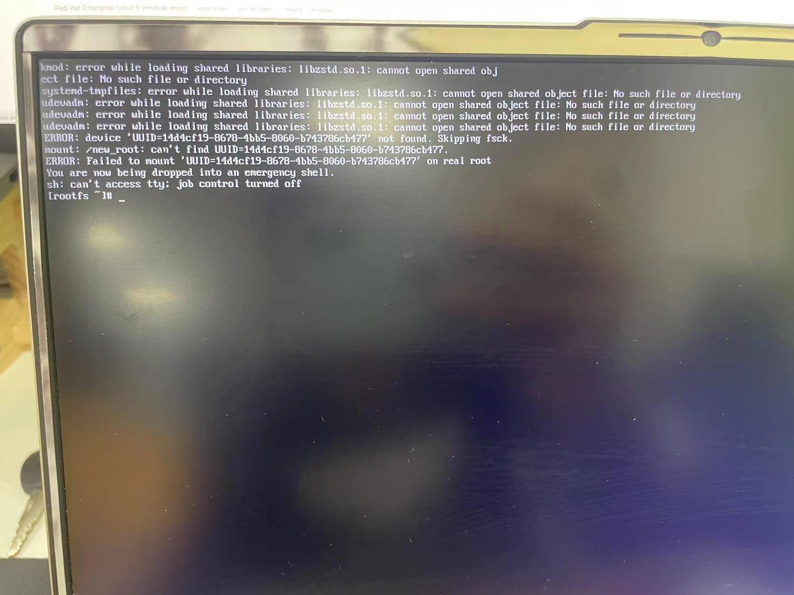

前几天捣鼓trace-cmd，里面要用到zstd进行压缩解压缩。于是我就从facebook的repo上将zstd的源代码下载了下来，执行了`make install`以及copy来copy去的一系列骚操作。今天使用`pacman -Syyu`更新后，使用vim发现找不到指令，出于经验（之前遇到过每次更新后`uname -r`后`pacman -Q liux`版本不一致情况），采取了reboot操作，但无法启动操作系统，出现了以下现象。



由于libzstd之前确实遇到过，所以初步判断应该是我前几天捣鼓的时候把环境弄坏了，所以导致了找不到该文件。

## 解决步骤

1. 使用liveUSB，按住F5进入UEFI界面，将USB启动盘的启动顺序提前

2. 进入liveUSB，通过以下指令进入操作系统

   ```bash
   mount /dev/xxx /mnt
   mount /dev/xxx /mnt/boot	
   arch-chroot /mnt
   ```

   第一行为根目录所在分区，第二行为/boot目录所在分区

3. kmod为动态链接的二进制程序，通过`ldd /usr/bin/kmod`发现其动态链接的`libzstd.so.1`指向`/usr/local/lib64/libzstd.so.1`，这个应该是我之前`make install`安装的，奇怪的是该路径下确实存在`libzstd.so.1`，但系统启动找不到该文件。通过`lddconfig -p | grep zstd`发现存在重复定义，同时根据`lsinitcpio /boot/initramfs-linux.img`发现其中存在`/usr/local/lib64/libzstd.so.1`的文件链接。因此判断为kmod加载时不知道出于什么原因找不到`libzstd.so.1`（即使路径下有），因此尝试将该动态链接指向`/usr/lib/libzstd.so.1`，于是寻找`/etc/ld.so.conf.d/`路径下文件内容为`/usr/local/lib64`的conf文件并将其删除，然后使用`lddconfig`命令进行更新。

4. 此时`lddconfig -p` 中只剩下一个指向`/usr/lib/libzstd.so.1`的链接，`ldd /usr/bin/kmod`中的链接路径也改为了`/usr/lib/libzstd.so.1`

5. 之后进入`/boot`目录，使用命令`mkinitcpio -p linux`重新生成initramfs-linux.img

6. 退出系统进行reboot，问题解决。

其中遇到了太多的坑就不展开讲了，从中学到了一些linux启动和链接的知识，但也只是一知半解，只能提供一个解决办法，而且root cause还是不知道为什么，但因为急需电脑，所以就不做深究了，希望下次遇到了，这个post可以有些帮助，且能深究一下原因。