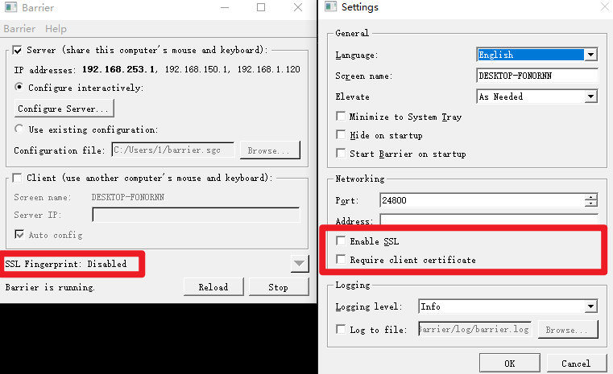

请进行以下操作前reboot电脑，否则容易遇到虽然使用sudo pacman -Syyu滚动升级但某些包不存在的错误。

## 鼠标键盘共享

其中windows作为服务器端，使用windows的鼠标和键盘，Arch Linux作为客户端。

使用barrier（免费）进行配置即可，笔者忘记了当时配置的具体过程，反正为了方便记得将客户端和服务器端barrier Settings中的```Enable SSL```给取消掉。



## 文件共享

其中Windows作为客户端，Arch linux作为服务端。

### Linux 端操作

1. Arch linux安装samba服务，打开终端并运行以下命令来安装Samba：

   ```bash
   sudo pacman -Syu samba
   ```

2. 编辑Samba的配置文件（通常是`/etc/samba/smb.conf`），使用文本编辑器打开该文件：

   ```
   sudo nano /etc/samba/smb.conf
   ```

3. 在配置文件的末尾添加以下内容来创建共享文件夹：

   ```
   [shared]
      comment = Shared Folder
      path = /path/to/shared/folder
      read only = no
      guest ok = yes
   ```

   将`/path/to/shared/folder`替换为你想要共享的实际文件夹路径。

4. 保存并关闭文件。通过以下命令创建用户和密码

   ```bash
   sudo smbpasswd -a 用户名
   ```
   
5. 然后启动并启用Samba服务：

   ```bash
   sudo systemctl start smb.service
   sudo systemctl enable smb.service
   ```

6. 配置防火墙，安装iptables软件包（如果尚未安装）。在终端中运行以下命令：

    ```
    sudo pacman -Syu iptables
    ```

7. 打开终端，并使用root权限执行以下命令以添加Samba的防火墙规则：

    ```
    sudo iptables -A INPUT -p tcp --dport 445 -j ACCEPT
    sudo iptables -A INPUT -p udp --dport 137:138 -j ACCEPT
    sudo iptables -A INPUT -p udp --dport 139 -j ACCEPT
    sudo iptables-save | sudo tee /etc/iptables/iptables.rules
    ```

    以上命令将允许Samba所需的端口通过防火墙。

8. 启用iptables服务。运行以下命令：

    ```
    sudo systemctl enable iptables.service
    sudo systemctl start iptables.service
    ```

    现在，Samba应该能够在Arch Linux和Windows之间进行文件传输。

    请注意，iptables是一个底层工具，配置相对复杂。如果你希望更简化的防火墙管理工具，可以考虑使用ufw（Uncomplicated Firewall）或其他前端工具，但在Arch Linux上，默认情况下是没有ufw的。

### windows端操作

win+r后输入```\\ip addr```即可


之后输入第五步创建的用户名和密码即可