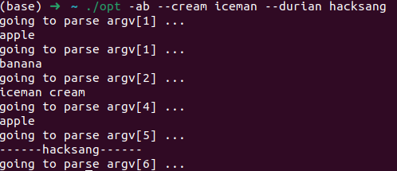

   在[linux](https://so.csdn.net/so/search?q=linux&spm=1001.2101.3001.7020)中，经常需要各种命令，通常情况下都会带各种参数，而这些参数是如何解析的呢？通常使用GNU C提供的函数getopt、getopt_long、getopt_long_only函数来解析命令行参数。

## getopt_long函数

   getopt函数只能处理短选项，而getopt_long函数两者都可以，可以说getopt_long已经包含了getopt_long的功能。因此，这里就只介绍getopt_long函数。

```
#include <unistd.h>

int getopt(int argc, char * const argv[],
           const char *optstring);

extern char *optarg;
extern int optind, opterr, optopt;

#include <getopt.h>

int getopt_long(int argc, char * const argv[],
           const char *optstring,
           const struct option *longopts, int *longindex);
```

* argc: main函数的参数

* argv: main函数的参数

* optstring: 表示**短选项**字符串。 形式如```a:b::cd:```，分别表示程序支持的命令行短选项有-a、-b、-c、-d，冒号含义如下：

  1. 只有一个字符，不带冒号——只表示选项， 如-c 
  2. 一个字符，后接一个冒号——表示选项后面带一个参数，如-a 100
  3. 一个字符，后接两个冒号——表示选项后面带一个可选参数，即参数可有可无， 如果带参数，则选项与参数直接不能有空格

* longopts:表示**长选项**结构体, *longopts* is a pointer to the first element of an array of *struct option* declared in <getopt.h> as

  ```
  struct option {
      const char *name;
      int         has_arg;
      int        *flag;
      int         val;
  };
  ```

  * name：表示选项的名称
  * has_arg：表示选项是否携带参数，该参数有下面三个不同的值
    1. no_argument(或者是0)时   ——参数后面不跟参数值，eg: --version,--help
    2. required_argument(或者是1)时 ——参数输入格式为：--参数 值 或者 --参数=值。eg:--dir=/home
    3. optional_argument(或者是2)时  ——参数输入格式只能为：--参数=值
  * flag: 
    1. 如果为NULL，当存在长选项时，返回val。
    2. 不为NULL，当存在长选项，返回0，将flag指针指向的对象设置为val值。
  * val：找到选项的返回值，通常用来和短选项的值保持一致。

* longindex:非空时，它指向的变量将记录当前找到参数符合longopts里的第几个元素的描述，即是longopts的下标值。

该头文件还存在几个全局变量供使用：

1. optarg:选项对应的参数值
2. optind：下一个将被处理到参数在argv中的下标值
3. opterr
4. optopt：未被标识的选项

### 返回值

1. 如果短选项找到，那么将返回短选项对应的字符。
2. 如果长选项找到，如果flag为NULL，返回val。如果flag不为空，返回0
3. 如果遇到一个选项没有在短字符、长字符里面。或者在长字符里面存在二义性的，返回“？”
4. 如果解析完所有字符没有找到（一般是输入命令参数格式错误，eg： 连斜杠都没有加的选项），返回“-1”
5. By default, **getopt**() permutes the contents of *argv* as it scans, so that eventually all the nonoptions are at the end. Two other modes are also implemented. If the first character of *optstring* is '+' or the environment variable **POSIXLY_CORRECT** is set, then option processing stops as soon as a nonoption argument is encountered. If the first character of *optstring* is '-', then each nonoption *argv*-element is handled as if it were the argument of an option with **character code 1.**此时遇到非option的参数，会返回1，我们可以用optarg参数来获取该字符串。

## 测试用例

```c
#include <stdio.h>
#include <getopt.h>

int main(int argc, char *argv[]) {
  const struct option table[] = {
        {"apple", no_argument, NULL, 'a'},
        {"banana", no_argument, NULL, 'b'},
        {"cream", required_argument, NULL, 'c'},
        {"durian", no_argument, NULL, 'd'},
        {0, 0, 0, 0}
  };
  int o;
  printf("going to parse argv[%d] ...\n", optind);
  while((o = getopt_long(argc, argv, "-abc:d", table, NULL)) != -1) {
        switch(o) {
          case 'a':
                printf("apple\n");
                break;
          case 'b':
                printf("banana\n");
                break;
          case 'c':
                printf("%s cream\n", optarg);
                break;
          case 'd':
                printf("apple\n");
                break;
          case 1:
                printf("------%s------\n", optarg);
                break;
          default:
                printf("cannot reach here\n");
        }
        printf("going to parse argv[%d] ...\n", optind);
  }
  return 0;
}

```

测试结果如下：

