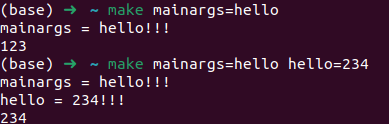

There are three types of variables in the Makefile

* makes' environment variables
* command-line
* variables defined in the Makefile

## Priority

1. command-line
2. variables defined in the Makefile
3. environment variable

There are an exception (```-e```flag):

> Variables in `make` can come from the environment in which `make` is run. Every environment variable that `make` sees when it starts up is transformed into a `make` variable with the same name and value. However, an explicit assignment in the makefile, or with a command argument, overrides the environment. (If the ‘-e’ flag is specified, then values from the environment override assignments in the makefile. See [Summary of Options](https://www.gnu.org/software/make/manual/make.html#Options-Summary). But this is not recommended practice.)

## getenv()

> When `make` runs a recipe, some variables defined in the makefile are placed into the environment of each command `make` invokes. By default, only variables that came from the `make`’s environment or set on its command line are placed into the environment of the commands. You can use the `export` directive to pass other variables. See [Communicating Variables to a Sub-`make`](https://www.gnu.org/software/make/manual/make.html#Variables_002fRecursion), for full details.

So according to the text above, we can use getenv in C file to get the variable passed by the command line. Here is an example:

C file:

```c
#include <stdio.h>
#include <stdlib.h>

int main() {
  char *mainargs = NULL;
  mainargs = getenv("mainargs");
  if(mainargs)
        printf("mainargs = %s!!!\n", mainargs);
  mainargs = getenv("hello");
  if(mainargs)
        printf("hello = %s!!!\n", mainargs);
  return 0;
}
```

Makefile:

```makefile
hello=123

run: getenv
        @./getenv
        @echo $(hello)

getenv : getenv.c
        @gcc -o getenv getenv.c
```



we can see that the command-line variable can be gotten through ```getenv```, but the ```hello``` variable defined in the Makefile cannot be gotten through ```getenv```.