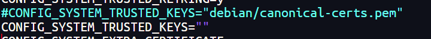
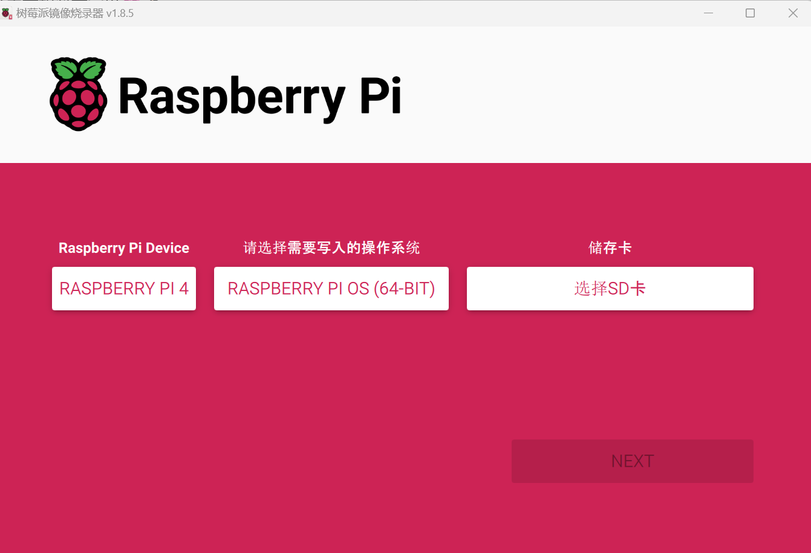

## 环境配置

### 安装依赖项

```
apt install git bc bison flex libssl-dev make libc6-dev libncurses5-dev libelf-dev dwarves
```

### 下载树莓派的内核

GitHub 地址：https://github.com/raspberrypi/linux

可以直接使用 `git clone --depth=1 --branch rpi-5.9.y https://github.com/raspberrypi/linux` 来下载 5.9 版本的内核。

### 下载交叉编译工具（x86_64 编译 arm64）

#### 方法一 wget安装 [1]

下载链接：https://releases.linaro.org/components/toolchain/binaries/7.5-2019.12/aarch64-linux-gnu/gcc-linaro-7.5.0-2019.12-x86_64_aarch64-linux-gnu.tar.xz

gcc-7.5.0-2019.12-x86_64_aarch64,截至2020年10月13日，该交叉编译工具为最新版本

```shell
wget https://releases.linaro.org/components/toolchain/binaries/7.5-2019.12/aarch64-linux-gnu/gcc-linaro-7.5.0-2019.12-x86_64_aarch64-linux-gnu.tar.xz
tar -xvf gcc-linaro-7.5.0-2019.12-x86_64_aarch64-linux-gnu.tar.xz
mv ./gcc-linaro-7.5.0-2019.12-x86_64_aarch64-linux-gnu ~/gcc-linaro
```

把交叉编译工具添加到环境变量

1. 首先 `vim ~/.bashrc`
2. 在 .bashrc 后面加上：`export PATH=$PATH:~/gcc-linaro/bin`
3. 执行 `source ~/.bashrc` 刷新环境变量

#### 方法二： apt安装 (Ubuntu) [3]

安装适用于你要编译的内核架构之工具链：

- 要安装用于编译 64 位内核的 64 位工具链，请运行以下命令：

  复制

  ```
  $ sudo apt install crossbuild-essential-arm64
  ```

- 要安装用于编译 32 位内核的 32 位工具链，请运行以下命令：

  复制

  ```
  $ sudo apt install crossbuild-essential-armhf
  ```

### 生成.config文件

1. 首先进入内核目录
2. 设置环境变量`KERNEL=kernel8`
3. 执行 `make ARCH=arm64 CROSS_COMPILE=aarch64-linux-gnu- bcm2711_defconfig`，生成.config文件
4. 如果你要自定义某些配置，再执行 `make ARCH=arm64 CROSS_COMPILE=aarch64-linux-gnu- menuconfig`，会弹出内核配置窗口进行配置

## 编译和安装

### 启动编译过程

```
make -j20 ARCH=arm64 CROSS_COMPILE=aarch64-linux-gnu-
```

> **技巧**
>
> 在多核设备上，参数 `make -j<数量>` 会把工作分配到多个核心，从而显著提高编译速度。可运行 `nproc` 查看你有多少处理器，我们建议使用的数字为处理器数量的 1.5 倍。

如果遇到以下问题

```
make[1]: *** No rule to make target 'debian/canonical-certs.pem', needed by 'certs/x509_certificate_list'.  
Stop.
```

将.config中`CONFIG_SYSTEM_TRUSTED_KEYS`设置为空即可。



### 安装内核

内核编译完成后，你需要把内核复制到树莓派的启动介质（一般是存储卡和固态硬盘），然后安装模块。

#### 准备启动介质

根据官方文档[2]我们可以使用U盘来作为启动介质，毕竟SD卡并不是那么好用，我们找一个U盘，使用[Raspberry Pi Imager](https://pidoc.cn/docs/computers/getting-started#使用imager工具安装)安装操作系统，当然主要目的是帮我们进行分区，后面可以替换boot分区中的内容。



#### **找到你的启动介质**

首先运行 `lsblk`。然后接入启动介质，再次运行 `lsblk`；新出现的设备就是你的启动介质。你将看到类似如下的输出：

```
sdb
   sdb1
   sdb2
```

如果 `sdb` 代表你的启动介质，`sdb1` 代表 **启动分区**（`FAT32` 格式），而 `sdb2` 代表（可能为 `ext4` 格式）**根分区**。先将这些分区分别挂载到 `mnt/boot`、`mnt/root`，并根据实际的启动介质位置来调整分区字母：

```
$ mkdir mnt
$ mkdir mnt/boot
$ mkdir mnt/root
$ sudo mount /dev/sdb1 mnt/boot
$ sudo mount /dev/sdb2 mnt/root
```

#### **安装**

接下来，把内核模块安装到启动介质上，对于 64 位内核：

```
$ sudo make -j20 ARCH=arm64 CROSS_COMPILE=aarch64-linux-gnu- INSTALL_MOD_PATH=mnt/root modules_install
```

接下来，把内核和设备树文件安装到启动分区中，并备份下旧内核。

```shell
$ sudo cp mnt/boot/$KERNEL.img mnt/boot/$KERNEL-backup.img
```

要安装 64 位内核：运行以下命令可创建当前内核的备份镜像，安装新的内核镜像、叠加层文件、README 文件，然后卸载分区：

```
$ sudo cp arch/arm64/boot/Image mnt/boot/$KERNEL.img
$ sudo cp arch/arm64/boot/dts/broadcom/*.dtb mnt/boot/
$ sudo cp arch/arm64/boot/dts/overlays/*.dtb* mnt/boot/overlays/
$ sudo cp arch/arm64/boot/dts/overlays/README mnt/boot/overlays/
$ sudo umount mnt/boot
$ sudo umount mnt/root
```

树莓派默认是用32位内核启动，需要修改 boot 分区下的 config.txt 文件

```
arm_64bit=1 kernel=kernel8.img
```

#### 重启

把启动介质接入树莓派，然后接入电源，运行刚编译的内核。

```
reboot
```

#### 确认

启动后执行 `uname -a` 可查看内核版本。

## 参考

1. [编译树莓派 4B Linux 5.9 内核](https://shumeipai.nxez.com/2020/10/18/compile-raspberry-pi-4b-linux-5-9-kernel.html)
2. [树莓派官方文档-启动介质](https://pidoc.cn/docs/computers/getting-started#%E5%90%AF%E5%8A%A8%E4%BB%8B%E8%B4%A8)
3. [树莓派官方文档-交叉编译](https://pidoc.cn/docs/computers/linux-kernel#%E4%BA%A4%E5%8F%89%E7%BC%96%E8%AF%91%E5%86%85%E6%A0%B8)