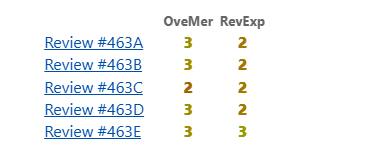

Inspired by the blog [List of Rejections](https://zhyfeng.github.io/posts/blog-post-1/), i wanna sum up the rejection i received by now (2025/01/20). Its a positive attitude to face the failure, so never give up!

* [IWQoS 2023] Reject |  4. Accept \ 2. Weak reject \  2. Weak reject \ 3. Weak accept |
	
	62 and 11 papers were accepted as regular papers and short papers, respectively, out of 264 submissions.
	
* [WWW 2025] Reject |  Technical Quality: 4 \ Technical Quality: 4 \ Technical Quality: 3 \ Technical Quality: 3 \ Technical Quality: 5

  Received 2062 valid submissions, of which 409 were accepted to the conference.

* [Mobicom 2025] Reject | 3 3 2 3 3

  Out of 348 submissions in the winter session, 36 papers were accepted.

  

* [ASPLOS 2026 Summer Cycle] Reject | 3 3 3

  89 papers were accepted out of 840 submissions, and 42 were invited for revision.