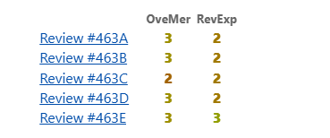

Inspired by [List of Rejections](https://zhyfeng.github.io/posts/blog-post-1/), this page records the research rejections I have received through September 9, 2026. Rejection is part of research: every review offers feedback, perspective, and a starting point for the next iteration.

## 2023

### IWQoS 2023

**Decision:** Rejected 
**Overall ratings:** 4 (Accept) / 2 (Weak Reject) / 2 (Weak Reject) / 3 (Weak Accept)

Of 264 submissions, 62 regular papers and 11 short papers were accepted.

## 2025

### WWW 2025

**Decision:** Rejected 
**Technical quality:** 4 / 4 / 3 / 3 / 5

The conference received 2,062 valid submissions and accepted 409 papers.

### MobiCom 2025

**Decision:** Rejected 
**Scores:** 3 / 3 / 2 / 3 / 3

Of 348 submissions in the winter session, 36 papers were accepted.

## 2026

### ASPLOS 2026

**Decision:** Rejected 
**Scores:** 3 / 3 / 3

Of 840 submissions, 89 papers were accepted and 42 were invited for revision.

### SOSP 2026

**Decision:** Rejected

| Review | Overall Merit | Expertise | Novelty | Presentation |
|:------:|:-------------:|:---------:|:-------:|:------------:|
| 1 | 2 | 1 | 2 | 3 |
| 2 | 3 | 1 | 3 | 3 |
| 3 | 3 | 2 | 2 | 3 |
| 4 | 2 | 2 | 2 | 2 |
| 5 | 2 | 1 | 2 | 1 |
