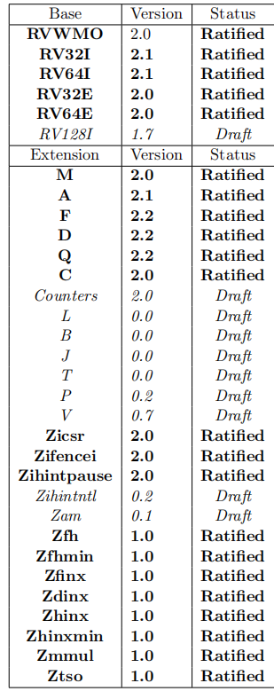

RISCV官网的manual是下面两个

The specifications shown below represent the current, ratified and published releases.

- Volume 1, Unprivileged Specification version 20191213 [[PDF](https://github.com/riscv/riscv-isa-manual/releases/download/Ratified-IMAFDQC/riscv-spec-20191213.pdf)]
- Volume 2, Privileged Specification version 20211203  [[PDF](https://github.com/riscv/riscv-isa-manual/releases/download/Priv-v1.12/riscv-privileged-20211203.pdf)]

我发现github上有最新的，因此选择最新的manual查看

三种状态

* Ratified（批准的）
* Frozen（are not expected to change significantly before being put up for ratification）
* Draft（are expected to change before ratification）



# Terminology

* platform：可以包含一个或多个RISC-V兼容的核心以及RISC-V不兼容的核心、固定功能的加速器、多种物理内存架构、IO设备以及interconnect来讲这些组件相连。
* core：一个包含独立取指单元的component。一个核心可能通过超线程技术支持多个hardware threads(harts)。
* coprocessor：一个附属在RISC-V core的单元，is mostly sequenced by a RISC-V instruction stream, 通常也包含额外的架构状态和指令集扩展（extension）
* accelerator：表示非可编程的特定功能的单元或者一个可以自动针对特定任务的core

# Software Execution Environments and Harts

Execution Environments Interface（EEI）定义了程序的初始转台、harts的类型以及数量、内存和IO区域的可访问性和属性，所有合法指令的执行表现。（ISA是EEI的一个组件）EEI的例子包括Linux application binary interface（ABI）、RISC-V supervisor binary interface（SBI），EEI的实现可以是纯软件、纯硬件或者软硬结合。实现例子包括：

1. Bare metal
2. OS
3. hypervisor
4. emulators, such as Spike, QEMU or rv8, which emulate RISC-V harts on an underlying x86 system

从运行在execution environment的软件角度来看，hart是可以自动取指执行的资源。（抽象的执行资源，而不是软件层面上的线程）

# ISA Overview

> A RISC-V ISA is defined as a base integer ISA, which must be present in any implementation, plus
> optional extensions to the base ISA.

这个base integer ISA和早期的RISC处理器指令非常相似，除了没有branch delay slot，以及拥有对可选变长指令编码的支持。

RISC-V实际上是相关ISA的家族，目前包含四个基础的ISA，每一个都有不同宽度和数量的整数寄存器和对应的地址空间。主要的base integer variants有RV32I和RV64I。提供了32bit和64bit的地址空间。我们使用```XLEN```来表示证书寄存器的位数。在RISC-V中，补码用来表示有符号整数。

> The four base ISAs in RISC-V are treated as distinct base ISAs. A common question is why is there not a single ISA, and in particular, why is RV32I not a strict subset of RV64I? Some earlier ISA designs (SPARC, MIPS) adopted a strict superset policy when increasing address space size to support running existing 32-bit binaries on new 64-bit hardware.

RISC-V支持自制扩展，可以扩展一个或者多个可选的指令集，每一个指令集编码空间被划分为三个不重叠的三类：

1. standard
2. reserved：saved for future
3. custom：available for vendor-specific non-standard extensions

为了支持更通用的软件发展，一系列标准extensions被定义

* I(Integer)
* M(Multiply)
* A(Atomic)
* F(Floating-point)
* D(Double-precision floating-point)
* C(Compressed):提供了16bits形式的指令

# Memory

RISC-V地址空间为2<sup>XLEN</sup> bytes。

* word：32 bits（4 bytes）
* halfword：16 bits（2 bytes）
* doubleword：64 bits（8 bytes）
* quadword：128 bits（16 bytes）

> The memory address space is circular, so that the byte at address 2XLEN *−*1 is adjacent to the byte at address zero. Accordingly, memory address computations done by the hardware ignore overflow and instead wrap around modulo 2XLEN.

execution environment定义了硬件资源到hart地址空间的映射。

执行RISC-V机器指令包含一个或多个memory access，被划分为implicit和explict访问两种。当执行指令时，一个implicit memory read发生来获取编码的指令。load和store指令会执行explicit memory read or write。

RISC-V默认的内存一致性模型是Weak Memory Ordering（RVWMO），定义在17章。可选的是，具体的实现可以才哟个更强的模型，比如Total Store Ordering，定义在26章。由于RVWMO是最弱的模型，因此RISCV的实现和其他模型都可以兼容。针对隐式的内存读写，软件必须执行fence或者cache-control指令来确保内存访问的特定读写。

# Exceptions Traps and Interrupts

* exception: unusual condition occurring at run time associated with an instruction in the current RISC-V hart
* interrupt:  an external asynchronous event that may cause a RISC-V hart to experience an unexpected transfer of control.
* *trap* to refer to the transfer of control to a trap handler caused by either an **exception** or an **interrupt**

从运行在execution environment的软件角度来看，harts遇到的traps可以有如下四种效果：

1. contained trap：对软件来说是可见的。
2. requested trap：请求environment代表软件做某些事情，如system call。在这种情况，有可能不会返回到harts中执行，比如system call导致environment终结或者删除该harts。
3. invisible trap：EE handle完之后转移会harts执行，软件并不知情。例子有emulate missing instructions，在demand-paged环境中处理缺页。
4. fatal trap：代表fatal failure，导致EE终止。例子包括虚拟内存页保护机制出现问题。每一个EEI需要定义execution如何终止且被报告给外部环境。

