# RISC-V Manual阅读 —— RV32I

包含40个指令，足够实现目标compiler或者OS。

## Programmers' Model for Base Integer ISA

寄存器：32个寄存器x0-x31+PC寄存器，x0默认为0。

没有特别定义stack pointer火subroutine return address是哪一个寄存器，任意一个寄存器都可以用来做这个目的。然而，standard software calling convention使用x1来作为调用的返回地址，x5作为alternate link register，x2作为stack pointer。硬件有可能会使用x1火x5来加速函数调用和返回，具体可见JAL和JALR指令。

## Base Instruction Formats

在基础的RV32I ISA中，有四个核心指令格式：R/I/S/U。所有的指令都32位长，且align32bits，如果不对齐的话，当分支指令或无条件跳转指令的目标地址不对齐，则会发生那个intruction-address-misaligned exception。这个异常报道在branch或jump指令上，而不是目标指令上。如果条件跳转没有被采用，即使目标地址misalign，也不会导致异常。

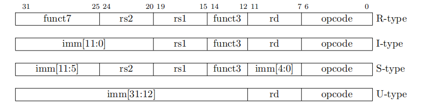

RISC-V ISA将rs和rd在所有格式中保证在相同的位置，以此来简化decode。

除了11章讲到的CSR指令中的立即数是无符号扩展，其他所有指令中的立即数都是符号扩展。实践中，sign bit都在指令的31位，以此来加速sign-extension。

> In practice, most immediates are either small or require all XLEN bits. We chose an asymmetric immediate split (12 bits in regular instructions plus a special load-upper-immediate instruction with 20 bits) to increase the opcode space available for regular instructions.

## Immediate Encoding Variants

目前存在两种指令格式的变式（B/J）来处理立即数。

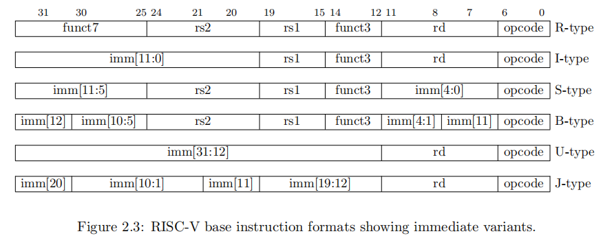

S和B唯一的区别在于，B中的立即数左移一位（相当于乘2），imm[10:1]和sign bit保留在了原来的位置上，B中的inst[7]放在了立即数的高位。

相同的是，U和J的唯一区别在于，立即数左移12位形成U，左移1位形成J。立即数在指令中的位置最大化了与其他格式的重叠。下图显示了各个指令格式中立即数的形成方式。

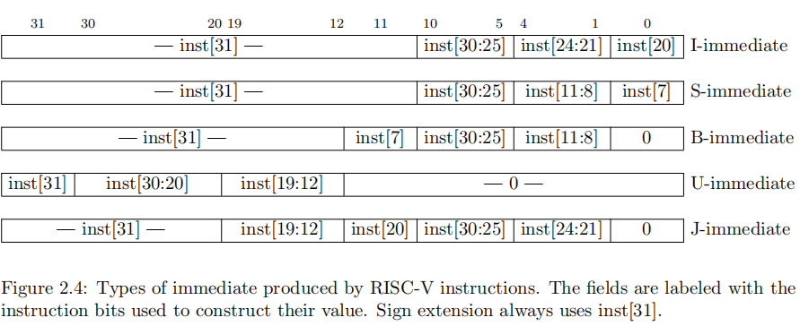

## Integer Computational Instructions

大部分整数计算指令操作在```XLEN```bits长度的值上，要么是register-immediate（I type）要么是register-register（R type）指令，目标均为```rd```寄存器。整数计算指令不会导致arithmetic exceptions。

> We did not include special instruction-set support for overflow checks on integer arithmetic operations in the base instruction set, as many overflow checks can be cheaply implemented using RISC-V branches.

* I type(opcode = OP-IMM)

  * ADDI: adds sign-extended 12-bit immediate to register rs1. Arithmetic overflow is ignored and the result is simply the low XLEN bits of the result. ADDI *rd, rs1, 0* is used to implement the MV *rd, rs1* assembler pseudoinstruction.
  * SLTI(set less than immediate):  places the value 1 in register *rd* if register *rs1* is less than the sign-extended immediate when both are treated as **signed numbers**, else 0 is written to *rd*.
  * SLTIU is similar but compares the values as unsigned numbers (i.e., the immediate is first sign-extended to ```XLEN``` bits then treated as an unsigned number). Note, SLTIU *rd, rs1, 1* sets *rd* to 1 if *rs1* equals zero, otherwise sets *rd* to 0 (assembler pseudoinstruction SEQZ *rd, rs*).
  * ANDI/ORI/XORI: are logical operations that perform bitwise AND, OR, and XOR on register *rs1*and the sign-extended 12-bit immediate and place the result in *rd* Note, XORI *rd, rs1, -1* performs a bitwise logical inversion of register *rs1* (assembler pseudoinstruction NOT *rd, rs*).

  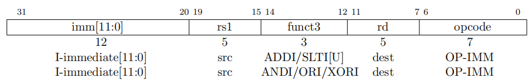

  * SLLI/SRLI/SRAI:  Shift Instructions，rs中存放要被shift的操作数，shift的位数放在imm[4:0]中。向右平移的bit在30位上，SLLI为logical left shift（0进入低位），SRLI表示为logical right shift（0进入高位），SRAI表示arithmetic right shift（原来的最高位进入高位）

  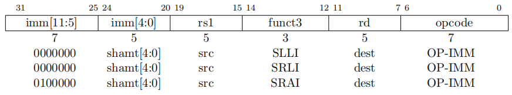

  * NOP

    除了用来增加pc，没有任何影响。NOP被编码为ADDI x0,x0, 0。可以用来进行代码段对齐、或者留出对内敛代码更改的空间。

    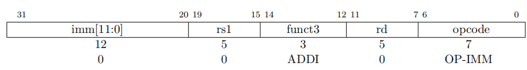

  * Memory Ordering Instructions

    FENCE指令用来order 设备IO和内存访问的顺序。任何设备输入（I）、设备输出（O）、内存读（R）和内存（W）may be ordered with respect to any combination of the same. A memory consistency model is a set of rules specifying the values that can be returned by loads of memory. Informally, no other RISC-V hart or external device can observe any operation in the *successor* set following a FENCE before any operation in the *predecessor* set preceding the FENCE.

    > Informally, no other RISC-V hart or external device can observe any operation in the *successor* set following a FENCE before any operation in the *predecessor* set preceding the FENCE.

    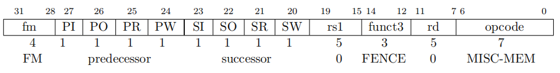

    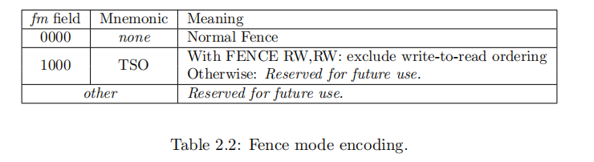

  * SYSTEM Instructions，用于访问系统资源，导致精确异常。

    * ECALL：service request
    * EBREAK：return control to a debugging environment，相当于x86上的int3，一开始设计为将控制权交给debugger

    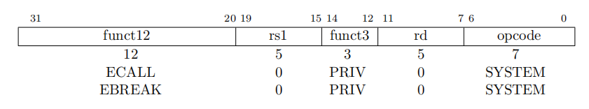

  * JALR，目标地址通过rs1+符号扩展后的12bit立即数获取，然后将最低为设置为0，将pc+4放入rd寄存器中。

    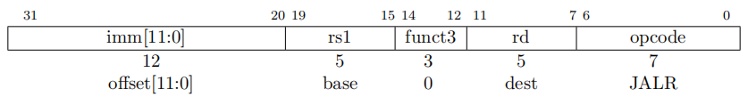

    无条件跳转都使用pc-relative address来支持position-independent 代码。JALR用来enable两个指令序列可以访问到32bit的任务绝对地址。LUI+JALR或AUIPC+JALR。实践中JALR通常立即数为0，用来配合LUI和AUIPC。当rs为x0时，使用JALR可以访问到最低2KB和最高2KB的内容。

  * Load 如果load的目标寄存器是x0的话，必须产生异常。
    * LW
    * LH：16位有符号扩展到rd中
    * LHU：0扩展到rd中
    * LB[U]

* S type

  RV32I is a load-store architecture, where only load and store instructions access memory and arithmetic instructions only operate on CPU registers.目标内存地址计算为rs1寄存器内容加上有符号扩展的12bit立即数。对其的内存访问是具有原子性的。

  Regardless of EEI, loads and stores whose effective addresses are naturally aligned shall not raise an address-misaligned exception. Loads and stores whose effective address is not naturally aligned to the referenced datatype (i.e., the effective address is not divisible by the size of the access in bytes) have behavior **dependent on the EEI.** 有的EEI可能支持非对其访问。如果不能保证非对其访问的EEI要么完成其执行，要么产生异常（address-misaligned或access-fault）。

  * Store
    * SW
    * SH
    * SB

  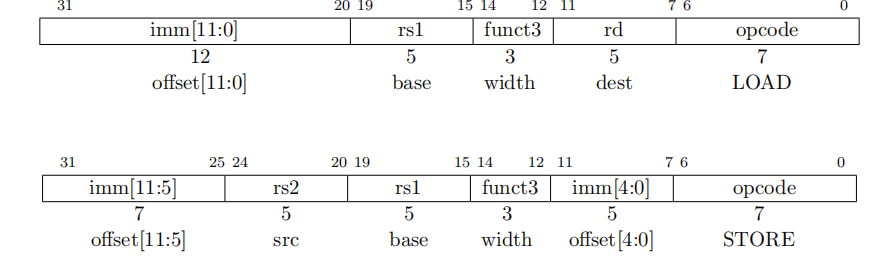

* R type： low XLEN bits of results are written to the destination *rd*

  * ADD/SLT[U] Note, SLTU *rd*, *x0*, *rs2* sets *rd* to 1 if *rs2* is not equal to zero, otherwise sets *rd* to zero (assembler pseudoinstruction SNEZ *rd, rs*).
  * AND/OR/XOR
  * SLL/SRL
  * SUB/SRA

  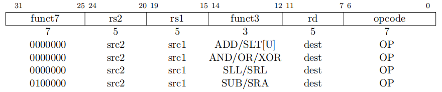

* U type

  * LUI(Load upper immediate) is used to build 32-bit constants places the 32-bit U-immediate value into the destination register *rd*, filling in the lowest 12 bits with zeros.
  * AUIPC( add upper immediate to pc) is used to build pc-relative addresses. AUIPC forms a 32-bit offset from the U-immediate, filling in the lowest 12 bits with zeros, adds this offset to the address of the AUIPC instruction, then places the result in register *rd*.

  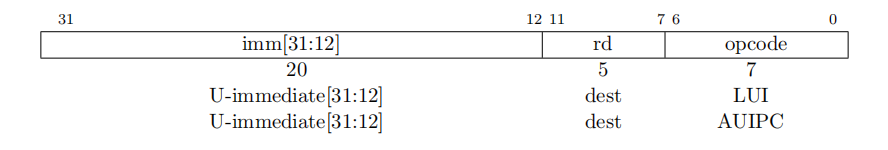

  > The combination of an AUIPC and the 12-bit immediate in a JALR can transfer control to any 32-bit pc-relative address, while an AUIPC plus the 12-bit immediate offset in regular load or store instructions can access any *32-bit* pc-relative data address.
  >
  > *The current* pc *can be obtained by setting the U-immediate to 0. Although a JAL +4 instruction could also be used to obtain the local* pc *(of the instruction following the JAL), it might *cause pipeline breaks in simpler microarchitectures or pollute branch-target buffer structures in more complex microarchitectures.*

* J type

  > If an instruction access-fault or instruction page-fault exception occurs on the target of a jump or taken branch, the exception is reported on the target instruction, not on the jump or branch instruction.

  * 无条件跳转

    J-immediate将立即数乘2，符号扩展，加上jump指令的PC形成跳转地址，因此Jump可以跳转正负1MB。

    * JAL，将pc+4存放在rd中，标准的函数调用使用x1作为返回地址寄存器，x5作为alternate link register。

      Plain unconditional jumps (assembler pseudoinstruction J) are encoded as a JAL with *rd*=x0.

    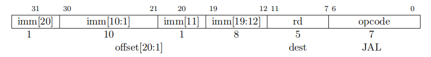

    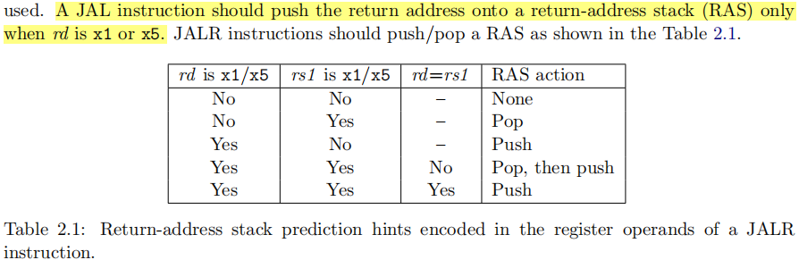

* B type ： 有条件跳转

  和JAL一样，立即数乘2，有符号扩展，加上PC得到目标地址。条件跳转的范围为正负4KB。

  * BEQ/BNE
  * BLT[U]
  * BGE[U]

  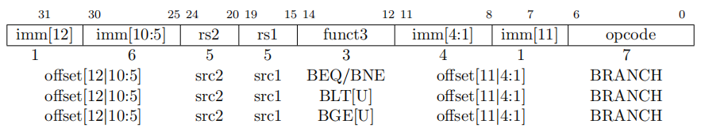

  > *Signed array bounds may be checked with a single BLTU instruction, since any negative index* will compare greater than any nonnegative bound.

* 