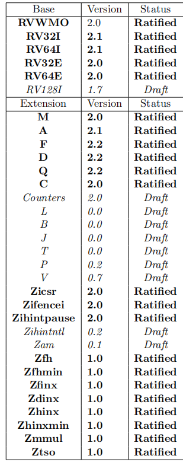

RISCV官网的manual是下面两个

The specifications shown below represent the current, ratified and published releases.

- Volume 1, Unprivileged Specification version 20191213 [[PDF](https://github.com/riscv/riscv-isa-manual/releases/download/Ratified-IMAFDQC/riscv-spec-20191213.pdf)]
- Volume 2, Privileged Specification version 20211203  [[PDF](https://github.com/riscv/riscv-isa-manual/releases/download/Priv-v1.12/riscv-privileged-20211203.pdf)]

我发现github上有最新的，因此选择最新的manual查看

三种状态

* Ratified（批准的）
* Frozen（are not expected to change significantly before being put up for ratification）
* Draft（are expected to change before ratification）

