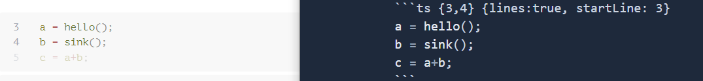

Slidev (slide + dev, **/slʌɪdɪv/**) is a web-based slides maker and presenter. It's designed for developers to focus on writing content in Markdown while also having the power of HTML and Vue components to deliver pixel-perfect layouts and designs with embedded interactive demos in your presentations.

Slidev具有如下特点：

1. 兼容markdown语法
2. 多种主题
3. 对于开发者友好。Slidev提供了code snippets，支持语法高亮，同时可以随时随地修改代码。
4. 速度快。powered by [Vite](https://vitejs.dev/), [Vue 3](https://v3.vuejs.org/) and [UnoCSS](https://unocss.dev/),每次修改文档，都会及时地显示到slides上。
5. 可移植性强。很方便的将slides导出为PDF、PNG或者一个hostable Single-page Application(SPA)

## Markdown语法

Slidev读取slides.md文件，并转化成slides。除了markdown，还可以使用内联的一些HTML 、Vue 组件。

比较重要的操作是使用```---``` with a new line来对slides进行分割。

我们可以对每一个slides的layout和metadata进行单独的设置，该设置称为front matter blocks，每一个frontmatter由三个-开始和三个-结束，中间的文字以YAML的格式表示。

### Code Blocks

```
​```ts
console.log('Hello, World!')
​```
```

### Link Highlighting

如果想要高亮某些行，使用```{}```，中间填入行数

```
​```ts {2,3}
function add(
  a: Ref<number> | number,
  b: Ref<number> | number
) {
  return computed(() => unref(a) + unref(b))
}
​```
```

如果想要enable所有slides中的line number，可以在config中设置```lineNumbers: true```，或者每一个code block中加上```{lines:true}```。同时也可以指定起始的行数

```
​```ts {6,7} {lines:true, startLine:5}
function add(
  a: Ref<number> | number,
  b: Ref<number> | number
) {
  return computed(() => unref(a) + unref(b))
}
​```
```



如果想要多个steps中改变高亮的行数，可以使用```|```进行分割。

```
​```ts {2-3|5|all}
function add(
  a: Ref<number> | number,
  b: Ref<number> | number
) {
  return computed(() => unref(a) + unref(b))
}
​```
```

如果code不能fit进入一个slides，则可以设置```maxHeight```，允许滑动来查看

## 嵌入式Styles

可以使用```<style>```tag来直接覆盖目前slides的styles

```
# This is Red

<style>
h1 {
  color: red
}
</style>

---

# Next slide is not affected
```

## 图像的放置

For local assets, put them into the [`public` folder](https://sli.dev/custom/directory-structure.html#public) and reference them with **leading slash**.

```

```

For you want to apply custom sizes or styles, you can convert them to the `` tag

```

```

请按照以上要求进行放置，不然build和导出pdf的时候可能会出现问题。

## Notes（注释）

每一页slides最后的comment block为注释，可以在presenter mode中作为note。

```
---
layout: cover
---

# Page 1

This is the cover page.

<!-- This is a note -->

---

# Page 2

<!-- This is NOT a note because it precedes the content of the slide -->

The second page

<!--
This is another note
-->
```


## 基础操作

### 初始化slidev仓库

```shell
npm init slidev
```

### 浏览器显示已有仓库

进入目录，然后运行以下命令

```
npx slidev
```

### 导出pdf

```
npx slidev export --output filename
```

### 快捷键

| Shortcuts     | Button | Description                                                  |
| :------------ | :----- | :----------------------------------------------------------- |
| f             |        | toggle fullscreen                                            |
| right / space |        | next animation or slide                                      |
| left          |        | previous animation or slide                                  |
| up            | -      | previous slide                                               |
| down          | -      | next slide                                                   |
| o             |        | toggle [slides overview](https://sli.dev/guide/navigation.html#slides-overview) |
| d             |        | toggle dark mode                                             |
| g             | -      | show goto...                                                 |


### 两栏放置内容

1. two-cols

   Separates the page content in two columns.

   #### Usage

   ```
   ---	
   layout: two-cols
   ---
   
   # Left
   
   This shows on the left
   
   ::right::
   
   # Right
   
   This shows on the right
   ```

   

### 取消在Toc中显示

```
---
hideInToc: true
---
```

### 修改字体

添加以下代码在md最前面

```
fonts:
  sans: 'LXGWWenKaiScreen'
  local: 'LXGWWenKaiScreen'
```

添加style.css文件，写入以下内容

```
* { -webkit-text-stroke-width:0.16px;}
@font-face{
    font-family: "LXGWWenKaiScreen";
    src: local("LXGWWenKaiScreen");
}
```

## Netlify部署

1. 运行命令：

   ```
   npx slidev build
   ```

   会生成静态文件在dist目录下。

2. 在项目根目录下创建`netlify.toml` ，输入以下内容

   ```
   [build.environment]
     NODE_VERSION = "14"
   
   [build]
     publish = "dist"
     command = "npm run build"
   
   [[redirects]]
     from = "/*"
     to = "/index.html"
     status = 200
   ```

3. 进入netlify官网，点击创建新的site，manually deploy。选中dist文件，将dist文件夹下的文件进行上传。


参考文档：https://sli.dev/guide/hosting.html#examples