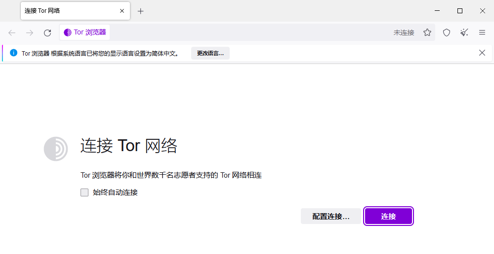

原文链接：https://sunine.notion.site/Tor-Z-Library-fca6880faf734698896329f1a1c4a825

## 前言

使用Z-Library 的官方 Telegram Bot 机器人无法下载大于 50MB 的书籍，如果想要下载大于 50MB 的书籍，则必须使用 Tor 浏览器，访问暗网版的 Z-Library

相关教程：[https://sunine.notion.site/sunine/Telegram-Z-Library-0308659487ac45e78ec1fd2e02fcee6e](https://www.notion.so/Telegram-Z-Library-0308659487ac45e78ec1fd2e02fcee6e)

## 购买 VPN

略

## 下载 Tor 浏览器

Tor 浏览器官网：

[Tor Project | 隐私和线上自由](https://www.torproject.org/zh-CN/download/)

**根据不同的电脑、手机系统下载对应的版本，本文以 Windows 系统为例。**

下载之后，打开安装。这一个步骤就不展开了，如果连安装都不会，也没必要继续看下面的内容了……

## 设置 Tor 浏览器

首先要打开你购买安装配置好的 VPN，如果你是购买我推荐的那家 VPN，那么在 Windows 系统下使用的客户端就叫做：Clash For Windows。

1. 打开 Clash For Windows，打开 **系统代理，确保能够 正常打开**  [https://www.google.com](https://www.google.com) 
2. 打开 Tor 浏览器：

1. 点击 **配置连接，**往下滚动页面，找到 **高级，**点击 **设置：**

1. 按下图设置，设置好之后，点击 **确定**

1. 点击 **************选择内置网桥：**************
   
    
    
2. 如下图：

1. 勾选 **始终自动连接，**然后点击最上面的 **连接：**

1. 之后会跳转到这个页面：

成功连接后，会跳转到这个页面：

在设置页面，会显示：

## 打开 Z-Library

最后就是打开 Z-Library 登录页面，

在 Tor 浏览器地址栏，输入地址：[http://loginzlib2vrak5zzpcocc3ouizykn6k5qecgj2tzlnab5wcbqhembyd.onion/](http://loginzlib2vrak5zzpcocc3ouizykn6k5qecgj2tzlnab5wcbqhembyd.onion/)

登录后，会自动跳转到暗网版的 Z-Library：

