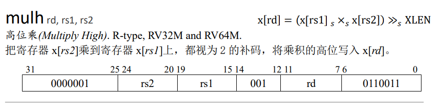
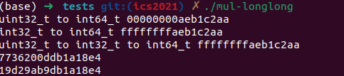

今天在做南京大学的PA时遇到了一个C语言的问题，导致am-kernel程序的mul-longlong.c一直无法通过测试，后来发现和C语言的类型转换有关系。

RISCV32中MULH的功能如下：



需要对两个32位数进行相乘取高位，在C语言的NEMU实现中```src1```和```src2```均为```word_t(uint32_t)```类型，因此我采用类型提升的操作将其直接转换为```int64_t```类型然后相乘。在遇到第一个测试发生错误。

正确答案：

```
(long long)0xaeb1c2aa * (long long)0xaeb1c2aa => 0x19d29ab9db1a18e4
```

我的答案：

```
(long long)0xaeb1c2aa * (long long)0xaeb1c2aa => 0x7736200DDB1A1800
```

后来我使用微软自带的和网络上的计算机得到的结果也是我自己的答案，当时有些蒙圈了，后来仔细分析还是和乘法的符号有关，于是写了一个程序简单看一下结果。

```c
#include <stdio.h>
#include <assert.h>
#include <stdint.h>

int main() {
        int i ,j ,ans_idx = 0;
        uint32_t x = 0xaeb1c2aa;
        int32_t y = 0xaeb1c2aa;
        printf("uint32_t to int64_t %016lx\n", (int64_t)x) ;
        printf("int32_t to int64_t %016lx\n", (int64_t)y) ;
        printf("uint32_t to int32_t to int64_t %016lx\n", (int64_t)(int32_t)x) ;
        printf("%lx\n", (int64_t)x * (int64_t)x) ;
        printf("%lx\n", (int64_t)(int32_t)x * (int64_t)(int32_t)x) ;
        return 0;
}
```

得到结果如下：



发现直接将uint32_t的变量转换为int64_t是会直接0扩展的，而不是先看成符号数进行符号位扩展，因此得到的计算结果有误。