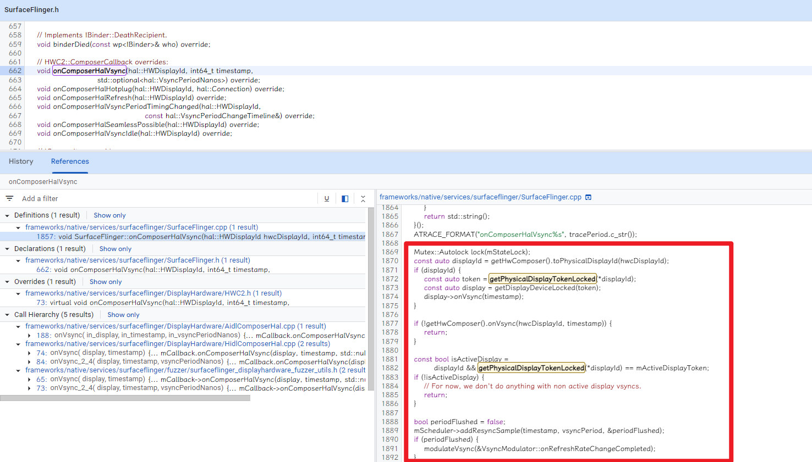

# Android Graphics

## Vsync

Application 开发者使用如下三种方式将图像绘制到屏幕上：

1. Canvas
2. OpenGL ES
3. Vulkan

## Android graphics组件

不论开发者使用什么API，所有东西都会被绘制成一个surface。Surface 表示缓冲区队列的生产者端，通常由 SurfaceFlinger 使用。

>  Every window that is created on the Android platform is backed by a surface

* image stream producers

  可以是任何生产graphic buffer的东西，包括OpenGL ES，Canvas 2D和mediaserver video decoders

* image stream consumers

  最常见的消费者是SurfaceFlinger。使用Windows manager提供的信息，将目前可见的surface组合到屏幕上。SurfaceFlinger是唯一可以更改显示内容的服务。Surfaceflinger使用OpenGL和Hardware Composer来组合一组surface。

* hardware composer

  显示系统的硬件抽象层。

  SurfaceFlinger can delegate certain composition work to the Hardware Composer to offload work from OpenGL and the GPU.

* Gralloc

  图像内存allocator，用于分配image producer所需要的内存。

  Gralloc根据usage flags来执行buffer的分配，usage flags包含以下几个属性

  * How often the memory will be accessed from software (CPU)
  * How often the memory will be accessed from hardware (GPU)
  * Whether the memory will be used as an OpenGL ES (GLES) texture
  * Whether the memory will be used by a video encoder

## Data Flow

### Buffer Queue

是图像各个组件的胶水，将各个组件联系在一起。

> BufferQueue contains the logic that ties image stream producers and image stream consumers together. 

**BufferQueue is a data structure that combines a buffer pool with a queue and uses Binder IPC to pass buffers between processes.**

BufferQueue可以工作三个不同的模式上：

1. Synchronous-like模式：不丢弃任何buffer，当供大于求，进行阻塞。
2. Non-blocking模式：不丢弃任何buffer，不进行阻塞，而是产生错误。可以用来避免潜在的死锁。
3. Discard模式：丢弃buffer。

#### BufferQueue And Gralloc

Consumers **create and own** the BufferQueue data structure and can exist in different processes than their producers.

当生产者需要buffer时，调用`dequeueBuffer()`函数从BufferQueue中请求空闲的buffer，指定buffer的宽度、高度、像素格式和usage flags。当生产者填充buffer后，调用`queueBuffer`将buffer还给bufferQueue。接着消费者通过`acquireBuffer()`获取buffer，然后使用buffer的内容，完成后调用`releaseBuffer`将bufferQueue还给bufferQueue。

BufferQueue的一些特性如buffer的最大数量，是有生产者和消费者共同决定的。

enable `gfx`，`view`和`sched`可以追踪到BufferQueue的一些信息。

当 VSYNC 信号到达时，SurfaceFlinger 会遍历它的层列表，以寻找新的缓冲区。如果找到新的缓冲区，它会获取该缓冲区；否则，它会继续使用以前获取的缓冲区。SurfaceFlinger 必须始终显示内容，因此它会保留一个缓冲区。如果在某个层上没有提交缓冲区，则该层会被忽略。SurfaceFlinger 在收集可见层的所有缓冲区之后，便会询问 Hardware Composer 应如何进行合成。

Hardware Composer HAL (HWC) 用于确定通过可用硬件来合成缓冲区的最有效方法。作为 HAL，其实现是特定于设备的，而且通常由显示设备硬件原始设备制造商 (OEM) 完成。

## Surface

surface是生产者和消费者交换buffers的一个借口。一个显示surface的bufferQueue通常被配置成triple-buffering。

Buffers are allocated on demand, so if the producer generates buffers slowly enough, such as at 30 fps on a 60 fps display, there might only be two allocated buffers in the queue.

当应用进入前台时，WindowManager 服务会向 SurfaceFlinger 请求一个绘图 Surface。SurfaceFlinger 会创建一个其主要组件为 BufferQueue 的层，而 SurfaceFlinger 是其消耗方。生产方端的 Binder 对象通过 WindowManager 传递到应用，然后应用可以开始直接将帧发送到 SurfaceFlinger。

## Layer

A *Layer* is the most important unit of composition. A layer is a combination of a [surface](https://source.android.com/docs/core/graphics/arch-sh) and an instance of [`SurfaceControl`](https://developer.android.com/reference/android/view/SurfaceControl). Each layer has a set of properties that define how it interacts with other layers. Layer properties are described in the table below.

| Property     | Description                                                  |
| :----------- | :----------------------------------------------------------- |
| Positional   | Defines where the layer appears on its display. Includes information such as the positions of a layer's edges and its *Z order* relative to other layers (whether it should be in front of or behind other layers). |
| Content      | Defines how content displayed on the layer should be presented within the bounds defined by the positional properties. Includes information such as crop (to expand a portion of the content to fill the bounds of the layer) and transform (to show rotated or flipped content). |
| Composition  | Defines how the layer should be composited with other layers. Includes information such as blending mode and a layer-wide alpha value for [alpha compositing](https://en.wikipedia.org/wiki/Alpha_compositing#Alpha_blending). |
| Optimization | Provides information not strictly necessary to correctly composite the layer, but that can be used by the Hardware Composer (HWC) device to optimize how it performs composition. Includes information **such as the visible region of the layer and which portion of the layer has been updated since the previous frame.** |

* BufferLayer顾名思义，就是有Buffer的Layer，需要上层应用Producer去生产。
* ColorLayer可以绘制一种制定的颜色，和制定的透明度Alpha。它是取代之前的Dim Layer的，可以设置任何的颜色只，而不只是黑色。

To conduct most of this work, SurfaceFlinger acts as just another OpenGL ES client. So when SurfaceFlinger is actively compositing one buffer or two into a third, for instance, it is using OpenGL ES.

The Hardware Composer HAL conducts the other half of the work. This HAL acts as the central point for all Android graphics rendering.

## SurfaceFlinger

