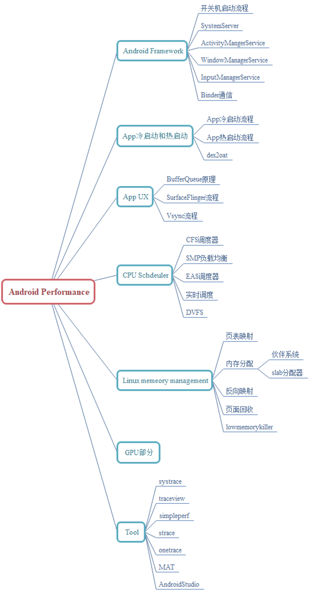
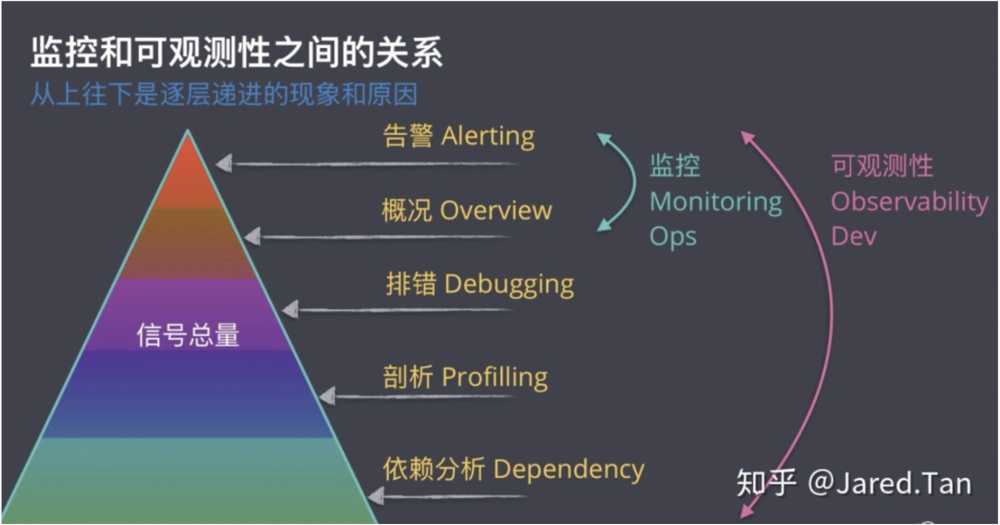
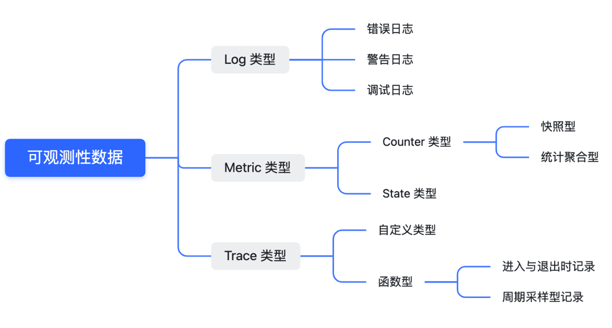
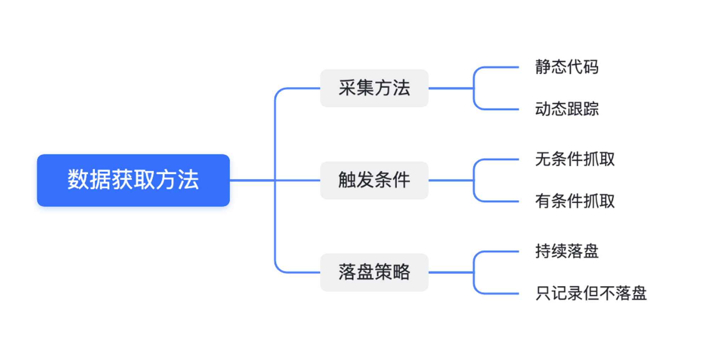
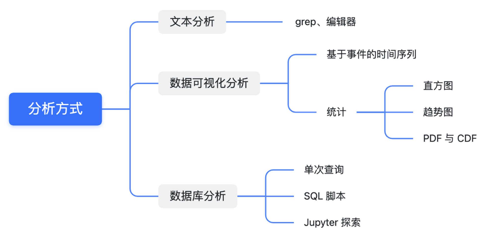
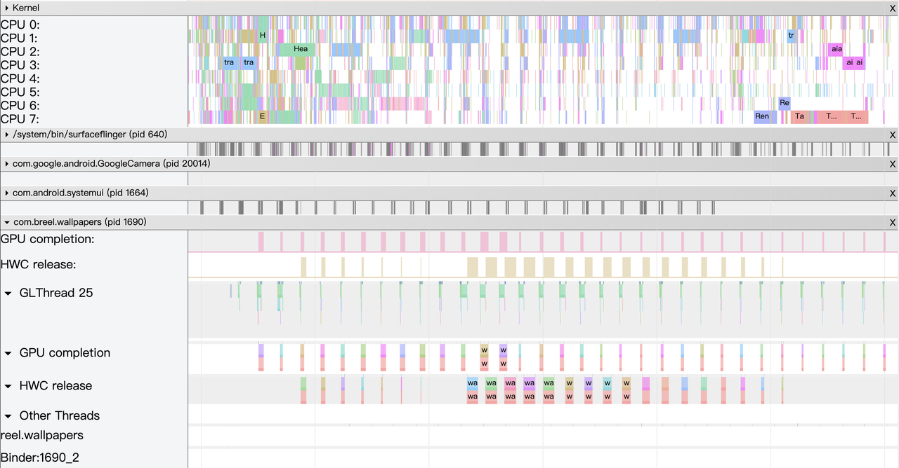
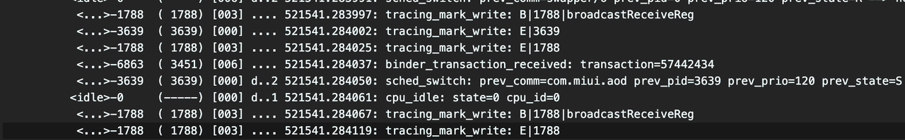
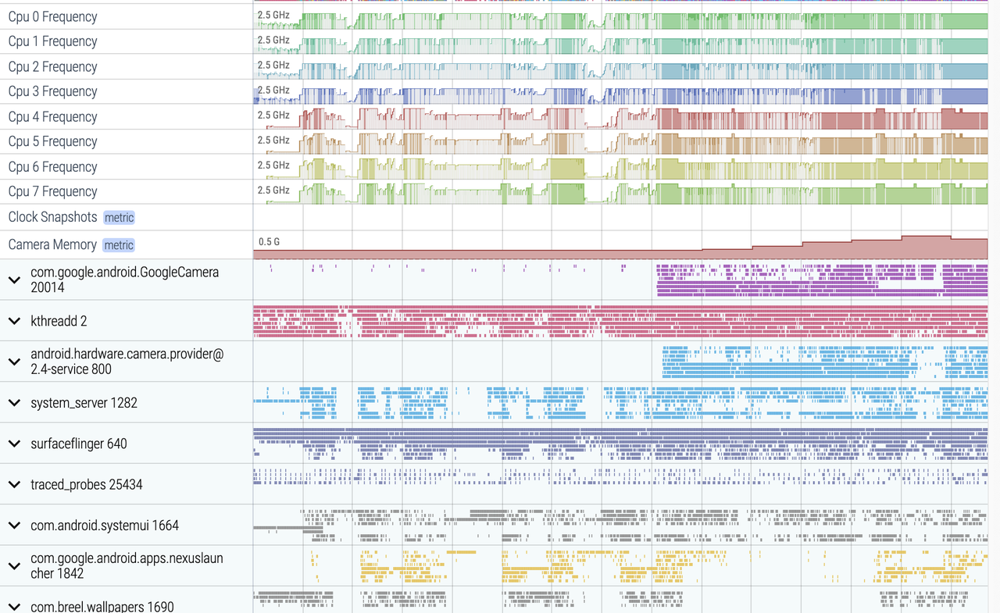

[TOC]

> Paul Graham 在其著作 <黑客与画家> 中断言：“不同语言的执行效率差距正变得越来越大，所以性能分析器（profiler）将变得越来越重要。目前，性能分析并没有受到重视。许多人好像仍然相信，程序运行速度提升的关键在于开发出能够生成更快速代码的编译器。**代码效率与机器性能的差距正在不断加大，我们将会越来越清楚地看到，应用软件运行速度提升的关键在于有一个好的性能分析器**帮助指导程序开发。”

在性能分析领域，银弹级别的工具是不存在的。工具在发展，老问题会以新的方式变样出现，不掌握核心逻辑的话时钟会让你浮于技术表面。[1]

## 可观测性技术

「可观测性技术」的类别。它研究的是通过工具，来观测复杂系统的运行细节，内容越细越好。对于复杂的系统来说，你通过阅读代码来了解整个运行过程其实是很困难的事情，更高效的方法就是借助此类工具，以最直观的的方式获取软件运行的状态。

可观测性技术是一个系统性工程，它能够让你更深入的了解软件里发生的事情。可用于了解软件系统内部运行过程（特别是对于业务逻辑或者交互关系复杂的系统）、排查问题甚至通过寻找瓶颈点优化程序本身。对于复杂的系统来说，你通过阅读代码来了解整个运行过程其实是很困难的事情，更高效的方法就是借助此类工具，以最直观的的方式获取软件运行的状态。

- 数据类型

  

  - Log类型：最朴素的数据记录方式，一般记录了在什么模块在**几点发生了什么事情**。几乎所有的 Log 类型是通过 string 类型的方式存储，数据呈现形式是一条一条的文本数据。**Log 是最基本的类型，因此通过转换，可以将 Log 类型转换成 Metric 或者 Trace 类型**，当然成本就是转换的过程，当数据量非常巨大的时候这可能会成为瓶颈。

  - Metric类型：它记录的是某个**维度**上**数值**的变化。知识点是「维度」与「数值」的变化。维度可能是 CPU 使用率、CPU Cluster 运行频率，或者上下文切换次数。数值变化既可以是采样时候的瞬时值（成为快照型）、与前一次采样时的差值（增或减）、或者某个时段区间的统计聚合值。

    实践中经常会使用统计值，比如我想看问题发生时刻前 5 分钟的 CPU 平均使用量。这时候需要将这五分钟内的所有数值做算数平均计算，或者是加权平均（如: 离案发点越近的样本它的权重就越高）。

  - Trace类型：Trace 类型标识了事件发生的时间、名称、耗时。多个事件通过关系，标识出了是父与子还是兄弟。当分析多个线程间复杂的调用关系时 Trace 类型是最方便的数据分析方式。

    Trace 类型特别适用于 Android 应用与系统级的分析场景，因为用它可以诊断:

    1. 函数调用链
    2. Binder 调用时的调用链
    3. 跨进程事件流跟踪

    Trace 类型可以由你手动添加开始与结束点，在一个函数里可以添加多个这种区间。通过预编译技术或者编程语言的特性，在函数的开头与结尾里自动插桩 Trace 区间。理想情况下后者是最好的方案，因为我们能知道系统中运行的所有的函数是哪些、执行情况与调用关系是什么。可以拿这些信息统计出调用次数最多（最热点）的函数是什么，最耗时的函数又是什么。可想而知这种方法带来的性能损耗非常大，因为函数调用的频次跟量级是非常大的，越是复杂的系统量级就越大。

    因此有一种迂回的方法，那就通过采样获取调用栈的方式近似拟合上面的效果。采样间隔越短，就越能拟合真实的调用关系与耗时，但间隔也不能太小因为取堆栈的操作本身的负载就会变高因为次数变多了。这种方法，业界管他叫 Profiler，你所见过的绝大部分编程语言的 Profiler 工具都是基于这个原理实现的。

- 数据获取方法

  

  - 静态代码和动态跟踪

    静态代码的采集方式是最原始的方式，优点是实现简单缺点是每次新增内容的时候需要重新编译、安装程序。

    更进一步的做法是预先把所有可能需要的地方上加入数据获取点，通过动态判断开关的方式选择是否输出，这既可以控制影响性能又能够在需要日志的时候可以动态打开，只不过这种方法的成本非常高。

    动态跟踪技术其实一直都存在，只是它的学习成本比较高，被誉为调试跟踪领域里的屠龙刀。它需要你懂比较底层的技术，特别是编译、ELF 格式、内核、以及**熟悉代码中的预设的探针**、动态跟踪所对应的编程语言。对，你没看错，这种技术甚至还有自己的一套编程语言用于「动态」的实现开发者需求。这种方式兼具性能、灵活性，甚至线上版本里遇到异常后可以动态查看你想看的信息。

    它有两个关键点，**探针与动态语言**，程序运行过程中需要有**对应的探针点将程序执行权限交接到动态跟踪框架，框架执行的逻辑是开发者使用动态语言来编写的逻辑。**个人理解为提供一个hook接口，接上自己的程序进行分析。

    所以，你的程序里首先是要有探针，好在 Linux 内核等框架埋好了对应的探针点，但是 android 应用层是没有现成的。所以目前 Android 上能用动态框架，如 eBPF **基本都是内核开发者在使用**。

  - 无条件抓取与有条件抓取

    无条件式抓取比较好理解，触发抓取之后不管发生任何事情，都会持续抓取数据。缺点是被观测对象产生的数据量非常大的时候可能会对系统造成比较大的影响，这种时候只能通过降低数据量的方式来缓解。需要做到既能满足需求，性能损失又不能太大。

    有条件式抓取经常用在可以识别出的异常的场景里。比如当系统的某个观测值超过了预先设定的阈值时，此时触发抓取日志并且持续一段时间或者达到另外一种阈值之后结束抓取。这相比于前面一个方法稍微进步了一些，仅在出问题的时候对系统有影响，其他时候没有任何影响点。**但它需要你能够识别出异常，并且这种异常是不需要异常发生之前的历史数据。**当然你可以通过降低阈值来更容易达到触发点，这可能会提高触发数据抓取的概率，这时候会遇到前面介绍的无条件式抓取遇到的同样的问题，需要平衡性能损失。

  - 落盘策略

    持续落盘是存储整个数据抓取过程中的所有数据，代价是存储的压力。如果能知道触发点，比如能够检测到异常点，这时候可以选择性的落盘。为了保证历史数据的有效性，因此把日志先暂存储到 RingBuffer 中，只有接受到落盘指令后再进行落盘存储。这种方式兼顾了性能与存储压力，但成本是运行时内存损耗与触发器的准确性。

- 分析方法

  

  - 文本分析

  - 数据可视化分析

    Systrace 的可视化框架是基于 Chrome 的一个叫 Catapult 的子项目构建。[Trace Event Format](https://docs.google.com/document/d/1CvAClvFfyA5R-PhYUmn5OOQtYMH4h6I0nSsKchNAySU/preview) 讲述了 Catapult 所支持的数据格式，如果你有 Trace 类型的数据，完全可以使用此框架来展示可视化数据。AOSP 编译系统，安卓应用的编译过程，也都有相应的 Trace 文件输出，它们也都基于 Catapult 实现了可视化效果。

  - 数据库分析

    面对大量数据分析的分析，通过对数据进行格式化，把他们转换成二维数据表，借助 SQL 语言可实现高效的查询操作。在服务器领域中 [ELK](https://www.elastic.co/cn/what-is/elk-stack) 等技术栈可以实现更为灵活的格式化搜索与统计功能。借助数据库与 Python，你甚至可以实现一套自动化数据诊断工具链。

  单纯的看一个模块的耗时用文本分析就够用了，多个系统间的交互那就要用可视化工具，复杂的数据库分析就要用到 SQL 的工具。无论哪种分析方式，本质上都是针对数据的分析，在实战中我们经常会通过其他工具对数据进行转换以支持不同的分析方式，比如从文本分析方式改成数据库分析方式。

## 谷歌三大件分析工具

Systrace，Perfetto 与 Android Studio 中的 Profiler 工具。通过他们定位出主要瓶颈之后，你才需要用到其他领域相关工具。

### Systrace

Systrace 是 Trace 类型的可视化分析工具，是第一代系统级性能分析工具。Trace 类型所支持的功能它都有支持。在 Perfetto 出现之前，基本上是唯一的性能分析工具，它将 Android 系统和 App 的运行信息以图形化的方式展示出来，与 Log 相比，Systrace 的图像化方式更为直观；与 TraceView 相比，抓取 Systrace 时候的性能开销基本可以忽略，最大程度地减少观察者效应带来的影响。

#### Systrace 的设计思路

在**系统的一些关键操作**（比如 Touch 操作、Power 按钮、滑动操作等）、**系统机制**（input 分发、View 绘制、进程间通信、进程管理机制等）、**软硬件信息**（CPU 频率信息、CPU 调度信息、磁盘信息、内存信息等）的关键流程上，插入类似 Log 的信息，我们称之为 TracePoint（本质是 Ftrace 信息），通过这些 TracePoint 来展示一个核心操作过程的执行时间、某些变量的值等信息。然后 Android 系统把这些散布在各个进程中的 TracePoint 收集起来，写入到一个文件中。导出这个文件后，Systrace 通过解析这些 TracePoint 的信息，得到一段时间内整个系统的运行信息。

Android 系统中，一些重要的模块都已经默认插入了一些 TracePoint，通过 TraceTag 来分类，其中信息来源如下

1. Framework Java 层的 TracePoint 通过 android.os.Trace 类完成
2. Framework Native 层的 TracePoint 通过 ATrace 宏完成
3. App 开发者可以通过 android.os.Trace 类自定义 Trace

### Perfetto

官网上号称它是下一代面向可跨平台的 Trace/Metric 数据抓取与分析工具。应用也比较广泛，除了 Perfetto 网站，[Windows Performance Tool](https://devblogs.microsoft.com/performance-diagnostics/new-tools-for-analyzing-android-linux-and-chromium-browser-performance/) 与 [Android Studio](https://developer.android.com/studio)，以及华为的 [GraphicProfiler](https://developer.huawei.com/consumer/cn/doc/development/Tools-Guides/overview-0000001050741459) 也支持 Perfetto 数据的可视化与分析。

Perfetto 相比 Systrace 最大的改进是可以支持长时间数据抓取，这是得益于它有一个可在后台运行的服务，通过它实现了对收集上来的数据进行 Protobuf 的编码并存盘。从数据来源来看，核心原理与 Systrace 是一致的，也都是基于 Linux 内核的 Ftrace 机制实现了用户空间与内核空间关键事件的记录（ATRACE、CPU 调度）。

Perfetto 所支持的数据类型、获取方法，以及分析方式上看也是前所未有的全面，它几乎支持所有的类型与方法。数据类型上通过 ATRACE 实现了 Trace 类型支持，通过可定制的节点读取机制实现了 Metric 类型的支持，在 UserDebug 版本上通过获取 Logd 数据实现了 Log 类型的支持。

不过 Perfetto 也有一些边界，首先它虽然提供了较高的灵活性但本质上还是静态数据收集器，不是动态跟踪工具，跟 eBPF 还是有本质上的差异。其次运行时成本比较高，因为涉及到在手机中实现 Ftrace 数据到 Perfetto 数据的转换。最后他不提供文本分析方式，只能通过网页可视化或者操作 SQLite 来进行额外的分析了。

### Android studio profiler

Android Profiler，它是一个集合体，集成了多种性能分析工具于一体，让开发者可以在 Android Studio 做开发应用，也不用再下载其它工具就能让能做性能调优工作。

目前 Android Studio Profiler 已经集成了 4 类性能分析工具： CPU、Memory、Network、Battery，其中 CPU 相关性能分析工具为 CPU Profiler，也是本章的主角，它把 CPU 相关的性能分析工具都集成在了一起，开发者可以根据自己需求来选择使用哪一个。可能很多人都知道，谷歌已经开发了一些独立的 CPU 性能分析工具，如 Perfetto、Simpleperf、Java Method Trace 等，现在又出来一个 CPU Profiler，显然不可能去重复造轮子，CPU Profiler 目前做法就是：从这些已知的工具中获取数据，然后把数据解析成自己想要的样式，通过统一的界面展示出来。

CPU Profiler 集成了性能分析工具：Perfetto、Simpleperf、Java Method Trace，它自然而然具备了这些工具的全部或部分功能，如下：

1. **System Trace Recording，它是**用 Perfetto 抓取的信息，可用于分析进程函数耗时、调度、渲染等情况，但是它一个精简版，只能显示进程强相关的信息且会过滤掉耗时短的事件，建议将 Trace 导出文件后在 https://ui.perfetto.dev/ 上进行分析。
2. **Java Method Trace Recording，它是**从虚拟机获取函数调用栈信息，用于分析 Java 函数调用和耗时情况。
3. **C/C++ Function Trace，它是用** Simpleperf 抓取的信息，Simpleperf 是从 CPU 的性能监控单元 PMU 硬件组件获取数据。 **C/C++ Method Trace** 只具备 Simpleperf 部分功能，用于分析 C/C++ 函数调用和耗时情况。

AS 中的 CPU Profiler 最大优势是集成了各种子工具，在一个地方就能操作一切，对应用开发者来说是非常方便的，**不过对系统开发者来说可能没那么幸运。**

## 其他分析工具

### Java Method Trace & TraceView

个人理解traceview貌似是以前的说法，两者method trace是现在的说法，两者都是针对function级别追踪，知道每个函数的运行大小，并以调用栈的形式展现。

根据Android官网所说，**Traceview 已废弃**。如果开发者使用的是 Android Studio 3.2 或更高版本，应改为使用 [**CPU 性能分析器**](https://developer.android.com/studio/profile/cpu-profiler?hl=zh-cn)来执行以下操作：检查通过使用 [`Debug`](https://developer.android.com/reference/android/os/Debug?hl=zh-cn) 类[对应用进行插桩](https://developer.android.com/studio/profile/generate-trace-logs?hl=zh-cn)而捕获的 `.trace` 文件，记录新方法轨迹，保存 `.trace` 文件，以及检查应用进程的实时 CPU 使用情况。下面是TraceView的一个简单介绍：

Traceview 是一个性能分析工具，告诉我们每一个方法执行了多长时间。Traceview 这款工具能够以图形的形式显示轨迹日志。可以通过使用 [`Debug`](https://developer.android.com/reference/android/os/Debug?hl=zh-cn) 类在代码中插桩以生成此类日志。这种跟踪方法非常精确，因为您可以指定需在代码中开始和停止记录轨迹数据的确切位置。如果您尚未生成此类轨迹日志并将其从连接的设备保存到本地计算机，请参阅[通过应用插桩生成轨迹日志](https://developer.android.com/studio/profile/generate-trace-logs?hl=zh-cn)。使用 Traceview 检查此类日志有助于您调试应用并分析其性能。

### MAT

MAT(Memory Analyzer Tool)，一个基于 Eclipse 的内存分析工具，是一个快速、功能丰富的JAVA heap分析工具，它可以帮助我们查找内存泄漏和减少内存消耗。使用内存分析工具从众多的对象中进行分析，快速的计算出在内存中对象的占用大小，看看是谁阻止了垃圾收集器的回收工作，并可以通过报表直观的查看到可能造成这种结果的对象。

### LOG

LogReport 抓取或者录制的 Log , 里面包含大量的信息 , 包括各种常规 Log (Main Log , System Log , Event Log , Kernel Log , Crash Log 等) , 也包含了厂商自己加的一些 Log ( Power Log , Performance Log 等) , 也包含事故发生时候的截图 \ 录制的视频等。通常我们可以使用logcat/dmesg/dumpsys等命令查看系统的log输出。

### Simpleperf

现代CPU一般都带有一个叫做性能监视单元（PMU）的组件，这个硬件能够记录诸如cpu周期数、执行的指令数、缓存失效次数等等关键信息；Linux内核对这个硬件做了一层封装，通过 `perf_event_open` 系统调用把接口暴露给用户空间；这就是simpleperf工具的由来。

### Bugreport

bugreport 是Android 系统下的一个工具，功能类似于系统的一个黑匣子；通过执行相应的命令可以获取到bugreport 包，其中包含设备日志，堆栈跟踪和其他诊断信息，可帮助您查找和修复系统错误；bugreport信息量非常之大，几乎涵盖整个系统各个层面内容，对于分析BUG是一大利器。

个人感觉安卓中的Log()函数、Debug()函数以及Trace()函数，都为安卓的性能追踪提供了很好的帮助。

## 综合对比

|               工具名称                |               应用场景                |        数据类型        |               获取方法               |       分析方式        |
| :-----------------------------------: | :-----------------------------------: | :--------------------: | :----------------------------------: | :-------------------: |
|               Systrace                |      Android 系统与应用性能分析       |       Trace 类型       |         无条件抓取 持续落盘          |      可视化分析       |
|               Perfetto                |      Android 系统与应用性能分析       | Metric 类型 Trace 类型 |         无条件抓取 持续落盘          | 可视化分析 数据库分析 |
|              AS Profiler              |      Android 系统与应用性能分析       |       Trace 类型       |         无条件抓取 持续落盘          |      可视化分析       |
|              SimplePerf               | Java/C++ 函数执行耗时 分析 PMU 计数器 |       Trace 类型       |         无条件抓取 持续落盘          |  可视化分析 文本分析  |
| Snapdragon Profiler Tools & Resources |       主要是高通 GPU 性能分析器       | Trace 类型 Metric 类型 |         无条件抓取 持续落盘          |      可视化分析       |
|        Mali Graphics Debugger         |    ARM GPU 分析器 (MTK、麒麟芯片)     | Trace 类型 Metric 类型 |         无条件抓取 持续落盘          |      可视化分析       |
|          Android Log/dumpsys          |               综合分析                |        Log 类型        |     有条件抓取 持续抓取但不落盘      |       文本分析        |
|      AGI (Android GPU Inspector)      |          Android GPU 分析器           | Trace 类型 Metric 类型 |         无条件抓取 持续落盘          |      可视化分析       |
|                 eBPF                  |        Linux 内核行为动态跟踪         |      Metric 类型       | 动态跟踪 有条件抓取 持续抓取但不落盘 |       文本分析        |
|                FTrace                 |            Linux 内核埋点             |        Log 类型        | 静态代码 有条件抓取 持续抓取但不落盘 |       文本分析        |

## 性能分析的Workflow

应用卡顿问题的原因比较多, 在数据埋点还没有完善的情况下, 更多的依赖 Systrace 来从全局的角度来分析卡顿的具体原因 [2]:

1. Systrace 分析
   1. 首先确认卡顿的 App
   2. 通过 App 的主线程和 SurfaceFlinger 的主线程信息可以确定卡顿的现场
   3. 分析 Systrace , Systrace 的分析需要一定的知识储备 : 需要知道 Systrace 每一个模块展示的内容是如何与用户感受到的内容相对应的 ; 需要知道 Systrace 上各个模块的交互式如何展示的 ; 需要知道 Binder 调用信息 ; 需要会看 Kernel 信息
      1. 如果是 App 主线程耗时, 则分析 App 主线程的原因 ( 案例里有 App 的卡顿原因 )
      2. 如果是 System 的问题, 则需要分析 System_Server \ SurfaceFlinger \ HWC \ CRTC \ CPU 等 ( 详细参考下面系统卡顿原因)
2. TraceView + 源码分析
   1. 使用 Systrace 确定原因后, 可以使用 TraceView 结合源码查看对应的代码逻辑 , Android Studio 的 Profile 工具可以以进程为单位 , 进行 Method 的 Profile , 可以打出非常详细的函数调用栈 , 并且可以与 Systrace 相对应
   2. 源码分析可以使用 Android Studio 进行断点调试 App 或者 Framework , 观察 Debug 信息是否与预期相符
3. 很多问题也需要借助 Log 工具抓上来的 Log 进行分析 , Log 分析 Log 里面一些比较重要的点 (一般从 Log 里面很难确定卡顿的原因, 但是可以结合 Systrace 做一定的辅助分析)
   1. 截图 : 确定卡顿发生的时间点 \ 卡顿的界面 (如果没有尽量提供)
   2. dumpsys meminfo 信息
   3. dumpsys cpuinfo 信息
   4. “Slow dispatch” 和 “Slow delivery” Log 信息
   5. 卡顿发生的一段时间内的 EventLog , 还原卡顿时候用户的操作
4. 本地尝试复现
   1. 可以录高速录像, 观察细节,如果必现,可以让测试这边提供录像.
   2. 过滤 Log , 找到卡顿时候的异常 Log
   3. 多抓几份 Systrace , 有助于确定原因
5. 可以让测试提供 LogReport 中没有的一些信息, 来分析当时用户的手机的整体的状态.
   1. adb shell dumpsys activity oom
   2. adb shell dumpsys meminfo
   3. adb shell cat /proc/buddyinfo
   4. adb shell dumpsys cpuinfo
   5. adb shell dumpsys input
   6. adb shell dumpsys window

## 关于 器、术、道

- 「器」Linux 社区以及谷歌所开发的工具发展方向朝着提高工具的集成化使得在一个地方可以方便查到所需的信息、或者是朝着获取更多信息的方向发展。
- 「术」层面依赖具体的业务知识，知道一帧是如何被渲染的、CPU 是如何选择进程调度的、IO 是如何被下发的等等。只有了解了业务知识才能正确的选择工具并正确的解读工具所提供的信息。
- 「道」层面思考的是要解决什么问题，问题的本质是什么？做到什么程度以及需要投入什么样的成本达成什么样的效果。为了解决一个问题，什么样的路径的「投入产出比」是最高的？整体打法是什么样？为了完成一件事，你首先要做什么其次是做什么，前后依赖关系的逻辑又是什么？

## Reference

1. [Android 性能优化的术、道、器](https://androidperformance.com/2022/01/07/The-Performace-1-Performance-Tools/#/1-%E6%80%A7%E8%83%BD%E5%88%86%E6%9E%90%E4%B8%AD%E7%9A%84%E5%8F%AF%E8%A7%82%E6%B5%8B%E6%80%A7%E6%8A%80%E6%9C%AF)
2. [Android 中的卡顿丢帧原因概述 - 方法论](https://androidperformance.com/2019/09/05/Android-Jank-Debug/#/1-%E6%B5%81%E7%95%85%E5%BA%A6%E7%9B%B8%E5%85%B3%E5%B7%A5%E4%BD%9C%E5%86%85%E5%AE%B9%E6%A6%82%E8%BF%B0)