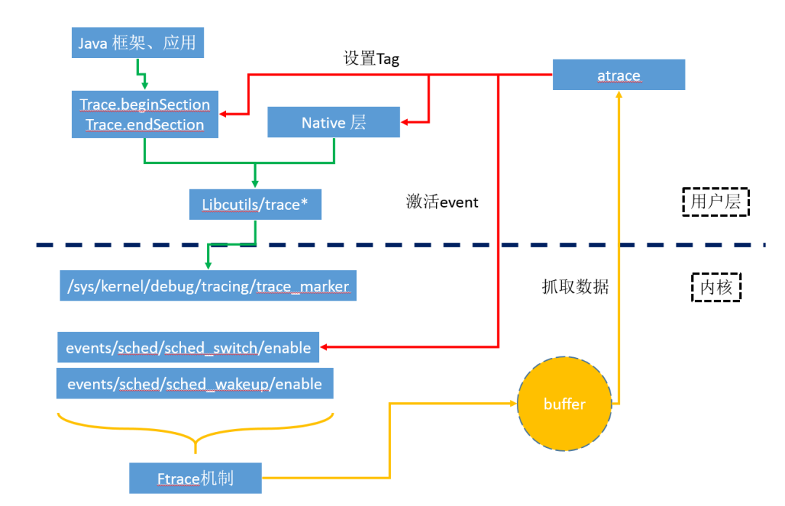
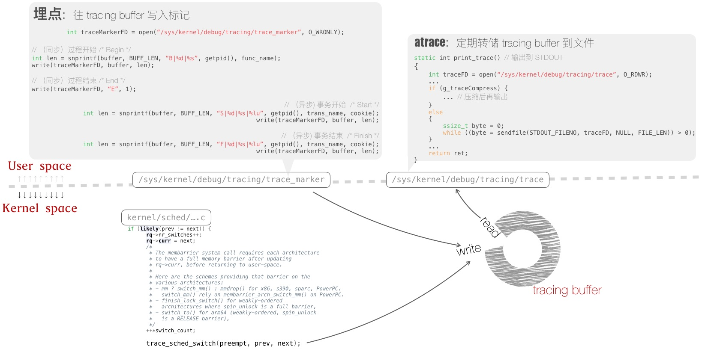
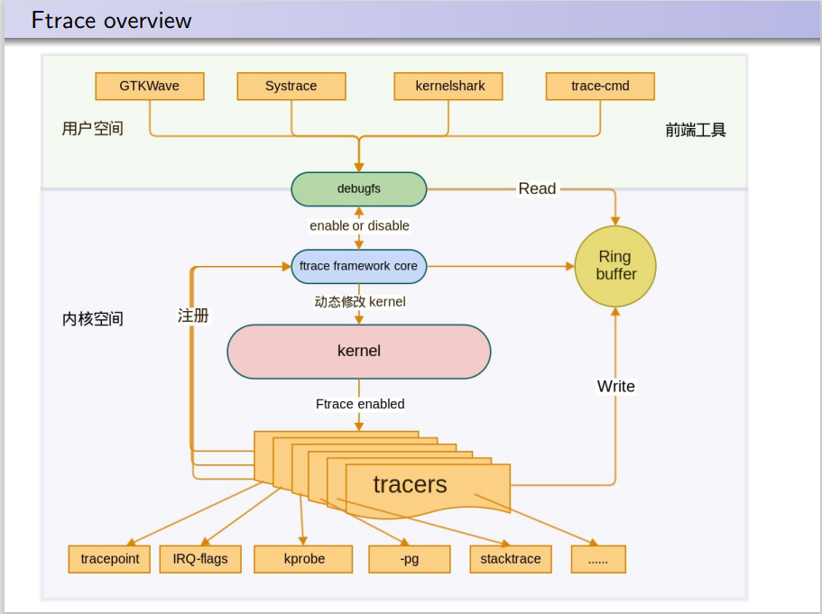

# Systrace 原理

## 简介

systrace 是分析 Android 设备性能的主要工具。不过，它实际上是多种其他工具的封装容器：它是 atrace 的主机端封装容器。atrace 是用于**控制用户空间跟踪和设置 ftrace 的设备端可执行文件**，也是 Linux 内核中的主要跟踪机制。systrace 使用 atrace 来启用跟踪，然后读取 ftrace 缓冲区并将其全部封装到一个独立的 HTML 查看器中。

systrace->atrace->ftrace and other

## 工作流程

1. 首先systrace指定抓取trace的类别等参数，然后触发手机端的/system/bin/atrace 开启对应文件节点的信息记录，接着atrace会读取 ftrace 的缓存，生成只包含ftrace信息的atrace_raw。
2. Systrace会进一步收集系统的ps、task等信息，这些信息是为了协助解析atrace_raw中的ftrace信息，比如ps信息可以得到进程的名称，而不是难记的pid号。处理后的ftrace信息将和systrace目录下的prefix.html、systrace_trace_viewer.html、suffix.html整合为一体，成为单个的html文件。
3. 当浏览systrace信息时，Chrome浏览器借助systrace解析器（通过chrome://tracing访问），解析上面生成的trace.html文件，把其中原始的ftrace信息分门别类，再按照时间轴聚合排列，绘制出不同色块，简洁可观的显示在html页面上。

## 具体实现

Systrace抓取的trace数据，总体上可以分为两类，一类是Java（Trace类）和Native（ATrace宏定义）在用户层发生的函数调用，一类是内核态的事件信息。

1. 用户层的函数调用，其实最终事件记录都是同一个文件节点/sys/kernel/debug/tracing/trace_marker。

   此节点允许用户层写入字符串，ftrace会记录该写入操作时的时间戳，当用户在上层调用不同函数时，写入不同的调用信息，比如函数进入和退出分别写入，那么ftrace就可以记录跟踪函数的运行时间。

   ```bash
   [tracing]# echo hello world > trace_marker
   [tracing]# cat trace
   # tracer: nop
   #
   #           TASK-PID    CPU#    TIMESTAMP  FUNCTION
   #              | |       |          |         |
   <...>-3718  [001]  5546.183420: 0: hello world
   ```

   atrace在处理用户层的多种trace类别时，仅仅是激活不同的TAG，如用户选择了Input类别，则激活ATRACE_TAG_INPUT；选中Graphics则激活ATRACE_TAG_GRAPHICS，记录调用的流程都是一样的，最终都是记录到trace_marker。它将 ftrace 的各种 Event 抽象为 tag，一个 atrace tag 对应多个 ftrace Event，例如 `sched` 这个 tag 分别包括了 `sched/sched_switch`，`sched/sched_wakeup`，`sched/sched_waking`，`sched/sched_blocked_reason`，`sched/sched_cpu_hotplug` 等这些 Event。

2. 内核态的事件信息，则不是统一的，需要激活各自对应的事件节点，让ftrace记录下不同事件的tracepoint。例如激活进程调度信息记录，需要激活如下相关节点：

   ```
   events/sched/sched_switch/enable
   events/sched/sched_wakeup/enable
   ```
   
内核在运行时，根据节点的使能状态，会往ftrace缓冲中打点记录事件。

最终，上述两类事件记录都汇集到同一缓冲中，然后atrace工具会回读抓取，保存下来就是原始的systrace信息。



## 源码分析

### Systrace

### Atrace

### Ftrace

## 更进一步——Ftrace



ftrace 是一种调试工具，在 Linux 2.6.27 版本中引入，用于了解 Linux 内核中的情况。Ftrace的设计目标简单，本质上是一种**静态代码插装技术**，**不需要**支持某种编程接口让用户自定义 trace 行为。静态代码插装技术更加可靠，不会因为用户的**不当使用**而导致**内核崩溃**。 ftrace 代码量很小，稳定可靠。

### Atrace

atrace (`frameworks/native/cmds/atrace`) 使用 ftrace 捕获内核事件，而 systrace.py（在较高版本的 [Catapult](https://github.com/catapult-project/catapult) 中为 run_systrace.py）使用 adb 在设备上运行 atrace。atrace 会执行以下操作：

- 通过设置属性 (`debug.atrace.tags.enableflags`) 来设置用户模式跟踪。

  您可以使用 atrace 将该属性设置为适当的值，但启动时跟踪除外。该属性是一个位掩码，除了查看相应的标头（在不同的 Android 版本之间会有所变化），没有确定正确值更好的办法了。

- 通过写入相应的 ftrace sysfs 节点来启用所需的 ftrace 功能。不过，由于 ftrace 支持的功能更多，**您可以自行设置一些 sysfs 节点，然后使用 atrace**。

### 启用ftrace事件

ftrace sysfs 节点位于 `/sys/kernel/tracing` 中，轨迹事件在 `/sys/kernel/tracing/events` 中被划分为多个类别。

如需按类别启用事件，请使用以下命令：

```
echo 1 > /sys/kernel/tracing/events/irq/enable
```

如需按事件启用事件，请使用以下命令：

```
echo 1 > /sys/kernel/tracing/events/sched/sched_wakeup/enable
```

可以在不使用 atrace 或 systrace 的情况下单独使用 ftrace，这在需要仅限内核的跟踪记录（或者您已经花时间手动写入用户模式跟踪属性）时很有帮助。如需只运行 ftrace，请执行以下操作：

1. 将缓冲区大小设置为足以用于您跟踪的值：

   ```
   echo 96000 > /sys/kernel/tracing/buffer_size_kb
   ```

2. 启用跟踪：

   ```
   echo 1 > /sys/kernel/tracing/tracing_on
   ```

3. 运行您的测试，然后停用跟踪：

   ```
   echo 0 > /sys/kernel/tracing/tracing_on
   ```

4. 转储跟踪：

   ```
   cat /sys/kernel/tracing/trace > /data/local/tmp/trace_output
   ```

trace_output 以文本形式提供跟踪记录。如需使用 Catapult 将其可视化，请从 GitHub 获取 [Catapult 代码库](https://github.com/catapult-project/catapult/tree/master/)并运行 trace2html：

```
catapult/tracing/bin/trace2html ~/path/to/trace_file
```

默认情况下，此操作会将 `trace_file.html` 写入同一目录中。

Tracepoint是在内核中固定的hook点，并不是在所有的函数中都有tracepoint。

### 使用动态ftrace

动态 ftrace 涉及在启动后重写内核代码，因此出于安全考虑，它在正式版内核中不可用。

在跟踪原理方面，以函数跟踪器为代表的传统跟踪器的实现主要利用了GCC编译器提供的`mcount`特性（一种静态代码插桩技术）。**当程序通过gcc命令进行编译且指定`-pg`调试选项时，GCC会在编译过程中往每个函数的入口处加入对`mcount`函数的调用代码**。此后，当程序执行过程发生函数调用时，`mcount`函数会被调用执行。`mcount`本是libc库中的函数，用来记录关于该程序执行及当前被调函数的一些信息，但由于内核的构建并不会与用户态模块进行链接，所以ftrace实现了自己的`mcount`函数来记录函数调用情况等相关跟踪数据。

进一步说， 在内核编译构建时，如果 `CONFIG_FUNCTION_TRACER` 选项被选中， 那么 GCC 便会开启`-pg`项对内核进行编译 ， 从而在每一个内核函数的入口处设置对 `mcount`函数的调用 。 尽管这种方式能够实现大范围的跟踪覆癌， 但也会导致大量的函数调用指令被加入内核中，进而会一定程度地降低内核的运行速度。为了降低跟踪对内核性能的影响， ftrace 支持了所谓的**dynamic ftrace**机制， 该功能通过配置 `CONFIG_DYNAMIC_FTRACE` 编译选项来启用。

如果 **dynamic ftrace** 被开启， 那么 GCC 在内核编译期间会调用一个名为`recordmcount.pl`的 Perl 脚本来分析每一个 C 程序目标文件中的 ELF 头信息以获取所有 text 段中调用 `mcount`的位置信息， 并在原始目标文件中以重链接 ( re-link ) 的方式新添加一个特殊的" **___mcount_loc** " 段来存储上述位置。在内核最后的链接阶段，所有这些位置信息会被记录到一张表里。内核启动初期 ， ftrace 核心通过扫描这张表， 将其中地址所指向的指令更新为 `nop`指令从而完成初始化。因此当跟踪未启用时， ftrace 几乎不会给系统带来额外的开销。此后在必要时， ftrace 会将`nop`指令动态替换为 `mcount`调用。 配置 `set_ftrace_filter` 和 `set_ftrace_notrace` 过滤器就是 **dynamic ftrace** 技术的一种具体体现。**以使用函数跟踪器为例，指定要跟踪或者无需跟踪的具体函数，实质上就是通知 ftrace 动态地将相关函数中的 nop 指令替换为 mcount 调用或者将 mcount 调用替换为 nop 指令的过程。**该设计很好地提高了跟踪的性能与灵活性。

## 自定义追踪事件

1. 修改内核，添加Trace event
2. dump trace file，查看


## Reference

